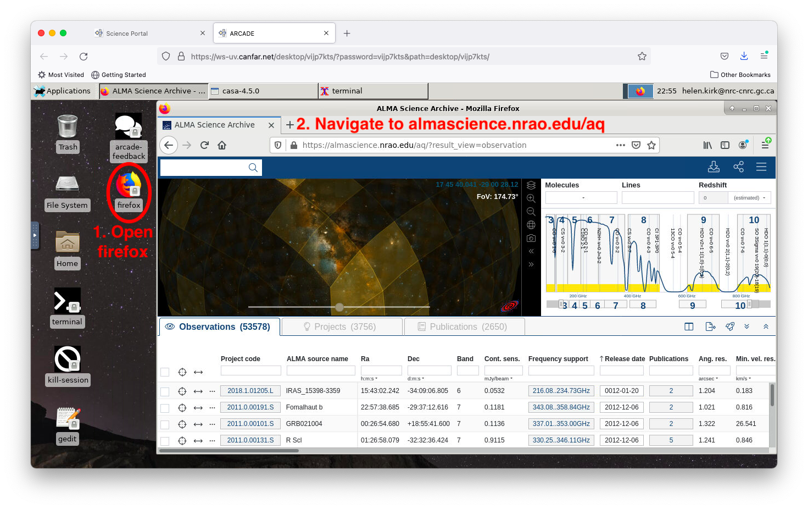
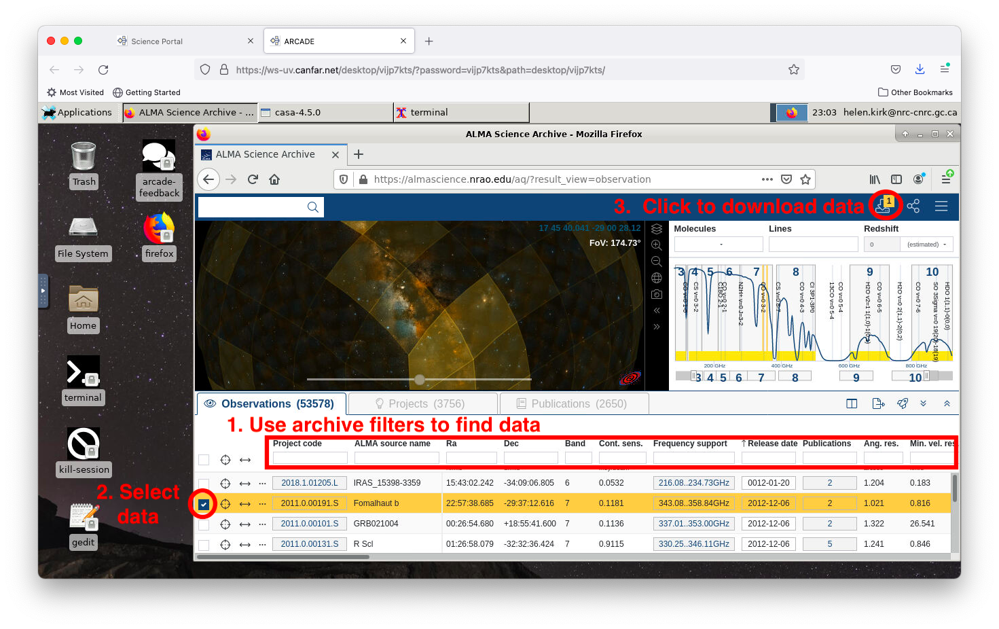
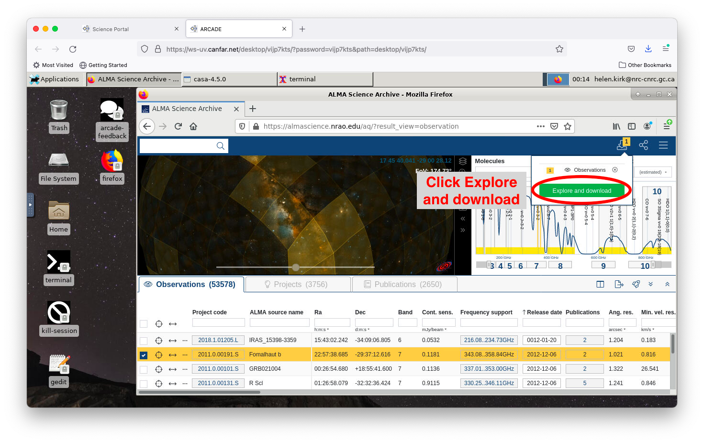
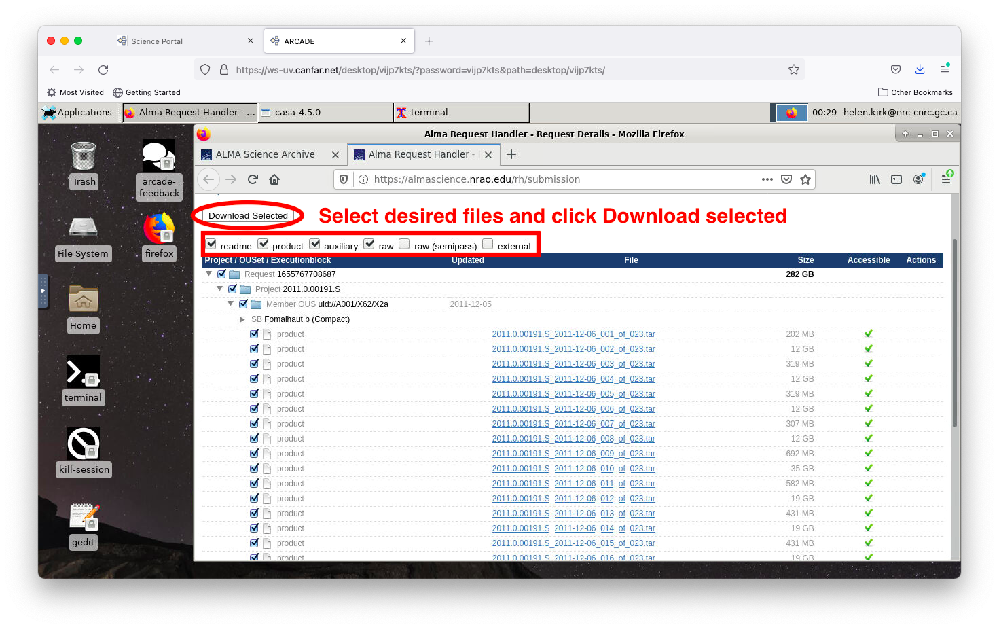
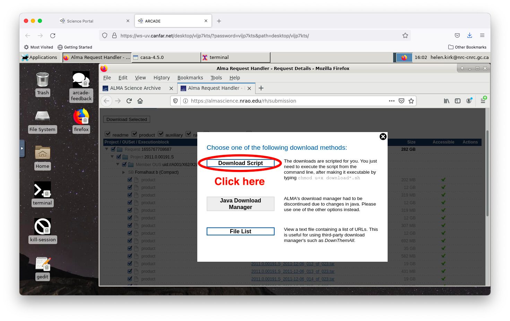
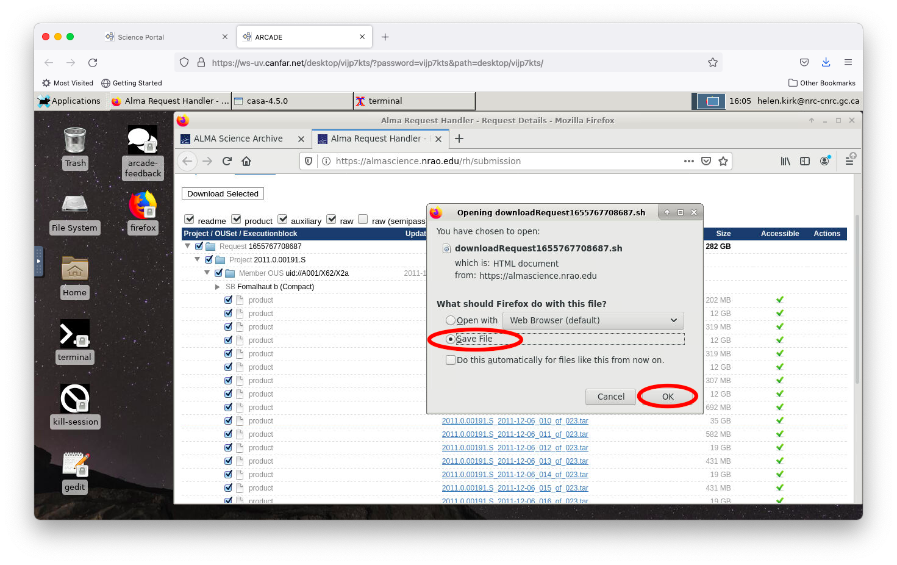
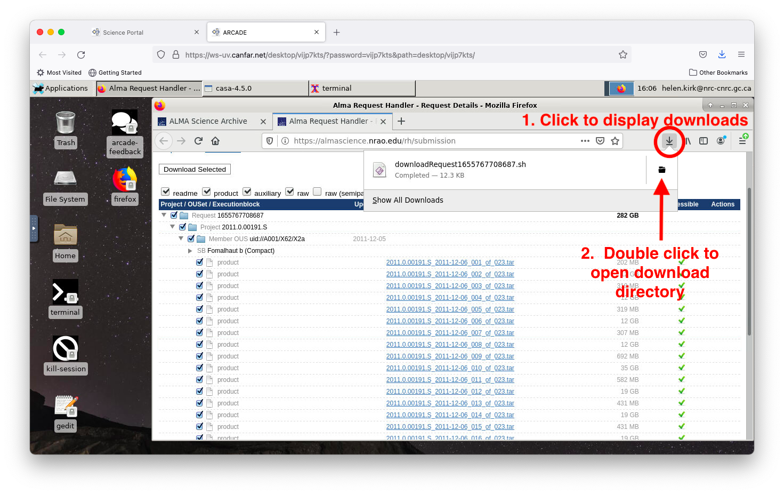
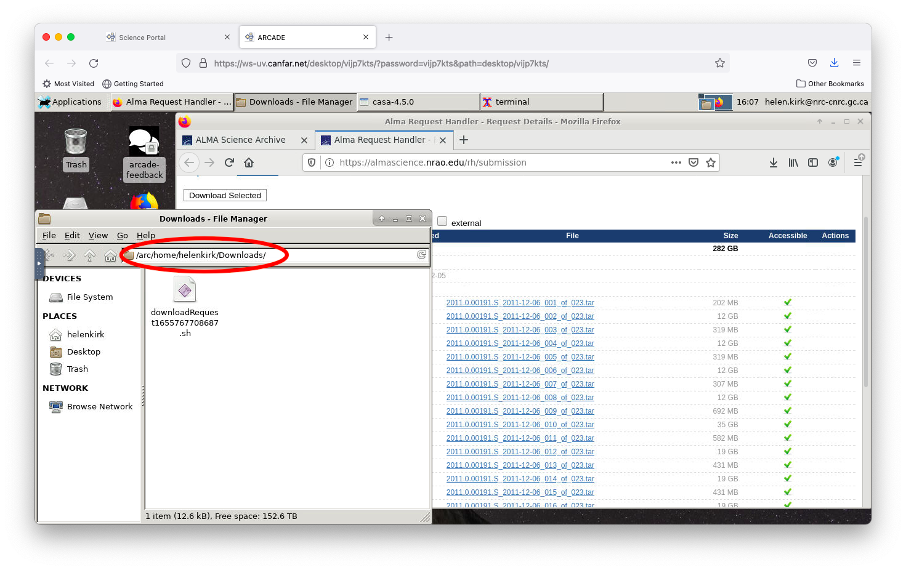
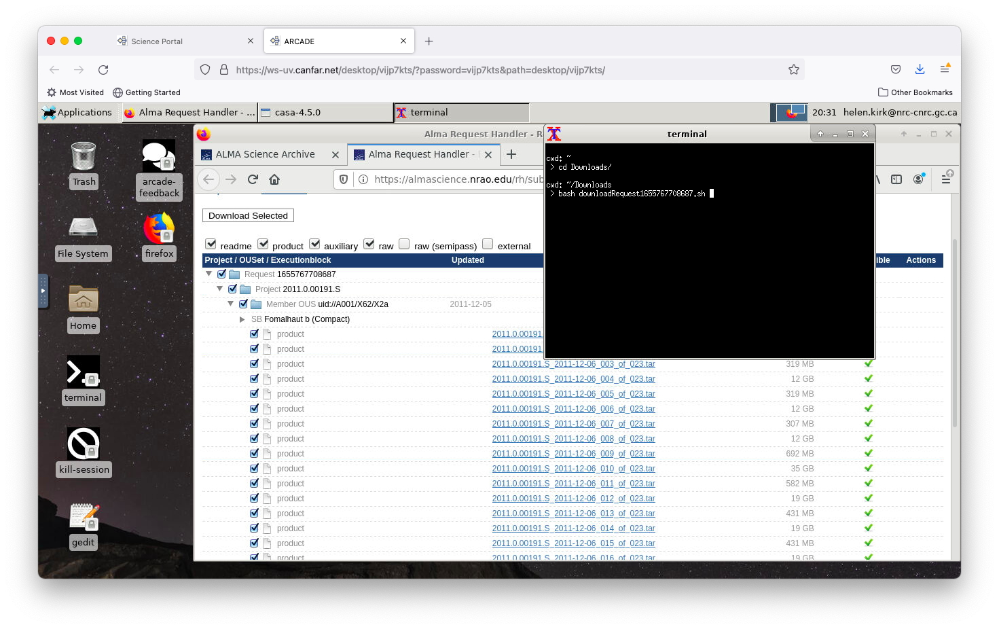

# Download ALMA Data (Direct Web Method)

Download ALMA archive data directly from your CANFAR Desktop session using the built-in Firefox browser.

## 📋 Overview

This tutorial shows how to query and download ALMA Science Archive data directly within a CANFAR Desktop session, without needing to transfer files from your local computer.

**Alternative method**: If you prefer to generate download scripts on your local computer, see the [transfer script tutorial](archive-script-download.md).

## 🎯 When to Use This Method

**Best for**:
- Quick data exploration and download
- When you want to work entirely within CANFAR
- Small to medium-sized datasets
- When you have good internet connectivity to the CANFAR servers

## 📚 Prerequisites

1. **CANFAR Desktop session** - Follow the [Desktop launch guide](../user-guide/launch-desktop.md)
2. **Basic ALMA archive knowledge** - Watch this tutorial: [ALMA Archive Video Tutorials](https://almascience.nrao.edu/alma-data/archive/archive-video-tutorials)

## 🚀 Step-by-Step Process

### Step 1: Open the ALMA Archive

1. **Launch Firefox** - Double-click the Firefox icon on your Desktop session
2. **Navigate to ALMA archive** - Go to [https://almascience.nrao.edu/aq/](https://almascience.nrao.edu/aq/)



### Step 2: Search for Your Data

1. **Use the search filters** to narrow down datasets:
   - **Source name** or coordinates
   - **Observation date range**
   - **Frequency bands**
   - **Project type** (e.g., individual projects, surveys)

2. **Apply filters** to find datasets matching your research needs

**💡 Tip**: The [ALMA Archive User Guide](https://almascience.nrao.edu/alma-data/archive/documentation) provides detailed search strategies.

### Step 3: Select Datasets

1. **Review search results** - Browse through the returned projects
2. **Select datasets** - Check the boxes to the left of projects you want to download



### Step 4: Access Download Options

1. **Click the download arrow** - Find the downward-pointing arrow in the upper right panel
2. **Start download process** - Click the green `Explore and download` button



### Step 5: Choose Specific Files

1. **Review available files** - The next window shows all available data products:
   - **Raw visibility data** (measurement sets)
   - **Calibrated data**
   - **Images and cubes**
   - **Auxiliary files** (logs, scripts, etc.)

2. **Select desired files** - Check boxes for the files you need
3. **Begin download** - Click `Download Selected`



### Step 6: Get Download Script

1. **Choose script download** - In the popup window, click `Download Script`



2. **Save script** - Save the download script to your Desktop session



### Step 7: Locate and Run the Script

1. **Find downloaded files** - Click the download arrow in Firefox's top-left corner
2. **Open download folder** - Double-click the folder icon to open the file manager



3. **Navigate to Downloads** - The file manager opens in your Downloads directory (usually `/arc/home/yourusername/Downloads/`)



### Step 8: Execute the Download

1. **Open terminal** - Double-click the terminal icon on your Desktop
2. **Navigate to script location**:
   ```bash
   cd ~/Downloads/
   ```
3. **Make script executable**:
   ```bash
   chmod +x downloadRequest_*.sh
   ```
4. **Run the download script**:
   ```bash
   ./downloadRequest_*.sh
   ```

**What this does**: The script will contact the ALMA archive servers and download all selected data files to your current directory.

## 💡 Tips and Best Practices

### Storage Considerations
- **Check available space**: Large ALMA datasets can be several GB each
- **Use project directories**: Consider downloading to `/arc/projects/yourproject/data/` for better organization
- **Monitor disk usage**:
  ```bash
  df -h /arc/projects/yourproject/
  ```

### Download Management
- **Large downloads**: For datasets >10GB, consider using a dedicated terminal session
- **Network interruptions**: The script can usually be re-run to resume interrupted downloads
- **Multiple datasets**: Download scripts can be edited to change download directories

### After Download
- **Verify data integrity**: Check that all expected files were downloaded
- **Organize files**: Move data to appropriate project subdirectories
- **Document downloads**: Keep track of which datasets you've downloaded and when

## 🚨 Troubleshooting

### Download Fails or Stops
- **Check internet connectivity**: Restart your session if network is unstable
- **Verify disk space**: Ensure sufficient space in your destination directory
- **Re-run script**: Download scripts can typically be re-executed to resume

### Can't Find Downloaded Files
- **Check Downloads folder**: Default location is `/arc/home/yourusername/Downloads/`
- **Check current directory**: Files download to wherever you ran the script
- **Use find command**:
  ```bash
  find /arc/home/yourusername -name "*.ms" -type d
  ```

### Script Permission Errors
```bash
# Make script executable
chmod +x downloadRequest_*.sh

# If that fails, run directly with bash
bash downloadRequest_*.sh
```

## 🔗 Related Documentation

- **[Transfer script method](archive-script-download.md)** - Alternative approach using local computer
- **[Data transfer guide](../data-transfer-guide.md)** - Moving data between systems
- **[Desktop session guide](../user-guide/launch-desktop.md)** - Setting up your workspace
- **[Storage systems guide](../storage-systems-guide.md)** - Understanding CANFAR file systems

> 

When all of the files have been downloaded, you should see a query about
un-tarring (uncompressing) them. Click `y` for yes.

> 

You can now open a CASA terminal to begin your data reduction or
analysis.
