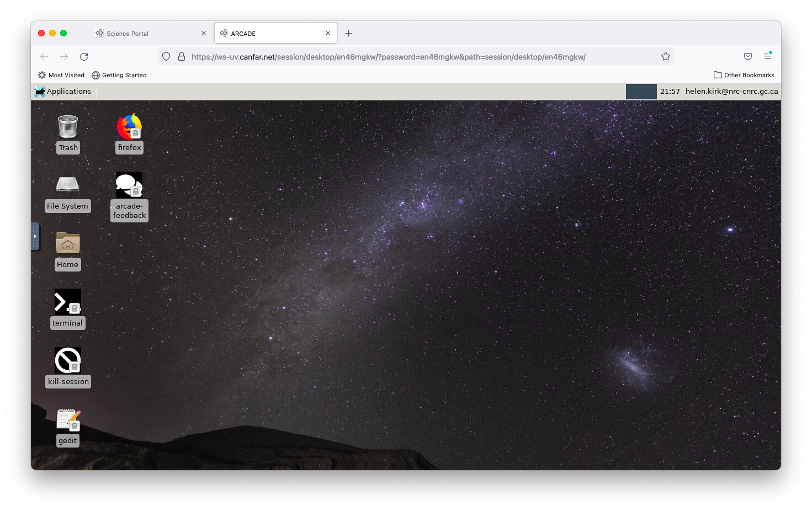
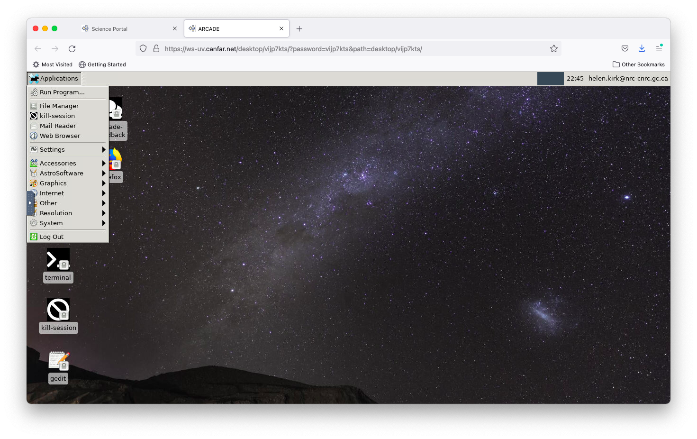
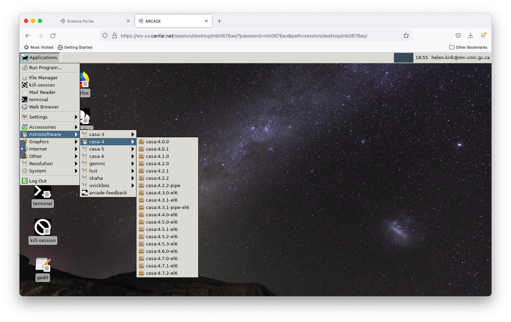
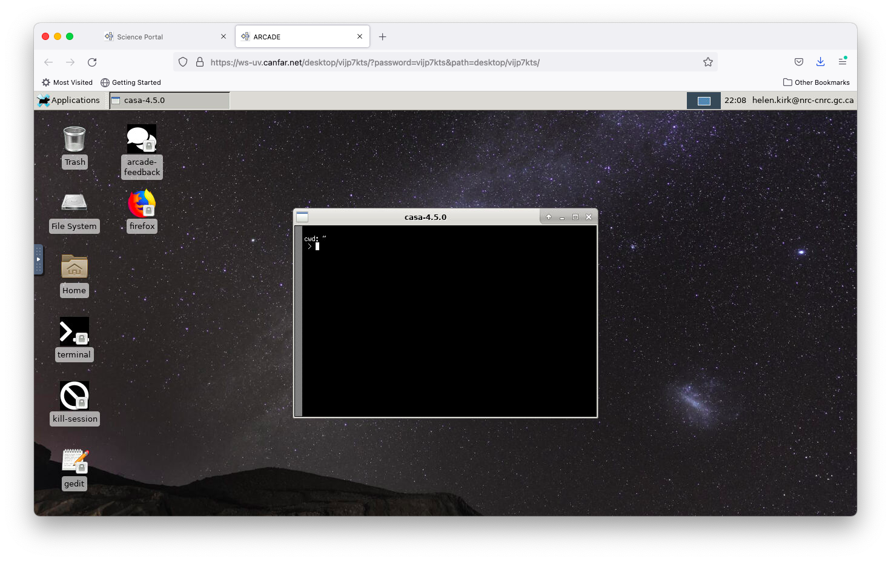
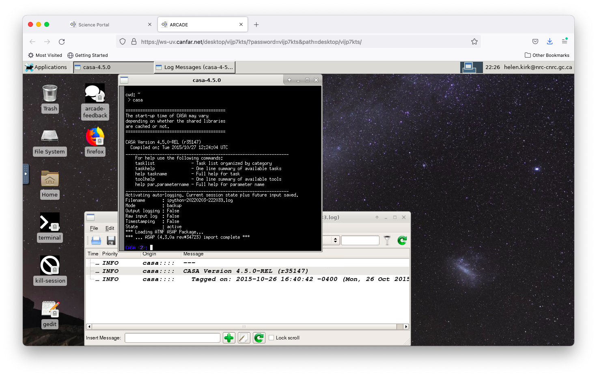
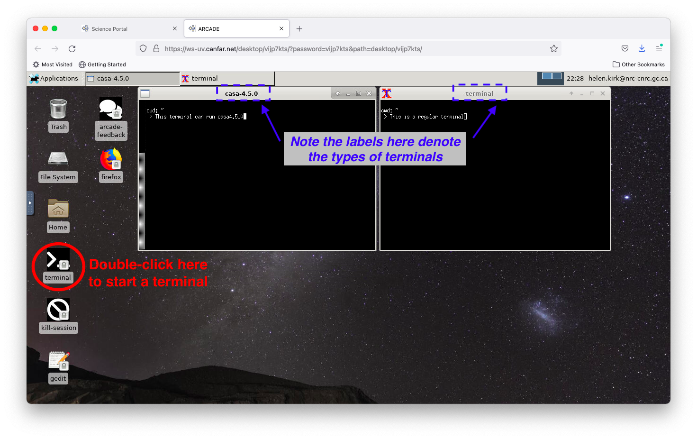

# Starting CASA in Desktop Sessions

Learn how to launch and use different versions of CASA (Common Astronomy Software Applications) in your CANFAR Desktop session.

## 📋 Overview

**CASA** is the primary software package for processing radio astronomy data, especially from ALMA and VLA. CANFAR provides access to multiple CASA versions, from legacy versions (back to CASA 3.4.0) to current releases.

## 🎯 Prerequisites

- **Desktop session running** - Follow the [Desktop launch guide](../user-guide/launch-desktop.md)
- **Basic familiarity** with CASA operation

## 🚀 Launching CASA

### Step 1: Access the Applications Menu

From your Desktop session, click the **Applications** menu in the top-left corner of your screen.





### Step 2: Navigate to CASA Versions

1. **Click on AstroSoftware** - This expands the astronomy software options
2. **Browse CASA versions** - Navigate through the available CASA versions
3. **Choose your version** - Select the specific CASA version you need



**Available versions**: Every CASA version from 3.4.0 onwards is available, including:
- **CASA 3.4.0** - Required for legacy ALMA Cycle 0 scripts ([migration guide](https://casaguides.nrao.edu/index.php?title=Updating_a_script_to_work_with_CASA_4.2))
- **CASA 4.x series** - Common for older datasets
- **CASA 5.x and 6.x** - Current versions for new observations

### Step 3: Launch CASA Terminal

Clicking your preferred CASA version opens a terminal configured with that specific CASA environment.



### Step 4: Start CASA

In the CASA-enabled terminal, you can start CASA in different modes:

**Interactive CASA**:
```bash
casa
```

**Pipeline CASA** (for automated reduction scripts):
```bash
casa --pipeline
```
*Note: Use two dashes before "pipeline"*



## 🔧 Using Multiple Terminal Types

### CASA vs Regular Terminals

You can work with both CASA-enabled and regular terminals simultaneously:

- **CASA terminals**: Pre-configured with specific CASA versions
- **Regular terminals**: Standard Linux environment for general tasks



**To open a regular terminal**: Double-click the `terminal` icon at the bottom-left of your Desktop.

### Terminal Labels

Each terminal window shows a label indicating its type:
- **Regular terminal**: Shows standard bash prompt
- **CASA terminal**: Shows the CASA version (e.g., "casa-6.1.1")

## 💡 Best Practices

### Choosing CASA Versions

**For ALMA data**:
- **Check reduction scripts**: The CASA version is usually specified in script headers or log files
- **Match original version**: Generally recommended to use the same CASA version that was originally used for data reduction
- **Pipeline indicators**: Scripts with "pipe" in their names require `casa --pipeline`

**For VLA data**:
- **Recent observations**: Use the latest CASA version
- **Legacy data**: Check the VLA documentation for recommended versions

### Terminal Usage

**CASA terminals**:
- ✅ Use for running CASA and CASA-related commands
- ✅ Access to CASA-specific environment variables
- ❌ Limited Linux command support

**Regular terminals**:
- ✅ Use for file management, text editing, system commands
- ✅ Full Linux command access
- ✅ Installing additional software

### Workflow Recommendations

1. **Use regular terminal** for:
   - Navigating directories
   - Editing scripts
   - Managing files
   - Installing packages

2. **Use CASA terminal** for:
   - Running CASA
   - Executing reduction scripts
   - Interactive CASA sessions

## 🚨 Troubleshooting

### CASA Won't Start
```bash
# Check if CASA is properly loaded
which casa

# Verify CASA environment
echo $CASAPATH
```

### Wrong CASA Version
- **Close current terminal** and open a new one with the correct version
- **Check version**: Run `casa --version` in the terminal

### Permission Issues
```bash
# Ensure scripts are executable
chmod +x scriptForPI.py

# Check file ownership
ls -la your_script.py
```

## 🔗 Related Documentation

- **[CASA container examples](casa-containers.md)** - Advanced CASA usage and containers
- **[Desktop session guide](../user-guide/launch-desktop.md)** - Setting up your workspace
- **[Data reduction tutorial](typical-reduction.md)** - End-to-end ALMA data processing
- **[Archive download tutorials](archive-download.md)** - Getting ALMA data for reduction
