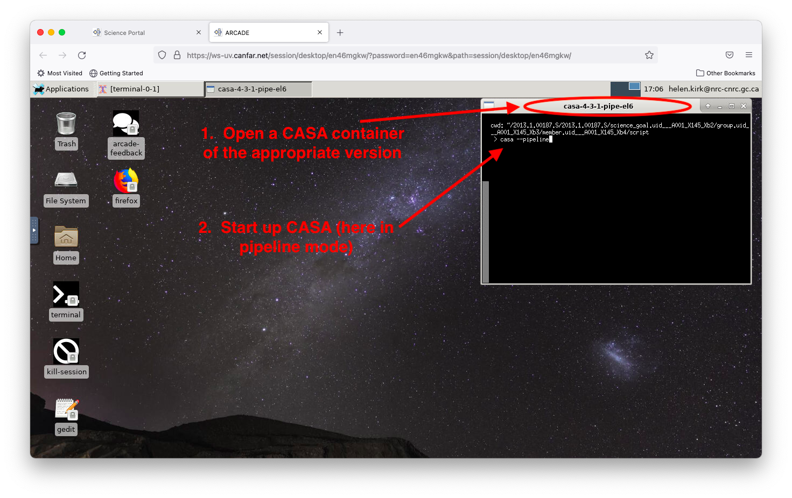
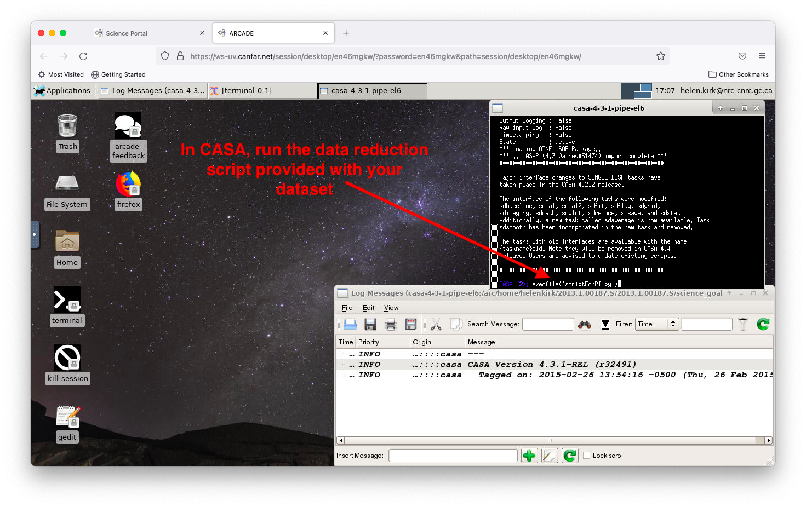
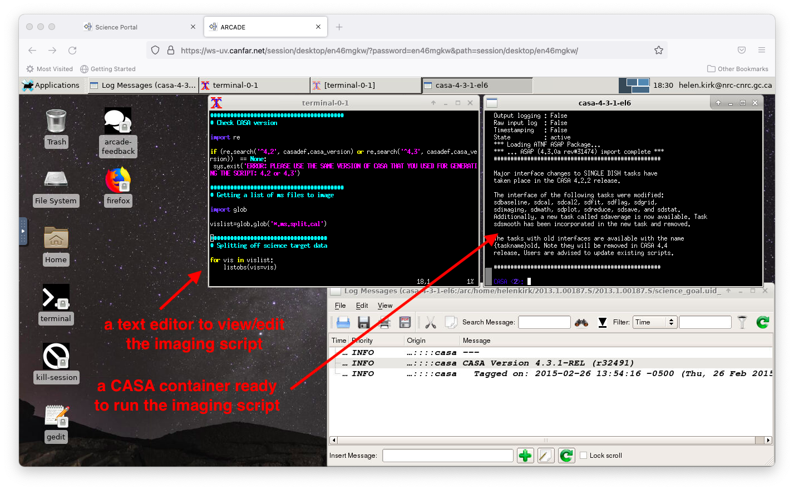
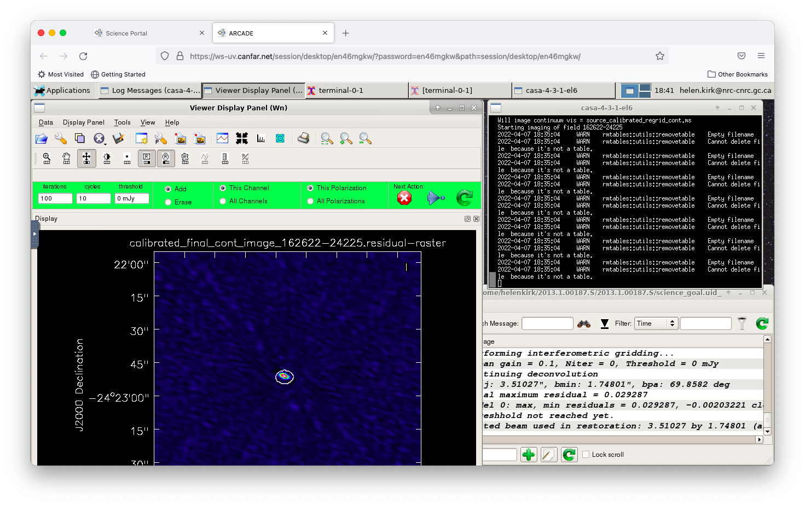
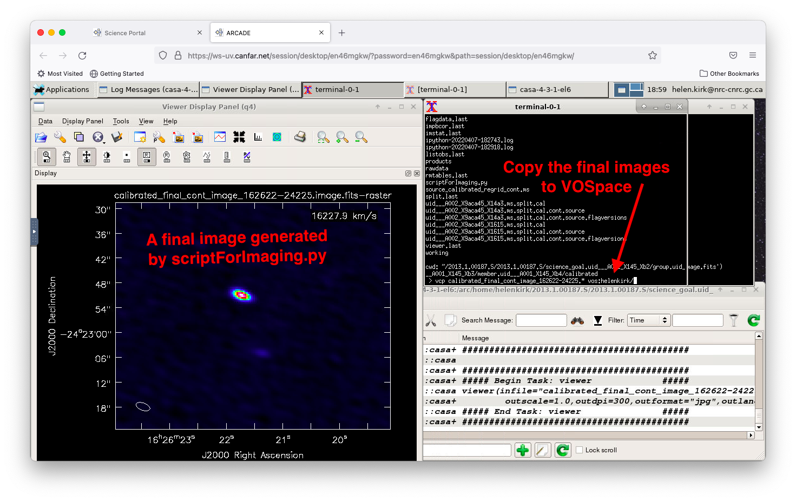

# ALMA Data Reduction and Imaging Tutorial

Complete tutorial for reducing and imaging ALMA datasets in CANFAR, from data acquisition to final image creation.

## 📋 Overview

This tutorial walks through a complete ALMA data reduction workflow:

1. **Data acquisition** - Download ALMA datasets
2. **Environment setup** - Launch appropriate CASA version
3. **Calibration** - Run reduction scripts
4. **Imaging** - Create scientific images
5. **Data export** - Transfer results to permanent storage

## 🎯 Prerequisites

- **ALMA dataset** downloaded to your CANFAR session
- **Desktop session running** - See [launch guide](../user-guide/launch-desktop.md)
- **Basic CASA knowledge** - Familiarity with CASA operation

## 📚 Step 1: Get Your ALMA Data

Choose one of these methods to obtain ALMA data:

- **[Direct download](archive-download.md)** - Download from archive using Firefox in your session
- **[Script transfer](archive-script-download.md)** - Transfer download script from your local computer
- **[File upload](../data-transfer-guide.md)** - Upload data you already have locally

## 🚀 Step 2: Set Up CASA Environment

### Check Required CASA Version

**📍 Find the correct CASA version**:
- Look at the **log files** included with your data
- Check the **top of reduction scripts** (usually `scriptForPI.py`)
- **Pipeline scripts**: If you see files with "pipe" in the name, you need pipeline mode

### Launch CASA

1. **Open the correct CASA version** - Follow the [CASA startup guide](start-casa.md)
2. **Start CASA in appropriate mode**:
   - **Standard reduction**: `casa`
   - **Pipeline reduction**: `casa --pipeline`



## ⚙️ Step 3: Run Data Calibration

### Execute the Reduction Script

Most ALMA datasets include a **calibration script** (typically `scriptForPI.py`):

```python
# In CASA
execfile('scriptForPI.py')
```



**What this does**:
- **Applies calibration** to the raw visibility data
- **Flags problematic data** automatically
- **Creates calibrated measurement set(s)** in the `calibrated/` directory
- **Generates diagnostic plots** for quality assessment

**⏱️ Timing**: Calibration can take anywhere from 30 minutes to several hours depending on dataset size and complexity.

## 🖼️ Step 4: Create Images

### Prepare for Imaging

After calibration completes, you'll find:
- **Calibrated data**: `calibrated/*.ms` files
- **Imaging script**: Usually `scriptForImaging.py`

### Set Up Imaging Environment

**📍 Important**: Imaging sometimes requires a different CASA version than calibration.

1. **Check imaging requirements**:
   - Look at the imaging script header
   - Note if it specifies a different CASA version

2. **Switch CASA versions if needed**:
   - **Example**: Calibration used `casa-4.3.1-pipe`, imaging needs `casa-4.3.1` (interactive)
   - Close current CASA and open the required version

3. **Copy imaging script to calibrated directory**:
   ```bash
   # In a regular terminal
   cp scriptForImaging.py calibrated/
   cd calibrated/
   ```

### Run Imaging Script



**💡 Pro tip**: Open a regular terminal alongside CASA for file management and script editing ([clipboard usage guide](../user-guide/using-clipboard.md)).

### Interactive Imaging with tclean

Many imaging scripts use **tclean** interactively, where you define clean regions:



**What to expect**:
- **Interactive viewer** opens showing your data
- **Draw clean boxes** around sources you want to image
- **Monitor convergence** as the algorithm iterates
- **Stop cleaning** when residuals look good

## 📊 Step 5: Review and Export Results

### Check Your Images

After imaging completes, you'll have various output files:
- **`.image`** - Main scientific image
- **`.residual`** - Remaining uneimaged flux
- **`.psf`** - Point spread function
- **`.pb`** - Primary beam correction



### Quality Assessment

```python
# In CASA - check image statistics
imstat('your_image_name.image')

# View image
viewer('your_image_name.image')
```

## 📤 Step 6: Transfer Final Results

### Choose Export Method

Select appropriate transfer method based on data size and destination:

| Method | Best For | Instructions |
|--------|----------|--------------|
| **VOSpace** | Long-term storage, publication | [VOSpace tools guide](../user-guide/vospace-tools.md) |
| **Web download** | Small images (<1GB) | [Web file manager](../user-guide/web-file-manager.md) |
| **sshfs** | Local computer storage | [sshfs setup guide](../user-guide/sshfs-setup.md) |

### Example: VOSpace Export

```bash
# Transfer final images to VOSpace
vcp calibrated_final_cont_image_162622-24225.* vos:yourusername/project_name/

# Transfer key files with organization
vcp calibrated_final_cont_image.image vos:yourusername/alma_project/images/
vcp calibrated_final_cont_image.fits vos:yourusername/alma_project/images/
```

**What this does**: Copies your final image products to VOSpace for permanent storage and backup.

## 💡 Best Practices

### File Organization

```bash
# Recommended project structure
/arc/projects/yourproject/
├── raw_data/           # Original downloaded data
├── calibrated/         # Calibrated measurement sets
├── images/            # Final image products
├── scripts/           # Custom analysis scripts
└── documentation/     # Notes, logs, parameters
```

### CASA Version Management

- **Always use the recommended version** specified in the dataset documentation
- **Keep calibration and imaging separate** if different versions are required
- **Document which versions you used** for reproducibility

### Storage Considerations

- **Calibrated data is large**: Plan for 2-5x the size of raw data
- **Clean up intermediate files**: Remove unnecessary files to save space
- **Use VOSpace for final products**: Don't rely on `/arc` storage for permanent archival

## 🚨 Troubleshooting

### Script Execution Issues

```python
# If execfile() fails in newer CASA versions
exec(open('scriptForPI.py').read())

# Check CASA version compatibility
print(casa['version'])
```

### Memory or Performance Problems

- **Restart CASA** if it becomes slow or unresponsive
- **Close other applications** to free up memory
- **Consider using headless processing** for very large datasets

### Missing or Corrupted Data

```bash
# Check data integrity
# In CASA
listobs('your_dataset.ms')

# Verify file sizes match expectations
ls -lh calibrated/
```

### Version Compatibility Issues

- **Download fresh scripts** from the ALMA archive if needed
- **Check CASA release notes** for known compatibility issues
- **Contact ALMA helpdesk** for dataset-specific problems

## 🔗 Related Documentation

- **[CASA startup guide](start-casa.md)** - Detailed CASA environment setup
- **[Archive download tutorials](archive-download.md)** - Getting ALMA data
- **[Data transfer guide](../data-transfer-guide.md)** - All transfer methods explained
- **[Storage systems guide](../storage-systems-guide.md)** - Understanding CANFAR storage
- **[CASA containers guide](casa-containers.md)** - Advanced CASA usage

**External Resources**:
- [ALMA Data Reduction Guide](https://almascience.nrao.edu/processing/science-pipeline)
- [CASA Documentation](https://casadocs.readthedocs.io/)
- [ALMA Cycle Guides](https://almascience.nrao.edu/alma-data/cycle-guides)
