# Accounts & Permissions

**Managing users, groups, and access control on CANFAR**

This section covers everything you need to know about user management, group permissions, and access control on the CANFAR platform. Whether you're setting up a new collaboration or managing an existing team, this guide will help you understand and configure permissions effectively.

!!! abstract "🎯 What You'll Learn"
    By the end of this guide, you'll understand:
    - How CANFAR's permission system works
    - How to create and manage research groups
    - How to control access to files and containers
    - How to use APIs for programmatic access

## 🔓 Permissions System

CANFAR's permission system is built on several layers that work together to provide secure, flexible access control:

!!! info "Permission Layers"
    - **CADC Accounts** - Your base identity for accessing Canadian astronomy services
    - **Groups** - Collections of users for collaborative access 
    - **Harbor Permissions** - Container registry access control
    - **ACL (Access Control Lists)** - File-level permissions on `/arc` shared file system
    - **API Authentication** - Programmatic access control

## 👥 Group Management

**_Groups are the foundation of collaboration on CANFAR. A group defines who can access shared resources, what projects and storage they can use, and how they can interact._**

### Group Hierarchy

```mermaid
graph TD
    Admin["👑 Group Administrator"]
    Members["👤 Group Members"]
    Resources["💾 Shared Resources"]
    
    Admin --> |"Manages"| Members
    Admin --> |"Controls access to"| Resources
    Members --> |"Access"| Resources
    
    Resources --> Projects["📁 /arc/projects/groupname/"]
    Resources --> Storage["💾 Storage Quotas"]
    Resources --> Containers["🐳 Container Access"]
```



!!! success "Key Concept"
    Groups enable collaborative research by providing shared access to storage, computing resources, and container images while maintaining security boundaries.

### Creating and Managing Groups

**Access the Group Management Interface:**

[**🔗 CADC Group Management**](https://www.cadc-ccda.hia-iha.nrc-cnrc.gc.ca/en/groups/){ .md-button .md-button--primary }

#### Step 1: Create a New Group

1. Click **"New Group"**
2. Provide a meaningful group name (e.g., `myproject-team`)
3. Add a brief description of the project or collaboration
4. Click **"Create"**

#### Step 2: Add Members

1. Find your group in the list
2. Click **"Edit"** in the Membership column
3. Type the name (not username) of your collaborator
4. Select from the search results
5. Click **"Add member"**

!!! tip "Finding Users"
    The search function uses real names, not CADC usernames. Search for "John Smith" rather than "jsmith".

#### Step 3: Assign Administrators

1. Click **"Edit"** in the Administrators column  
2. Add users who should be able to manage the group
3. Administrators can add/remove members and modify permissions

### Member Roles

| Role | Permissions | Best For |
|------|-------------|----------|
| **Administrator** | Full group management, resource allocation | Project PIs, senior team members |
| **Member** | Access shared resources, collaborate | Researchers, grad students |

## 🔐 Harbor Permissions

Harbor is CANFAR's container registry where container images are stored and managed.

!!! info "Registry Access"
    **Registry URL:** [https://images.canfar.net](https://images.canfar.net)

### Access Levels

| Permission Level | Can Do | Cannot Do |
|------------------|--------|-----------|
| **Guest** | Pull public images | Push images, see private repos |
| **Developer** | Pull all group images, push to group repos | Delete images, manage projects |
| **Master** | Full project management | System administration |

### Managing Harbor Access

Harbor permissions are typically managed by CANFAR administrators. Contact [support@canfar.net](mailto:support@canfar.net) to:

- Request access to a project repository
- Set up a new project for your container images
- Modify permissions for team members

### Using Harbor

```bash
# Login to Harbor
docker login images.canfar.net

# Pull a container
docker pull images.canfar.net/skaha/astroml:latest

# Push your container (if you have permissions)
docker push images.canfar.net/myproject/custom-container:v1.0
```

## 🛡️ Access Control Lists {#acl-access-control-lists}

### What are ACLs?

**Access Control Lists (ACLs)** provide fine-grained file and directory permissions beyond traditional POSIX permissions. While POSIX permissions only support owner/group/other with read/write/execute, ACLs allow you to grant specific permissions to individual users and groups.

!!! warning "Important Distinction"
    ACLs extend traditional POSIX permissions, allowing multiple users and groups to have different permissions on the same file or directory.

### Why ACLs Matter in Astronomy

**Traditional POSIX Limitations:**
- Only one group can own a file
- No granular control over multiple collaborators
- Difficult to share data across research groups

**ACL Advantages:**
- Multiple users and groups can have different permissions on the same file
- Grant specific researchers read access to your dataset
- Allow collaborators to write to specific directories
- Maintain security while enabling flexible collaboration

!!! success "Research Collaboration"
    ACLs enable flexible data sharing across research groups while maintaining security boundaries - perfect for multi-institutional astronomy projects.

### ACL vs POSIX Comparison

| Scenario | POSIX Permissions | ACL Permissions |
|----------|------------------|-----------------|
| **Single collaboration** | `rwxrwx---` (group access) | Same as POSIX |
| **Multi-group project** | Must choose one group | Grant specific access to multiple groups |
| **Guest researcher access** | Add to group or world-readable | Grant individual read access |
| **Selective write access** | All group members can write | Grant write access only to specific users |

### Viewing ACLs

```bash
# View ACL permissions
getfacl /arc/projects/myproject/sensitive_data/

# Output example:
# file: sensitive_data/
# owner: alice
# group: myproject-team
# user::rwx
# user:bob:r--           # Bob has read-only access
# user:carol:rw-         # Carol can read and write
# group::r--             # Group has read-only
# group:external-team:r-- # External group has read access
# mask::rwx
# other::---             # No access for others
```

### Setting ACLs

```bash
# Grant user 'bob' read access to a directory
setfacl -m u:bob:r /arc/projects/myproject/shared_data/

# Grant group 'external-collab' read access
setfacl -m g:external-collab:r /arc/projects/myproject/public_results/

# Grant user 'alice' full access to a file
setfacl -m u:alice:rw /arc/projects/myproject/scripts/analysis.py

# Remove ACL entry
setfacl -x u:bob /arc/projects/myproject/sensitive_data/

# Remove all ACLs
setfacl -b /arc/projects/myproject/temp_data/
```

### ACL Best Practices

**📁 Directory Structure with ACLs:**

```text
/arc/projects/myproject/
├── public/          # World-readable results
│   └── (ACL: group:world:r)
├── team/           # Full team access
│   └── (ACL: group:myproject-team:rw)
├── admin/          # Admin-only access
│   └── (ACL: user:pi:rw, group:admins:rw)
└── external/       # Controlled external access
    └── (ACL: user:collaborator:r, group:external-team:r)
```

!!! tip "ACL Best Practices"
    - **Principle of least privilege** - Grant minimum necessary access
    - **Regular audits** - Review ACLs periodically with `getfacl`
    - **Document permissions** - Keep notes on why specific ACLs were set
    - **Use groups when possible** - Easier to manage than individual user ACLs

## 🔌 API Authentication

### Overview

CANFAR provides REST APIs for programmatic access to platform features. All API calls require proper authentication.

!!! info "API Access"
    APIs enable automation and integration with external tools and workflows.

### Authentication Methods

#### Method 1: Bearer Tokens (Recommended)

**Best for:** Short-term automation, development, interactive use

```bash
# Get a 48-hour token
curl https://ws-cadc.canfar.net/ac/login \
  -d "username=your_username" \
  -d "password=your_password"

# Use token in API calls
curl -H "Authorization: Bearer YOUR_TOKEN" \
  https://ws-uv.canfar.net/skaha/v0/session
```

#### Method 2: Proxy Certificates

**Best for:** Long-term automation, file transfers, production scripts

```bash
# Install CADC utilities
pip install cadcutils

# Generate proxy certificate
cadc-get-cert -u your_username

# Certificate stored in ~/.ssl/cadcproxy.pem
# Valid for 10 days, automatically used by CADC tools
```

### API Examples

#### Session Management

```bash
# List active sessions
curl -H "Authorization: Bearer TOKEN" \
  https://ws-uv.canfar.net/skaha/v0/session

# Launch new session  
curl -H "Authorization: Bearer TOKEN" \
  -d "name=my-analysis" \
  -d "image=images.canfar.net/skaha/astroml:latest" \
  https://ws-uv.canfar.net/skaha/v0/session

# Delete session
curl -X DELETE \
  -H "Authorization: Bearer TOKEN" \
  https://ws-uv.canfar.net/skaha/v0/session/SESSION_ID
```

#### File Operations (VOSpace)

```bash
# List files
curl -H "Authorization: Bearer TOKEN" \
  https://ws-cadc.canfar.net/vospace/nodes/myproject

# Upload file
curl -X PUT \
  -H "Authorization: Bearer TOKEN" \
  -H "Content-Type: application/octet-stream" \
  --data-binary @local_file.fits \
  https://ws-cadc.canfar.net/vospace/data/myproject/remote_file.fits
```

### API Resources

| Service | Documentation | Purpose |
|---------|---------------|---------|
| **Skaha** | [ws-uv.canfar.net](https://ws-uv.canfar.net) | Session management |
| **VOSpace** | [CADC VOSpace](https://www.cadc-ccda.hia-iha.nrc-cnrc.gc.ca/en/doc/vospace/) | File operations |
| **CADC Auth** | [CADC Services](https://www.cadc-ccda.hia-iha.nrc-cnrc.gc.ca/en/doc/netrc) | Authentication |

## 🚨 Common Issues

!!! warning "Troubleshooting Guide"
    These are the most common permission issues and their solutions.

### Problem: "Permission Denied" accessing `/arc/projects/`

**Cause:** Not a member of the project group

**Solution:**
1. Contact project administrator of your team to add you to the group
2. Verify group membership at [CADC Group Management](https://www.cadc-ccda.hia-iha.nrc-cnrc.gc.ca/en/groups/)

### Problem: Cannot push to Harbor container registry

**Cause:** Insufficient Harbor permissions

**Solution:**
1. Contact [support@canfar.net](mailto:support@canfar.net) to request developer access
2. Verify you're logged into Harbor: `docker login images.canfar.net`

### Problem: API calls return 401 Unauthorized

**Cause:** Invalid or expired authentication token

**Solution:**
1. Generate new token: `curl https://ws-cadc.canfar.net/ac/login -d "username=..." -d "password=..."`
2. Check token format in Authorization header: `Bearer YOUR_TOKEN`

### Problem: ACL changes not taking effect

**Cause:** ACL mask or inheritance issues

**Solution:**
1. Check effective permissions: `getfacl filename`
2. Update ACL mask: `setfacl -m m::rwx filename`
3. Set default ACLs for directories: `setfacl -d -m g:groupname:rw directory/`

## 🔗 What's Next?

Now that you understand permissions and access control:

- **[Storage Guide →](../storage/index.md)** - Apply permissions to manage data
- **[Container Guide →](../containers/index.md)** - Access and build container images  
- **[API Guide →](../batch-jobs/index.md#api-access)** - Use programmatic access
- **[Help & Support →](../../help/index.md)** - Get assistance with user management

---

!!! warning "Security Reminder"
    Never share your CADC password or authentication tokens. Use group-based permissions for collaboration, and regularly review access permissions for sensitive data.
