# Concepts

**Understanding the CANFAR Science Platform architecture and core concepts**

This section covers the fundamental concepts you need to understand to effectively use CANFAR. Whether you're a grad student starting your first analysis or a project manager setting up a team workspace, these concepts will help you understand how the platform works.

## 🎯 What is CANFAR?

The **Canadian Advanced Network for Astronomy Research (CANFAR)** Science Platform is a cloud-based computing environment designed specifically for astronomical research. It provides:

- **On-demand computing resources** without needing your own servers
- **Pre-built software environments** with astronomy packages ready to use  
- **Shared storage systems** for collaborative research
- **Scalable infrastructure** that grows with your project needs

### Why Use CANFAR?

**For Individual Researchers:**
- No software installation headaches - everything is pre-configured
- Access powerful computing resources without owning hardware
- Work from anywhere with just a web browser
- Automatic backups and data protection

**For Research Teams:**
- Share data and analysis environments seamlessly
- Standardized software stacks across the team
- Collaborative workspaces and session sharing
- Centralized project management

**For Large Projects:**
- Scale computing resources up or down as needed
- Batch processing for large datasets
- Custom software environments for specialized workflows
- Integration with astronomy data archives

## 🏗️ Platform Architecture

CANFAR is built on modern cloud-native technologies designed for scalability and reliability:

```mermaid
graph TB
    User[👤 You] --> Portal[🌐 Science Portal<br/>www.canfar.net]
    Portal --> Auth[🔐 CADC Authentication]
    Portal --> Sessions[🖥️ Session Manager<br/>Skaha]
    
    Sessions --> K8s[☸️ Kubernetes Cluster]
    K8s --> Containers[🐳 Container Images<br/>Harbor Registry]
    K8s --> Storage[💾 Storage Systems]
    
    Storage --> ARC[📁 ARC Storage<br/>Fast SSD]
    Storage --> VOSpace[☁️ VOSpace<br/>Archive Storage]
    Storage --> Scratch[⚡ Scratch<br/>Temporary NVMe]
    
    Sessions --> Types[Session Types]
    Types --> Notebook[📓 Jupyter Notebooks]
    Types --> Desktop[🖥️ Desktop Environment]
    Types --> CARTA[📊 CARTA Viewer]
    Types --> Firefly[🔥 Firefly Viewer]
    Types --> Contrib[⚙️ Contributed Apps]
```

### Key Components

**🌐 Science Portal**
: Web interface where you log in and manage sessions. No software installation required.

**☸️ Kubernetes**
: Container orchestration system that manages your computing sessions automatically.

**🐳 Containers**
: Pre-built software environments containing astronomy tools, Python packages, and dependencies.

**💾 Storage Systems**
: Multiple storage types optimized for different use cases (active research, archives, temporary files).

**🔐 Authentication**
: Integration with CADC (Canadian Astronomy Data Centre) for secure access control.

## 🐳 Understanding Containers

Containers are the key to CANFAR's power and flexibility. Think of them as "software packages" that include everything needed to run specific tools.

### What's in a Container?

A typical astronomy container includes:

- **Operating System** (usually Ubuntu Linux)
- **Astronomy Software** (CASA, DS9, Python astronomy packages)
- **Programming Languages** (Python, IDL, C++ compilers)
- **System Libraries** and dependencies
- **Environment Configuration** (paths, variables)

### Popular CANFAR Containers

| Container | Purpose | Key Software |
|-----------|---------|--------------|
| **astroml** | General astronomy analysis | Python, NumPy, SciPy, Astropy, Matplotlib |
| **casa** | Radio interferometry | CASA, Python, common astronomy tools |
| **desktop** | GUI applications | Full Ubuntu desktop, Firefox, terminals |
| **carta** | Radio astronomy visualization | CARTA viewer, analysis tools |
| **notebook** | Interactive computing | JupyterLab, Python scientific stack |

### Container Lifecycle

**First Launch:** 2-3 minutes (downloading container)  
**Subsequent Launches:** 30-60 seconds (container cached)

## ☸️ Kubernetes & Sessions

CANFAR uses Kubernetes to manage your computing sessions. You don't need to understand Kubernetes deeply, but here are the key concepts:

### Session Management

**Sessions are temporary:** Each time you launch a session, Kubernetes creates a new container instance. When you stop the session, the container is destroyed.

**Data persistence:** Your files persist through a storage system, not in the container itself. This means:
- ✅ Files in `/arc/projects/` and `/arc/home/` are saved permanently  
- ❌ Files in `/tmp/` or container system directories are lost when session ends
- ⚡ Files in `/scratch/` are wiped when session ends

**Resource limits:** Each session has CPU, memory, and storage limits based on your group's allocation.

### Session Types

Different session types provide different interfaces to the same underlying computing resources:

**📓 Notebook Sessions**
: JupyterLab interface for interactive analysis, perfect for data exploration and visualization.

**🖥️ Desktop Sessions** 
: Full Linux desktop environment for GUI applications like CASA, DS9, and image viewers.

**📊 CARTA Sessions**
: Specialized for radio astronomy visualization and analysis.

**🔥 Firefly Sessions**
: LSST table and image visualization tools.

**⚙️ Contributed Sessions**
: Custom applications contributed by the community.

## 🌐 REST Web Services

CANFAR provides REST APIs for programmatic access, allowing you to:

- Launch and manage sessions from scripts
- Transfer files programmatically  
- Integrate CANFAR into automated workflows
- Build custom applications using CANFAR resources

### Key API Endpoints

| Service | Purpose | Documentation |
|---------|---------|---------------|
| **Skaha** | Session management | [ws-uv.canfar.net](https://ws-uv.canfar.net) |
| **VOSpace** | File operations | [VOSpace API](../storage/vospace-api.md) |
| **CADC** | Authentication | [CADC Services](https://www.cadc-ccda.hia-iha.nrc-cnrc.gc.ca) |

## 💾 VOSpace Concepts

VOSpace is CANFAR's web-accessible storage system, based on the International Virtual Observatory Alliance (IVOA) standard.

### Key Features

**Web-based Access:** Upload, download, and manage files through web interfaces or command-line tools.

**Metadata Support:** Store astronomical metadata alongside your files.

**Version Control:** Track changes to important datasets.

**Sharing Controls:** Fine-grained permissions for collaborative projects.

### VOSpace vs. File System Storage

| Feature | VOSpace (`vos:`) | ARC Storage (`/arc/`) |
|---------|------------------|----------------------|
| **Access Method** | Web APIs, command tools | POSIX file system |
| **Speed** | Medium (network-based) | Fast (direct access) |
| **Best For** | Archives, sharing, backups | Active analysis, large computations |
| **Quota** | User/project based | Group-based |
| **Backup** | Geo-redundant | Daily snapshots |

## 🔗 What's Next?

Now that you understand the core concepts, dive into specific areas:

- **[Accounts & Permissions →](../accounts-permissions/index.md)** - Manage users and access
- **[Storage Systems →](../storage/index.md)** - Master data management  
- **[Container Usage →](../containers/index.md)** - Work with software environments
- **[Interactive Sessions →](../interactive-sessions/index.md)** - Start analyzing data

---

!!! tip "Key Takeaway"
    CANFAR provides the computing power of a research institution without the infrastructure overhead. Focus on your science - let CANFAR handle the computers, software, and data management.
