# CANFAR Platform Concepts

**Understanding the architecture and core concepts behind the CANFAR Science Platform**

This section covers the fundamental concepts you need to understand to effectively use CANFAR. Whether you are a student starting your first analysis or a project manager setting up a team workspace, these concepts will help you understand how the platform works.

!!! abstract "🎯 What You'll Learn"
    By the end of this guide, you'll understand:
    
    - How CANFAR's cloud architecture works
    - The role of containers in your research workflow
    - How sessions and storage systems interact
    - When to use different platform features

## 🚀 What is CANFAR?

The **Canadian Advanced Network for Astronomy Research (CANFAR)** Science Platform is a cloud-based computing environment designed specifically for astronomical research. It provides:

- **On-demand computing resources** without needing your own servers
- **Pre-built software environments** with astronomy packages ready to use
- **Shared storage systems** for collaborative research
- **Scalable infrastructure** that grows with your project needs

!!! success "Key Benefit"
    CANFAR eliminates the traditional barriers of software installation, hardware management, and infrastructure setup, letting you focus entirely on your research.

### Who Benefits from CANFAR?

=== "Individual Researchers"
    - **No software installation headaches** - pre-configured containers ready to use
    - Access powerful computing resources without owning hardware
    - Work from anywhere with just a web browser
    - Automatic backups and data protection

=== "Research Teams"
    - Share data and analysis environments seamlessly
    - Standardized software stacks across the team
    - Collaborative workspaces and session sharing
    - Centralized project management

=== "Large Projects"
    - Scale computing resources up or down as needed
    - Batch processing for large datasets
    - Custom software environments for specialized workflows
    - Integration with astronomy data archives

## 🏗️ Architecture

CANFAR is built on modern cloud-native technologies designed for scalability and reliability. Here's how the components work together:

```mermaid
%%{init: {'flowchart': {'curve': 'linear'}}}%%
graph LR
    %% User Entry Point
    User["👤 You"]:::user
    
    %% Portal Layer
    Portal["🌐 Science Portal<br/>canfar.net"]:::portal
    Auth["🔐 CADC Authentication"]:::auth
    Sessions["🖥️ Session Manager<br/>Skaha"]:::sessions
    
    %% Infrastructure Layer
    K8s["☸️ Kubernetes Cluster"]:::k8s
    Containers["🐳 Container Images<br/>Harbor Registry"]:::containers
    Storage["💾 Storage Systems"]:::storage
    
    %% Storage Systems
    arc["📁 arc Posix Storage<br/>Shared Filesystem"]:::arc
    VOSpace["☁️ VOSpace Object Store<br/>Long-term Storage"]:::vospace
    Scratch["⚡ Scratch<br/>Temporary SSDs"]:::scratch
    
    %% Session Types
    Types["Session Types"]:::types
    Notebook["📓 Jupyter Notebooks"]:::notebooks
    Desktop["🖥️ Desktop Environment"]:::desktop
    CARTA["📊 CARTA Viewer"]:::carta
    Firefly["🔥 Firefly Viewer"]:::firefly
    Contrib["⚙️ Contributed Apps"]:::contrib
    Batch["🏭 Batch Jobs"]:::batch
    
    %% Connections
    User --> Portal
    Portal --> Auth
    Portal --> Sessions
    
    Auth --> K8s
    Sessions --> K8s
    
    K8s --> Containers
    K8s --> Storage
    
    Storage --> arc
    Storage --> VOSpace
    Storage --> Scratch
    
    Sessions --> Types
    Types --> Notebook
    Types --> Desktop
    Types --> CARTA
    Types --> Firefly
    Types --> Contrib
    Types --> Batch
    
    %% Styling
    classDef user fill:#e3f2fd,stroke:#1976d2,stroke-width:3px,color:#000
    classDef portal fill:#f3e5f5,stroke:#7b1fa2,stroke-width:2px,color:#000
    classDef auth fill:#ffebee,stroke:#c62828,stroke-width:2px,color:#000
    classDef sessions fill:#e8f5e8,stroke:#2e7d32,stroke-width:2px,color:#000
    classDef k8s fill:#fff3e0,stroke:#ef6c00,stroke-width:3px,color:#000
    classDef containers fill:#f1f8e9,stroke:#558b2f,stroke-width:2px,color:#000
    classDef storage fill:#e0f2f1,stroke:#00695c,stroke-width:2px,color:#000
    classDef arc fill:#fce4ec,stroke:#ad1457,stroke-width:2px,color:#000
    classDef vospace fill:#f3e5f5,stroke:#6a1b9a,stroke-width:2px,color:#000
    classDef scratch fill:#fff8e1,stroke:#f57f17,stroke-width:2px,color:#000
    classDef types fill:#e1f5fe,stroke:#0277bd,stroke-width:2px,color:#000
    classDef notebooks fill:#f3e5f5,stroke:#7b1fa2,stroke-width:2px,color:#000
    classDef desktop fill:#e8f5e8,stroke:#388e3c,stroke-width:2px,color:#000
    classDef carta fill:#fff3e0,stroke:#f57c00,stroke-width:2px,color:#000
    classDef firefly fill:#fce4ec,stroke:#c2185b,stroke-width:2px,color:#000
    classDef contrib fill:#e0f2f1,stroke:#00695c,stroke-width:2px,color:#000
    classDef batch fill:#ffebee,stroke:#d32f2f,stroke-width:2px,color:#000
```

!!! info "Architecture Key Points"
    - **Science Portal**: Your web interface - no software installation required
    - **Kubernetes**: Manages your computing requirements automatically
    - **Containers**: Pre-built software environments with astronomy tools
    - **Storage Systems**: Multiple types optimized for different use cases
    - **Authentication**: Secure access via CADC integration

## 🐳 Containers

Containers are at the heart of CANFAR's flexibility and power. Think of them as complete, portable software environments that include everything needed to run specific applications.

!!! warning "Important Distinction"
    Unlike virtual machines that include entire operating systems, containers share the host's kernel and only package the application and its dependencies. This makes them faster, more efficient, and easier to distribute.

### Why Containers Matter for Astronomy

**Traditional Software Installation:**

- Struggle with dependencies and conflicting versions
- Missing libraries and system requirements
- Different behavior across different machines
- Time-consuming setup and configuration

**CANFAR Containers:**

- Consistent environment that works the same everywhere
- Pre-configured with astronomy packages
- No installation headaches
- Easy to share and reproduce results

!!! success "Research Reproducibility"
    Containers ensure your analysis runs the same way for you, your collaborators, and future researchers. This is crucial for reproducible science.

### Popular CANFAR Containers

| Container | Purpose | Best For |
|-----------|---------|----------|
| **astroml** | General astronomy analysis | Python, NumPy, SciPy, Astropy, Matplotlib |
| **casa** | Radio interferometry | CASA software, Python, astronomy tools |
| **desktop** | GUI applications | Full Ubuntu desktop, Firefox, terminal |
| **carta** | Radio astronomy visualization | CARTA viewer, analysis tools |
| **notebook** | Interactive computing | JupyterLab, Python scientific stack |

!!! tip "Getting Started"
    Start with the **astroml** container for general astronomy work. It includes most common packages and is regularly updated.

### Container Lifecycle

When you launch a session, here's what happens behind the scenes:

1. **Request**: You choose a container type in the Science Portal
2. **Download**: Kubernetes pulls the container image (first time: 2-3 minutes)
3. **Launch**: Container starts with your storage connected
4. **Work**: You use the pre-configured environment
5. **Cleanup**: Container is destroyed when session ends (files persist in storage)

!!! info "Performance Note"
    Subsequent launches of the same container are much faster (30-60 seconds) since the image is cached locally.

## ☸️ Sessions and Computing Resources

CANFAR uses Kubernetes to manage your computing sessions. You don't need to understand Kubernetes deeply, but here are the key concepts:

!!! abstract "Session Fundamentals"
    - **Temporary**: Each session creates a new container instance
    - **Persistent Data**: Files persist through storage systems, not containers
    - **Resource Limits**: CPU, memory, and storage based on your request

### Session Types

Different session types provide different interfaces to the same underlying computing resources:

=== "📓 Notebook Sessions"
    **JupyterLab Interface** for interactive analysis

    - Perfect for data exploration and visualization
    - Python, R, and other kernels available
    - Rich text, code, and visualization in one interface

=== "🖥️ Desktop Sessions"
    **Full Linux desktop environment** for GUI applications

    - CASA, DS9, and image viewers
    - Traditional desktop workflow
    - Multiple applications running simultaneously

=== "📊 CARTA Sessions"
    **Specialized for radio astronomy** visualization and analysis

    - CARTA viewer for FITS files
    - Radio astronomy workflows
    - Interactive data exploration

=== "🔥 Firefly Sessions"
    **Table and image visualization** tools

    - Astronomical table viewing
    - Image display and analysis
    - Web-based interface

=== "⚙️ Contributed Sessions"
    **Custom applications** contributed by the community
    
    - Specialized tools and workflows
    - Community-maintained software
    - Experimental features

## 💾 Storage Systems

### Data Persistence Rules

CANFAR provides multiple storage systems optimized for different use cases:

!!! warning "Critical: Where Your Files Are Saved"
    Understanding where your files persist is crucial for not losing work:

| Location | Persistence | Best For |
|----------|-------------|----------|
| `/arc/projects/yourgroup/` | ✅ **Permanent, backed up** | Datasets, results, shared code |
| `/arc/home/yourusername/` | ✅ **Permanent, backed up** | Personal configs, small files |
| `/scratch/` | ❌ **Wiped at session end** | Large computations, temporary files |
| `/tmp/` | ❌ **Lost when session ends** | Temporary processing only |

### ARC Storage (`/arc/`)

**High-performance POSIX file system** for active research:

- **Speed**: Fast, direct access for large computations
- **Sharing**: Group-based access control
- **Backup**: Daily snapshots
- **Best For**: Active analysis, large datasets, collaborative work

### VOSpace (`vos:`)

**Web-accessible object store** for long-term storage:

- **IVOA**: Based on the International Virtual Observatory Alliance (IVOA) standard
- **Access**: Web APIs and command-line tools
- **Metadata**: Astronomical metadata support
- **Versioning**: Track changes to datasets
- **Best For**: Archives, sharing, backups, metadata-rich data

!!! tip "Storage Strategy"
    Use **ARC storage** for active analysis and **VOSpace** for long-term archival and sharing.

### Storage Comparison

| Feature | ARC Storage (`/arc/`) | VOSpace (`vos:`) |
|---------|----------------------|------------------|
| **Access Method** | POSIX file system | Web APIs, command tools |
| **Speed** | Fast (direct access) | Medium (network-based) |
| **Best For** | Active analysis, large computations | Archives, sharing, backups |
| **Quota** | Group-based | User/project based |
| **Backup** | Daily snapshots | Geo-redundant |

## 🌐 Programmatic Access

CANFAR provides REST APIs for programmatic access, allowing you to:

- Launch and manage sessions from scripts
- Transfer files programmatically
- Integrate CANFAR into automated workflows
- Build custom applications using CANFAR resources

### Key API Endpoints

| Service | Purpose | Documentation |
|---------|---------|---------------|
| **CANFAR Python Client** | Session management | [TBD](TBD) |
| **VOSpace** | File operations | [VOSpace API](../storage/vospace-api.md) |
| **Access Control** | Authentication and Authorization | [CADC Services](https://www.cadc-ccda.hia-iha.nrc-cnrc.gc.ca/ac) |

!!! info "Advanced Users"
    The REST APIs enable automation and integration with external tools and workflows.

## 🔗 What's Next?

Now that you understand the core concepts, dive into specific areas:

- **[Accounts & Permissions →](../accounts-permissions/index.md)** - Manage users and access
- **[Storage Systems →](../storage/index.md)** - Master data management
- **[Container Usage →](../containers/index.md)** - Work with software environments
- **[Interactive Sessions →](../interactive-sessions/index.md)** - Start analyzing data

---

!!! success "Key Takeaway"
    CANFAR provides the computing power of a research institution without the infrastructure overhead. Focus on your science - let CANFAR handle the computers, software, and data management.
