# Concepts

**Understanding the CANFAR Science Platform architecture and core concepts**

This section covers the fundamental concepts you need to understand to effectively use CANFAR. Whether you are a student starting your first analysis or a project manager setting up a team workspace, these concepts will help you understand how the platform works.

## 🎯 What is CANFAR?

The **Canadian Advanced Network for Astronomy Research (CANFAR)** Science Platform is a cloud-based computing environment designed specifically for astronomical research. It provides:

- **On-demand computing resources** without needing your own servers
- **Pre-built software environments** with astronomy packages ready to use
- **Shared storage systems** for collaborative research
- **Scalable infrastructure** that grows with your project needs

### Why Use CANFAR?

**For Individual Researchers:**

- By default, there is little to no software installation headaches - you might be lucky with a pre-configured container which you can also modify when getting more familiar.
- Access powerful computing resources without owning hardware
- Work from anywhere with just a web browser
- Automatic backups and data protection

**For Research Teams:**

- Share data and analysis environments seamlessly
- Standardized software stacks across the team
- Collaborative workspaces and session sharing
- Centralized project management

**For Large Projects:**

- Scale computing resources up or down as needed
- Batch processing for large datasets
- Custom software environments for specialized workflows
- Integration with astronomy data archives

## 🏗️ Platform Architecture

CANFAR is built on modern cloud-native technologies designed for scalability and reliability:

```mermaid
graph TB
    User[👤 You] --> Portal[🌐 Science Portal<br/>canfar.net]
    Portal --> Auth[🔐 CADC Authentication]
    Portal --> Sessions[🖥️ Session Manager<br/>Skaha]

    Sessions --> K8s[☸️ Kubernetes Cluster]
    K8s --> Containers[🐳 Container Images<br/>Harbor Registry]
    K8s --> Storage[💾 Storage Systems]

    Storage --> arc[📁 arc Posix Storage<br/>Shared Filesystem]
    Storage --> VOSpace[☁️ VOSpace Object Store <br/>Long-term Storage]
    Storage --> Scratch[⚡ Scratch<br/>Temporary SSDs]

    Sessions --> Types[Session Types]
    Types --> Notebook[📓 Jupyter Notebooks]
    Types --> Desktop[🖥️ Desktop Environment]
    Types --> CARTA[📊 CARTA Viewer]
    Types --> Firefly[🔥 Firefly Viewer]
    Types --> Contrib[⚙️ Contributed Apps]
    Types --> Batch[🏭 Batch Jobs]
```

### Key Components

**🌐 Science Portal**
: Web interface where you log in and manage sessions. No software installation required.

**☸️ Kubernetes**
: Container orchestration system that manages your computing sessions automatically.

**🐳 Containers**
: Pre-built software environments containing astronomy tools, Python packages, and dependencies that you can use as-is or customize for your needs.

**💾 Storage Systems**
: Multiple storage types optimized for different use cases from active research to long-term archival storage.

**🔐 Authentication**
: Integration with CADC (Canadian Astronomy Data Centre) for secure access control and group management.

## 🐳 Understanding Containers

Containers are at the heart of CANFAR's flexibility and power. If you're familiar with virtual machines, containers serve a similar purpose but are much more lightweight and efficient. While a virtual machine includes an entire operating system, containers share the host's kernel and only package the application and its dependencies. This makes them start faster, use fewer resources, and easier to distribute.

Think of containers as complete, portable software environments that include everything needed to run specific applications. Unlike traditional software installation where you might struggle with dependencies, conflicting versions, or missing libraries, containers provide a consistent environment that works the same way regardless of where they run.

CANFAR provides a rich ecosystem of containers maintained by both the platform team and the community. You can use these containers directly for immediate productivity, or use them as starting points to build your own specialized environments. Whether you need a quick analysis environment or a highly customized workflow, containers adapt to your research needs.

### What Might Be in a Container?

The contents of containers vary significantly depending on their purpose and complexity. A minimal container might include just a specific tool and its immediate dependencies, while comprehensive research environments can include extensive software suites. Here are examples of what you might find in different types of astronomy containers:

A general-purpose astronomy container could include an operating system base (typically Ubuntu Linux), core astronomy software packages like CASA or DS9, programming languages such as Python with scientific libraries, essential system libraries and dependencies, and pre-configured environment settings for optimal performance.

However, specialized containers might be much more focused. A container designed for a specific data reduction pipeline might only include the necessary tools for that workflow, while a visualization container might emphasize graphical applications and display capabilities.

The beauty of the container ecosystem is that you're not limited to what others have built. While CANFAR provides many ready-to-use containers, you can also create your own containers tailored to your exact research needs, building upon existing containers or starting from scratch.

### Popular CANFAR Containers

CANFAR offers several well-maintained containers that cover common astronomical research scenarios. The **astroml** container provides a comprehensive environment for general astronomy analysis, including Python with NumPy, SciPy, Astropy, and Matplotlib. For radio interferometry work, the **casa** container includes CASA software along with Python and common astronomy tools. The **desktop** container offers a full Ubuntu desktop environment with Firefox and terminal access, perfect when you need GUI applications. Radio astronomy visualization is well-served by the **carta** container with its specialized CARTA viewer and analysis tools, while the **notebook** container provides JupyterLab with the complete Python scientific stack for interactive computing.

These represent just a starting point. The community continuously contributes new containers, and you can always build upon these foundations to create environments perfectly suited to your research workflow.

### Container Lifecycle

Understanding how containers work behind the scenes helps you use them more effectively. When you request a session through the Science Portal, several steps happen automatically. The portal communicates with Kubernetes to create your session using your chosen container. If the container hasn't been used recently on that computing node, Kubernetes pulls the container image from the registry, downloading the necessary layers efficiently. Once downloaded, Kubernetes starts the container and connects it to your storage systems, making your files and data available within the container environment.

The first time you launch a particular container type, this process typically takes 2-3 minutes as the system downloads and caches the container image. Subsequent launches of the same container are much faster, usually taking only 30-60 seconds, since the image is already cached locally.

## ☸️ Kubernetes & Sessions

CANFAR uses Kubernetes to manage your computing sessions. You don't need to understand Kubernetes deeply, but here are the key concepts:

### Session Management

**Sessions are temporary:** Each time you launch a session, Kubernetes creates a new container instance. When you stop the session, the container is destroyed.

**Data persistence:** Your files persist through a storage system, not in the container itself. This means:

- ✅ Files in `/arc/projects/` and `/arc/home/` are saved permanently
- ❌ Files in `/tmp/` or container system directories are lost when session ends
- ⚡ Files in `/scratch/` are wiped when session ends

**Resource limits:** Each session has CPU, memory, and storage limits based on your group's allocation.

### Session Types

Different session types provide different interfaces to the same underlying computing resources:

**📓 Notebook Sessions**
: JupyterLab interface for interactive analysis, perfect for data exploration and visualization.

**🖥️ Desktop Sessions**
: Full Linux desktop environment for GUI applications like CASA, DS9, and image viewers.

**📊 CARTA Sessions**
: Specialized for radio astronomy visualization and analysis.

**🔥 Firefly Sessions**
: Table and image visualization tools.

**⚙️ Contributed Sessions**
: Custom applications contributed by the community.

## 🌐 REST Web Services

CANFAR provides REST APIs for programmatic access, allowing you to:

- Launch and manage sessions from scripts
- Transfer files programmatically
- Integrate CANFAR into automated workflows
- Build custom applications using CANFAR resources

### Key API Endpoints

| Service            | Purpose                          | Documentation                                                    |
| ------------------ | -------------------------------- | ---------------------------------------------------------------- |
| **skaha**          | Session management               | [skaha](https://ws-uv.canfar.net/skaha)                          |
| **VOSpace**        | File operations                  | [VOSpace API](../storage/vospace-api.md)                         |
| **Access Control** | Authentication and Authorization | [CADC Services](https://www.cadc-ccda.hia-iha.nrc-cnrc.gc.ca/ac) |

## 💾 VOSpace Concepts

VOSpace is CANFAR's web-accessible storage system, based on the International Virtual Observatory Alliance (IVOA) standard.

### Key Features

**Web-based Access:** Upload, download, and manage files through web interfaces or command-line tools.

**Metadata Support:** Store astronomical metadata alongside your files.

**Version Control:** Track changes to important datasets.

**Sharing Controls:** Fine-grained permissions for collaborative projects.

### VOSpace vs. File System Storage

| Feature           | VOSpace (`vos:`)           | ARC Storage (`/arc/`)               |
| ----------------- | -------------------------- | ----------------------------------- |
| **Access Method** | Web APIs, command tools    | POSIX file system                   |
| **Speed**         | Medium (network-based)     | Fast (direct access)                |
| **Best For**      | Archives, sharing, backups | Active analysis, large computations |
| **Quota**         | User/project based         | Group-based                         |
| **Backup**        | Geo-redundant              | Daily snapshots                     |

## 🔗 What's Next?

Now that you understand the core concepts, dive into specific areas:

- **[Accounts & Permissions →](../accounts-permissions/index.md)** - Manage users and access
- **[Storage Systems →](../storage/index.md)** - Master data management
- **[Container Usage →](../containers/index.md)** - Work with software environments
- **[Interactive Sessions →](../interactive-sessions/index.md)** - Start analyzing data

---

!!! tip "Key Takeaway"
CANFAR provides the computing power of a research institution without the infrastructure overhead. Focus on your science - let CANFAR handle the computers, software, and data management.
