# Containers

**Working with astronomy software containers on CANFAR**

Containers are pre-packaged software environments that include everything needed to run astronomy applications. This section covers using existing containers, understanding the container ecosystem, building custom containers, and publishing them for the CANFAR community.

## 🎯 Container Fundamentals

### What are Containers?

Think of containers as **complete software packages** that include:

- **Operating System** (usually Ubuntu Linux)
- **Astronomy Software** (CASA, Python astronomy packages, etc.)
- **Programming Tools** (Python, IDL, compilers)
- **System Libraries** and dependencies
- **Environment Configuration** (paths, variables)

### Why Use Containers?

**🚫 Without Containers:**
- Software installation conflicts
- Dependency management nightmares  
- "Works on my machine" problems
- Platform-specific issues

**✅ With Containers:**
- Consistent software environments
- No installation required
- Reproducible research
- Easy sharing and collaboration

### Container Lifecycle on CANFAR


## 📦 Available Container Types

CANFAR provides containers optimized for different astronomy workflows:

### Core Astronomy Containers

| Container | Session Types | Purpose | Key Software |
|-----------|---------------|---------|--------------|
| **astroml** | notebook, desktop | General astronomy analysis | Python, Astropy, SciPy, Jupyter |
| **casa** | notebook, desktop | Radio interferometry | CASA, Python astronomy stack |
| **carta** | carta | Radio astronomy visualization | CARTA viewer, analysis tools |
| **desktop** | desktop | GUI applications | Full Ubuntu desktop, Firefox |
| **notebook** | notebook | Lightweight Jupyter | Basic Python scientific stack |

### Specialized Containers

| Container | Purpose | Key Features |
|-----------|---------|--------------|
| **firefly** | LSST data visualization | Firefly viewer, table tools |
| **topcat** | Table analysis | TOPCAT, Java astronomy tools |
| **ds9** | FITS image analysis | DS9 viewer, region analysis |
| **pluto** | Interactive Julia computing | Pluto.jl reactive notebooks |
| **phosphoros** | Photometric redshifts | SED fitting, redshift analysis |

### Container Architecture

```mermaid
graph TD
    Ubuntu[🐧 Ubuntu LTS Base]
    Base[📦 base container<br/>Core tools, Conda]
    AstroML[🔬 astroml<br/>Astronomy + ML]
    Specialized[⚙️ Specialized containers]
    
    Ubuntu --> Base
    Base --> AstroML
    Base --> Specialized
    
    AstroML --> |General analysis| AstroML[astroml]
    Specialized --> |Desktop GUI| Desktop[desktop]
    Specialized --> |CARTA viewer| CARTA[carta]
    Specialized --> |Firefly viewer| Firefly[firefly]
    Specialized --> |Table analysis| TopCat[topcat]
    Specialized --> |Image analysis| DS9[ds9]
    Specialized --> |Julia computing| Pluto[pluto]
```



## 🚀 Using Containers

### Choosing the Right Container

**👩‍🔬 For General Astronomy:**
```
Container: astroml
Session: notebook or desktop
Use case: Most Python-based astronomy work
```

**📡 For Radio Astronomy:**
```
Container: casa
Session: notebook or desktop  
Use case: ALMA/VLA data reduction, CASA tasks
```

**🖥️ For GUI Applications:**
```
Container: desktop
Session: desktop
Use case: Legacy tools, image viewers, IDL
```

**⚡ For GPU Computing:**
```
Container: astroml-cuda
Session: notebook
Use case: Machine learning, image processing
```

### Launching Containers

#### Through the Web Portal

1. **Access CANFAR Portal:** [https://www.canfar.net](https://www.canfar.net)
2. **Navigate to Science Portal**
3. **Select session type** (notebook, desktop, carta, etc.)
4. **Choose container** from dropdown
5. **Configure resources** (CPU, memory, GPU if needed)
6. **Launch session**

#### Via API

```bash
# Get authentication token
TOKEN=$(curl -s https://ws-cadc.canfar.net/ac/login \
  -d "username=myuser" -d "password=mypass" | tr -d '"')

# Launch notebook session with astroml container
curl -H "Authorization: Bearer $TOKEN" \
  -d "name=my-analysis" \
  -d "image=images.canfar.net/skaha/astroml:latest" \
  -d "type=notebook" \
  https://ws-uv.canfar.net/skaha/v0/session
```

### Working with Containers

#### Understanding the Environment

```bash
# Check which container you're running
echo $SKAHA_IMAGE

# See available software
conda list                    # Python packages
which casa                   # CASA installation
jupyter --version           # Jupyter version

# Check system resources
nproc                       # Available CPUs
free -h                     # Available memory
nvidia-smi                  # GPU status (if available)
```

#### Container File System

```bash
# Your data (persistent across sessions)
ls /arc/projects/myproject   # Shared project data
ls /arc/home/$USER          # Personal files

# Temporary space (wiped at session end)
ls /scratch                 # Fast temporary storage

# Container system (read-only)
ls /opt/casa                # CASA installation
ls /opt/conda               # Conda environment
```

#### Software Management

```bash
# Install additional Python packages (session-only)
pip install --user astroplan
pip install --user aplpy

# Install system packages (requires sudo, session-only)
sudo apt update
sudo apt install vim git

# Make installations persistent
# Save to /arc/home/$USER/.local/bin or create custom container
```

## 🔬 Container Registry (Harbor)

CANFAR uses Harbor to store and manage container images.

### Accessing Harbor

**Harbor URL:** [https://images.canfar.net](https://images.canfar.net)

**Login credentials:** Your CADC username and password

### Browsing Containers

```bash
# List available images
docker search images.canfar.net/skaha

# Pull image locally (for development)
docker pull images.canfar.net/skaha/astroml:latest

# Inspect image details
docker inspect images.canfar.net/skaha/astroml:latest
```

### Container Tags and Versioning

| Tag Pattern | Purpose | Example |
|-------------|---------|---------|
| `latest` | Most recent stable build | `astroml:latest` |
| `YYYY.MM` | Monthly releases | `astroml:2024.03` |
| `git-HASH` | Specific git commit | `astroml:git-a1b2c3d` |
| `dev` | Development builds | `astroml:dev` |

## 🛠️ Building Custom Containers

### When to Build Custom Containers

**✅ Build a custom container when:**
- You need specific software not in existing containers
- You want to standardize environments for your team
- You need reproducible computational environments
- You're developing tools for the community

**❌ Don't build custom containers for:**
- Installing a few Python packages (use `pip install --user`)
- Temporary software needs
- One-off analyses

### Container Development Workflow


### Container Types and Requirements

CANFAR supports different container types optimized for specific use cases:

#### 🪐 Notebook Containers

**Purpose**: Interactive Jupyter environments for data analysis

- **Base Images**: `jupyter/scipy-notebook` or similar
- **Access**: Web browser interface
- **Requirements**: Must have `jupyter lab` executable available
- **Use Cases**: Data analysis, visualization, interactive computing

**Basic Structure**:
```dockerfile
# Start with Jupyter base image
ARG ROOT_CONTAINER=jupyter/scipy-notebook:latest
FROM ${ROOT_CONTAINER}

LABEL maintainer="Your Name <your.email@institution.ca>"

USER root
WORKDIR /tmp

# System package updates
RUN apt-get update --yes --quiet --fix-missing \
    && apt-get upgrade --yes --quiet

# Install system packages
COPY packages.apt .
RUN apt-get install --yes --quiet $(cat packages.apt) \
    && apt-get clean --yes \
    && apt-get autoremove --purge --quiet --yes \
    && rm -rf /var/lib/apt/lists/* /var/tmp/*

# Configure system for CANFAR
ADD nsswitch.conf /etc/

USER ${NB_USER}

# Update conda environment
COPY env.yml .
RUN mamba env update --quiet -n base --file env.yml \
    && mamba update --quiet --all --yes \
    && mamba clean --all --quiet --force --yes \
    && fix-permissions ${CONDA_DIR} \
    && fix-permissions /home/${NB_USER}

WORKDIR ${HOME}
```

#### 🖥️ Desktop-App Containers

**Purpose**: GUI applications requiring X11 display

- **Base Images**: Desktop environments with VNC support
- **Access**: VNC client or web-based noVNC interface
- **Requirements**: X11 support, VNC server, default executable is `xterm`
- **Use Cases**: Legacy GUI tools, IDL, specialized visualization software

**VNC-Based Structure**:
```dockerfile
FROM ubuntu:22.04

# Install desktop environment and VNC
RUN apt-get update && apt-get install -y \
    xfce4 \
    xfce4-terminal \
    tigervnc-standalone-server \
    tigervnc-viewer \
    novnc \
    websockify \
    supervisor \
    curl \
    wget \
    && apt-get clean

# Install application-specific software
RUN apt-get install -y your-gui-application

# Configure VNC environment
ENV DISPLAY=:1 \
    VNC_PORT=5901 \
    NO_VNC_PORT=6901 \
    VNC_RESOLUTION=1280x1024 \
    VNC_PW=vncpassword

# System configuration for CANFAR
RUN apt-get install -y sssd-client acl
COPY nsswitch.conf /etc/
RUN echo "Set disable_coredump false" > /etc/sudo.conf
RUN dbus-uuidgen --ensure

# Set up startup scripts
COPY startup.sh /skaha/startup.sh
RUN chmod +x /skaha/startup.sh

EXPOSE $VNC_PORT $NO_VNC_PORT

CMD ["/skaha/startup.sh"]
```

#### ⚡ Headless Containers

**Purpose**: Batch processing and automation without GUI

- **Base Images**: Any Linux distribution
- **Access**: Command-line execution through batch jobs
- **Requirements**: Must be labeled as `headless` in Harbor registry
- **Use Cases**: Automated data processing, pipelines, scheduled analysis

**Basic Structure**:
```dockerfile
FROM ubuntu:22.04

# Install runtime dependencies
RUN apt-get update && apt-get install -y \
    python3 \
    python3-pip \
    curl \
    wget \
    && apt-get clean

# Install your processing software
COPY requirements.txt .
RUN pip3 install -r requirements.txt

# Configure for CANFAR
RUN apt-get install -y sssd-client acl
COPY nsswitch.conf /etc/
RUN echo "Set disable_coredump false" > /etc/sudo.conf

# Copy processing scripts
COPY src/ /opt/processing/
RUN chmod +x /opt/processing/*.sh

# Default command (will be overridden by skaha)
CMD ["/bin/bash"]
```

#### 🌐 Contributed Containers

**Purpose**: Community-developed tools and specialized applications

- **Base Images**: Various, depending on the tool
- **Access**: Web interface typically on port 5000
- **Requirements**: Web service configuration
- **Use Cases**: Custom web applications, specialized analysis tools

### Universal Container Requirements

All CANFAR containers must meet these minimum requirements:

- **Architecture**: Linux x86_64 distribution
- **User Context**: Containers run as the CADC user, never as root
- **Runtime Root**: If root access needed, configure sudo for specific actions during build
- **File System**: `/arc` filesystem automatically mounted for data access
- **System Integration**: Proper user lookup configuration for CANFAR infrastructure

**Required System Configuration**:

Create `nsswitch.conf` for proper user lookup:
```
passwd:     files sss
group:      files sss
shadow:     files sss
hosts:      files dns
networks:   files
protocols:  files
services:   files sss
netgroup:   files sss
automount:  files sss
```

**Standard System Packages** (`packages.apt`):
```
sssd-client
acl
vim
curl
wget
```
    Local[💻 Local Development]
    Test[🧪 Test Locally]
    Push[📤 Push to Harbor]
    Deploy[🚀 Test on CANFAR]
    Share[🌍 Share with Team]
    
    Local --> Test
    Test --> Push
    Push --> Deploy
    Deploy --> |Iterate| Local
    Deploy --> Share
```

### Building a Custom Container

#### 1. Create Dockerfile

```dockerfile
# Start from CANFAR base image
FROM images.canfar.net/skaha/astroml:latest

# Install additional system packages
USER root
RUN apt-get update && apt-get install -y \
    gfortran \
    libcfitsio-dev \
    && rm -rf /var/lib/apt/lists/*

# Switch back to non-root user
USER $NB_UID

# Install Python packages
RUN pip install --no-cache-dir \
    astroplan \
    photutils \
    reproject

# Install custom software
RUN git clone https://github.com/myteam/analysis-tools.git /opt/analysis-tools && \
    cd /opt/analysis-tools && \
    pip install -e .

# Set up environment
ENV PATH=/opt/analysis-tools/bin:$PATH

# Create workspace directory
RUN mkdir -p /arc/home/$NB_USER/workspace

WORKDIR /arc/home/$NB_USER
```

#### 2. Build and Test Locally

```bash
# Build the container
docker build -t myproject/custom-astro:latest .

# Test the container locally
docker run -it --rm \
  -v $(pwd):/arc/projects/myproject \
  myproject/custom-astro:latest \
  /bin/bash

# Test specific functionality
docker run --rm myproject/custom-astro:latest python -c "import astroplan; print('Success!')"
```

#### 3. Push to Harbor Registry

```bash
# Login to Harbor
docker login images.canfar.net

# Tag for Harbor
docker tag myproject/custom-astro:latest \
  images.canfar.net/myproject/custom-astro:latest

# Push to registry
docker push images.canfar.net/myproject/custom-astro:latest
```

### Container Testing and Deployment

#### Local Testing

**1. Build the container:**

```bash
docker build -t my-container:test .
```

**2. Test notebook containers:**

```bash
# Test Jupyter interface
docker run -p 8888:8888 my-container:test

# Verify Python packages
docker run --rm my-container:test python -c "import astropy; print('Success!')"
```

**3. Test desktop containers:**

```bash
# Test VNC interface
docker run -p 6901:6901 my-container:test
# Access via http://localhost:6901/?password=vncpassword
```

**4. Test headless containers:**

```bash
# Test command execution
docker run -it my-container:test /bin/bash

# Test with mounted storage simulation
docker run --rm -v $(pwd):/arc/projects/test my-container:test ls /arc/projects/test
```

#### Publishing to Harbor

**1. Tag for Harbor:**

```bash
docker tag my-container:test images.canfar.net/myproject/my-container:1.0
```

**2. Login to Harbor:**

```bash
docker login images.canfar.net
```

**3. Push to registry:**

```bash
docker push images.canfar.net/myproject/my-container:1.0
```

**4. Label in Harbor UI:**

- Go to [Harbor Registry](https://images.canfar.net)
- Navigate to your image
- Add appropriate labels: `notebook`, `desktop-app`, or `headless`

### Container Best Practices

#### Dockerfile Optimization

**Layer Management:**

```dockerfile
# ✅ Good - Combine related operations
RUN apt-get update && apt-get install -y \
    package1 \
    package2 \
    package3 \
    && apt-get clean \
    && rm -rf /var/lib/apt/lists/*

# ❌ Bad - Separate RUN commands create more layers
RUN apt-get update
RUN apt-get install -y package1
RUN apt-get install -y package2
```

**Security Practices:**

```dockerfile
# ✅ Use specific versions for reproducibility
FROM ubuntu:22.04

# ✅ Don't run as root
USER ${NB_USER}

# ✅ Clean up after installations
RUN apt-get update && apt-get install -y \
    my-package \
    && apt-get clean \
    && rm -rf /var/lib/apt/lists/* /var/tmp/*
```

#### Performance Optimization

**Multi-Stage Builds** for complex applications:

```dockerfile
# Build stage
FROM ubuntu:22.04 as builder
RUN apt-get update && apt-get install -y build-essential
COPY src/ /build/
RUN make -C /build install

# Runtime stage  
FROM ubuntu:22.04
COPY --from=builder /build/bin/* /usr/local/bin/
# ... rest of runtime configuration
```

**BuildKit Features:**

```bash
# Enable BuildKit for faster builds
export DOCKER_BUILDKIT=1
docker build --progress=plain -t my-container:latest .
```

### Headless Container Best Practices

For batch processing containers:

- **Stateless Design**: Single-use execution patterns
- **Logging**: Write output to stdout/stderr for monitoring
- **Exit Codes**: Return proper codes (0 for success, non-zero for failure)  
- **Environment Variables**: Check required variables in startup scripts
- **Scratch Storage**: Use `/scratch/` for temporary high-speed processing

**Example Processing Script:**

```bash
#!/bin/bash
set -e  # Exit on error

# Check required environment variables
if [ -z "$INPUT_FILE" ] || [ -z "$OUTPUT_DIR" ]; then
    echo "Error: INPUT_FILE and OUTPUT_DIR must be set"
    exit 1
fi

# Activate conda environment if needed
mamba activate base

# Run processing
echo "Processing $INPUT_FILE..."
python /opt/processing/analyze.py \
    --input "$INPUT_FILE" \
    --output "$OUTPUT_DIR/results.fits" \
    --verbose

echo "Processing complete!"
exit 0
```

### Common Issues and Solutions

#### Permission Problems

**Symptoms**: "Permission denied" errors when accessing `/arc` storage

**Solutions:**

- Ensure containers don't run as root in production
- Use proper file permissions for `/skaha` scripts
- Configure sudo only for specific operations during build

```dockerfile
# ✅ Correct approach
USER ${NB_USER}
RUN chmod +x /skaha/startup.sh
```

#### Environment Variable Issues

**Symptoms**: Applications can't find configuration or data

**Solutions:**

- Don't hardcode paths - use environment variables
- Check for required variables in startup scripts
- Use `/arc` paths for persistent data access

```bash
# ✅ Good - Check environment
if [ -z "$CANFAR_DATA_PATH" ]; then
    echo "Error: CANFAR_DATA_PATH not set"
    exit 1
fi
```

#### Resource Management

**Symptoms**: Large image sizes, slow builds

**Solutions:**

- Remove unnecessary packages to keep images smaller
- Clean package caches and temporary files
- Use specific package versions for reproducibility

```dockerfile
# ✅ Clean approach
RUN apt-get update && apt-get install -y \
    required-package \
    && apt-get clean \
    && rm -rf /var/lib/apt/lists/* /var/tmp/* \
    && pip cache purge
```

### Advanced Container Features

### Container Best Practices

#### Dockerfile Guidelines

```dockerfile
# Use specific base image versions for reproducibility
FROM images.canfar.net/skaha/astroml:2024.03

# Combine RUN commands to reduce layers
RUN apt-get update && apt-get install -y \
    package1 \
    package2 \
    && rm -rf /var/lib/apt/lists/*

# Use --no-cache-dir for pip to reduce image size
RUN pip install --no-cache-dir package1 package2

# Create non-root user for security
USER $NB_UID

# Set appropriate working directory
WORKDIR /arc/home/$NB_USER

# Document the container
LABEL maintainer="your.email@institution.edu"
LABEL description="Custom astronomy container for project XYZ"
LABEL version="1.0"
```

#### Performance Optimization

```dockerfile
# Use multi-stage builds for smaller images
FROM ubuntu:20.04 as builder
RUN apt-get update && apt-get install -y build-essential
COPY source/ /src/
RUN cd /src && make

FROM images.canfar.net/skaha/astroml:latest
COPY --from=builder /src/bin/* /usr/local/bin/

# Use .dockerignore to exclude unnecessary files
# Create .dockerignore file:
# .git
# *.md
# tests/
# docs/
```

## 🌍 Publishing Containers for CANFAR

### Making Containers Community Available

To make your container available to the broader CANFAR community:

#### 1. Prepare Documentation

Create clear documentation including:
- **Purpose and use cases**
- **Installation instructions**
- **Usage examples**
- **Dependencies and requirements**
- **Maintenance contact**

#### 2. Follow CANFAR Standards

Ensure your container follows CANFAR conventions:

```dockerfile
# Use CANFAR base images
FROM images.canfar.net/skaha/astroml:latest

# Include required labels
LABEL ca.nrc.cadc.skaha.session.type="notebook,desktop"
LABEL ca.nrc.cadc.skaha.session.app="Custom Analysis Tool"

# Maintain user permissions
USER $NB_UID
WORKDIR /arc/home/$NB_USER

# Support multiple session types
# Ensure Jupyter works for notebook sessions
# Ensure X11 apps work for desktop sessions
```

#### 3. Submit for Review

Contact [support@canfar.net](mailto:support@canfar.net) with:
- Container repository and documentation
- Use case description
- Target user community
- Maintenance commitment

#### 4. Community Integration

Once approved, your container will be:
- Added to the official container catalog
- Made available in the Science Portal interface
- Listed in the documentation
- Included in community support

### Container Maintenance

#### Version Management

```bash
# Tag releases appropriately
docker tag myproject/tool:latest myproject/tool:1.0
docker tag myproject/tool:latest myproject/tool:2024.03

# Maintain version history
git tag v1.0
git push origin v1.0
```

#### Regular Updates

```dockerfile
# Update base images regularly
FROM images.canfar.net/skaha/astroml:latest  # Check for updates monthly

# Update software dependencies
RUN pip install --upgrade astropy numpy scipy

# Test after updates
RUN python -c "import astropy; print(f'Astropy version: {astropy.__version__}')"
```

## 🔧 Advanced Container Topics

### Session Type Configuration

Different session types require specific container configurations:

#### Notebook Sessions
```dockerfile
# Ensure Jupyter is properly configured
RUN jupyter labextension install @jupyter-widgets/jupyterlab-manager

# Set up custom kernels
RUN python -m ipykernel install --user --name=custom-env --display-name="Custom Environment"
```

#### Desktop Sessions
```dockerfile
# Ensure X11 support
RUN apt-get install -y x11-apps

# Test X11 functionality
RUN echo 'export DISPLAY=:1' >> /etc/bash.bashrc
```

#### Contributed Sessions
```dockerfile
# Web applications typically run on port 5000
EXPOSE 5000

# Set up web server
COPY webapp/ /opt/webapp/
CMD ["python", "/opt/webapp/app.py"]
```

### GPU Support

```dockerfile
# Start from CUDA-enabled base
FROM images.canfar.net/skaha/astroml-cuda:latest

# Install GPU-accelerated packages
RUN pip install torch torchvision torchaudio --index-url https://download.pytorch.org/whl/cu118

# Test GPU availability
RUN python -c "import torch; print(f'CUDA available: {torch.cuda.is_available()}')"
```

### Integration with CANFAR Storage

```dockerfile
# Ensure proper permissions for ARC storage
RUN chmod g+s /arc/projects

# Set up VOSpace tools
RUN pip install vostools

# Configure environment for storage access
ENV VOSPACE_WEBSERVICE=https://ws-cadc.canfar.net/vospace
```

## 🔗 What's Next?

Now that you understand CANFAR containers:

- **[Interactive Sessions →](../interactive-sessions/index.md)** - Use containers in different session types
- **[Batch Jobs →](../batch-jobs/index.md)** - Run containers in headless mode
- **[Storage Guide →](../storage/index.md)** - Access data from containers

---

!!! tip "Container Success Strategy"
    Start with existing containers like `astroml` for most work. Only build custom containers when you have specific, persistent needs that can't be met with temporary package installations. When you do build custom containers, base them on CANFAR's standard images for maximum compatibility and maintenance ease.
