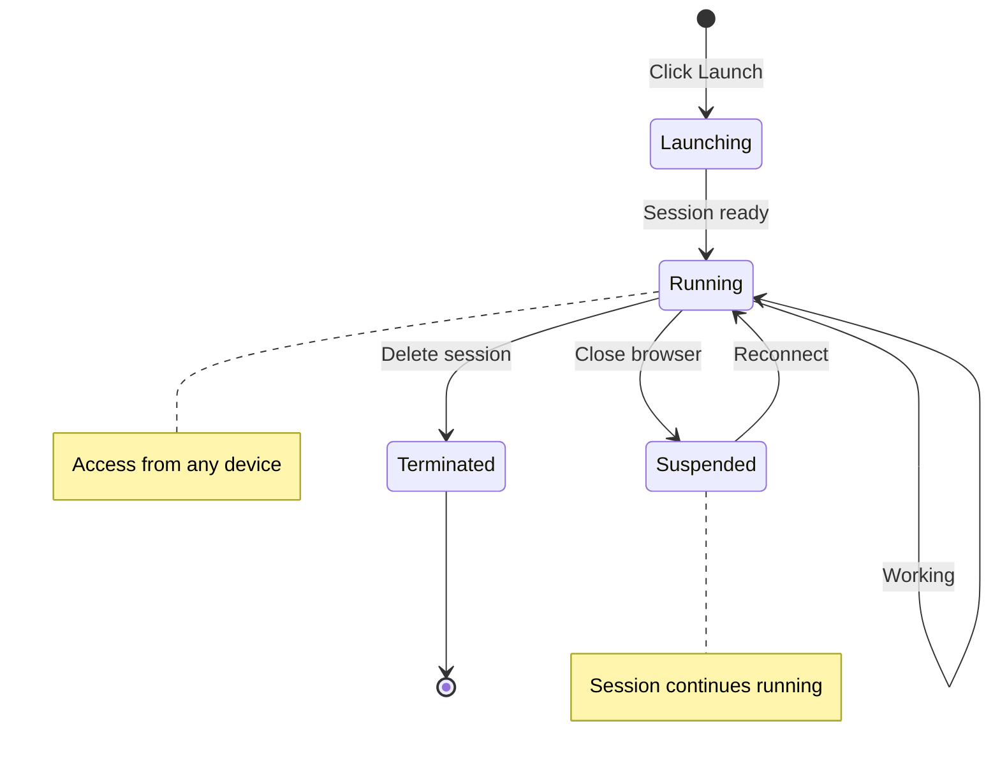

# Interactive Sessions

**Launch and manage interactive computing environments on CANFAR**

Interactive sessions provide web-based access to powerful computing resources with different interfaces optimized for specific workflows. Whether you're analyzing data in Jupyter notebooks, visualizing radio astronomy images, or running GUI applications, CANFAR's interactive sessions make it easy to get started.

## 🎯 Session Types Overview

CANFAR supports multiple session types, each optimized for different research workflows:

| Session Type | Interface | Best For | Key Features |
|--------------|-----------|----------|--------------|
| **[📓 Notebook](launch-notebook.md)** | JupyterLab | Data analysis, coding, documentation | Interactive Python, visualization, markdown |
| **[🖥️ Desktop](launch-desktop.md)** | Linux desktop | GUI applications, legacy software | Full desktop environment, X11 apps |
| **[📊 CARTA](launch-carta.md)** | CARTA viewer | Radio astronomy visualization | Cube analysis, region tools, catalogs |
| **[🔥 Firefly](launch-firefly.md)** | Firefly viewer | LSST data, table visualization | Image viewer, catalog overlay, cutouts |
| **[⚙️ Contributed](launch-contributed.md)** | Various | Community applications | Specialized tools, custom interfaces |

## 🚀 Quick Start Guide

### Step 1: Access the Science Portal

1. **Login** to [CANFAR Portal](https://www.canfar.net)
2. **Navigate** to "Science Portal" 
3. **Click** the plus sign (**+**) to create a new session

### Step 2: Choose Session Type

Select the interface that best matches your workflow:

=== "📓 Data Analysis"
    **Session Type:** `notebook`  
    **Container:** `astroml`  
    **Use Case:** Python analysis, Jupyter notebooks, data exploration

=== "📡 Radio Astronomy" 
    **Session Type:** `carta`  
    **Container:** `carta`  
    **Use Case:** Radio cube visualization, source analysis, imaging

=== "🖥️ GUI Applications"
    **Session Type:** `desktop`  
    **Container:** `desktop` or `astroml`  
    **Use Case:** CASA, DS9, image viewers, legacy tools

=== "🔬 Table Analysis"
    **Session Type:** `firefly`  
    **Container:** `firefly`  
    **Use Case:** LSST data, catalog visualization, image cutouts

### Step 3: Configure Resources

**Session Name:** Choose a descriptive name (e.g., "galaxy-photometry", "alma-reduction")

**Memory (RAM):**
- 8GB: Light analysis, small datasets
- 16GB: Default, suitable for most work
- 32GB+: Large datasets, memory-intensive tasks

**CPU Cores:**
- 2 cores: Default, recommended for most tasks
- 4+ cores: Parallel processing, intensive computations

**GPU (if available):**
- None: Standard CPU-only work
- 1 GPU: Machine learning, image processing

### Step 4: Launch and Connect

1. **Click** "Launch" and wait for initialization (~30-60 seconds)
2. **Session appears** on your portal dashboard
3. **Click** the session icon to connect
4. **Start working** in your interactive environment

## 📱 Session Management

### Session Lifecycle



### Session Limits

| Limit | Value | Notes |
|-------|-------|-------|
| **Concurrent sessions** | 3 active sessions | Across all session types |
| **Session duration** | 4 days maximum | Can be renewed indefinitely |
| **Idle timeout** | None | Sessions run until manually deleted |
| **Storage** | Persistent | Files saved to `/arc/` persist |

### Managing Active Sessions

#### From the Science Portal

- **View all sessions:** Portal dashboard shows active sessions
- **Connect to session:** Click session icon
- **Extend session:** Use "Renew" button before expiration
- **Delete session:** Click "X" to terminate and free resources

#### From Command Line

```bash
# List your active sessions
curl -H "Authorization: Bearer $TOKEN" \
  https://ws-uv.canfar.net/skaha/v0/session

# Delete specific session
curl -X DELETE \
  -H "Authorization: Bearer $TOKEN" \
  https://ws-uv.canfar.net/skaha/v0/session/SESSION_ID
```

### Session Sharing

Share running sessions with collaborators in your group:

1. **Copy session URL** from browser address bar
2. **Share with team member** (must be in same CANFAR group)
3. **Collaborate in real-time** - both can see and modify the same session

!!! warning "Security Note"
    Only share session URLs with trusted collaborators. Anyone with the URL and proper group membership can access your session.

## 🔧 Advanced Session Features

### Resource Allocation

#### Memory Management

```bash
# Check memory usage in session
free -h
htop

# Monitor specific process
ps aux | grep python
```

**Memory Tips:**
- Start with default 16GB, increase if needed
- Large datasets may require 32GB+ 
- Memory is shared - be considerate of other users

#### CPU Usage

```bash
# Check CPU cores available
nproc

# Monitor CPU usage
top
htop

# Run parallel processing
python -c "import multiprocessing; print(f'CPUs: {multiprocessing.cpu_count()}')"
```

### GPU Access

For containers with GPU support (e.g., `astroml-cuda`):

```bash
# Check GPU availability
nvidia-smi

# Test GPU in Python
python -c "import torch; print(f'CUDA available: {torch.cuda.is_available()}')"

# Monitor GPU usage
watch -n 1 nvidia-smi
```

### Persistent Configuration

Save personal settings that persist across sessions:

```bash
# Jupyter configuration
mkdir -p /arc/home/$USER/.jupyter
cp jupyter_config.py /arc/home/$USER/.jupyter/

# Shell configuration
echo "alias ll='ls -la'" >> /arc/home/$USER/.bashrc

# Python packages (user installation)
pip install --user astroplan
```

### Session Networking

#### Port Forwarding

For custom web applications running in sessions:

```bash
# In session: Run application on specific port
python -m http.server 8080

# Application accessible at: https://SESSION_URL/proxy/8080/
```

#### External Access

Sessions are accessible from anywhere with proper authentication:

- **Same computer:** Original browser window
- **Different computer:** Copy session URL, login with CADC credentials  
- **Mobile device:** Session URL works in mobile browsers

## 🛡️ Security and Best Practices

### Data Security

**✅ Do:**
- Save important work to `/arc/projects/` or `/arc/home/`
- Use group permissions for collaborative data
- Regularly save and backup critical results
- Log out of shared computers

**❌ Don't:**
- Store sensitive data in `/scratch/` (wiped at session end)
- Share session URLs publicly
- Leave sessions running unnecessarily
- Store passwords in plain text files

### Performance Optimization

#### Session Performance

```bash
# Close unused applications to free memory
# Kill runaway processes
kill -9 PID

# Clean temporary files
rm -rf /scratch/temp_*
```

#### Storage Performance

```bash
# Use /scratch/ for intensive I/O
cp /arc/projects/data.fits /scratch/
# ... process in /scratch/ ...
cp /scratch/results.fits /arc/projects/

# Compress large files
gzip large_dataset.fits
```

### Troubleshooting Common Issues

#### Session Won't Start

**Problem:** Session stuck in "Launching" state

**Solutions:**
1. Check resource availability - try lower memory/CPU
2. Wait 2-3 minutes for container download
3. Try different container image
4. Contact support if persistent

#### Session Disconnected

**Problem:** Lost connection to running session

**Solutions:**
1. Refresh browser page
2. Click session icon again from portal
3. Check internet connection
4. Clear browser cache if needed

#### Out of Memory Errors

**Problem:** Application crashes with memory errors

**Solutions:**
1. Launch new session with more memory
2. Process data in smaller chunks
3. Use `/scratch/` for temporary files
4. Optimize code for memory efficiency

#### Slow Performance

**Problem:** Session responding slowly

**Solutions:**
1. Check system resources (`htop`, `free -h`)
2. Close unnecessary applications
3. Use `/scratch/` for I/O intensive tasks
4. Consider launching session with more resources

## 🔗 Session-Specific Guides

Detailed guides for each session type:

- **[📓 Jupyter Notebooks →](launch-notebook.md)** - Interactive data analysis and visualization
- **[🖥️ Desktop Environment →](launch-desktop.md)** - GUI applications and legacy software
- **[📊 CARTA Viewer →](launch-carta.md)** - Radio astronomy cube visualization
- **[🔥 Firefly Viewer →](launch-firefly.md)** - LSST image and table visualization  
- **[⚙️ Contributed Apps →](launch-contributed.md)** - Community-developed tools

## 🔗 What's Next?

Once you're comfortable with interactive sessions:

- **[Storage Guide →](../storage/index.md)** - Manage data across sessions
- **[Batch Jobs →](../batch-jobs/index.md)** - Automate workflows  
- **[Container Guide →](../containers/index.md)** - Customize software environments
- **[Radio Astronomy →](../radio-astronomy/index.md)** - Specialized workflows

---

!!! tip "Session Success Tips"
    1. **Start small** - Use default resources and scale up if needed
    2. **Save frequently** - Important work should go in `/arc/` directories  
    3. **Share wisely** - Session URLs are powerful - only share with trusted collaborators
    4. **Monitor resources** - Keep an eye on memory and CPU usage with `htop`
    5. **Clean up** - Delete finished sessions to free resources for others
