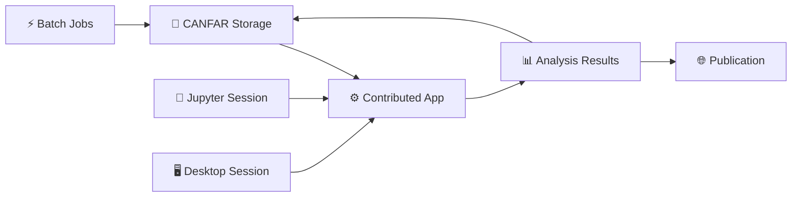

# Launching Contributed Applications

**Access community-developed tools and specialized research applications**

Contributed applications are specialized tools developed by the CANFAR community and external collaborators. These applications provide unique interfaces and capabilities not available in standard session types, often targeting specific astronomical workflows or research domains.

## 🎯 What are Contributed Applications?

Contributed applications are web-based tools that:

- **Extend CANFAR's capabilities** beyond standard notebook/desktop sessions
- **Provide specialized interfaces** for specific research tasks  
- **Integrate with CANFAR storage** and authentication systems
- **Offer unique workflows** not possible with standard tools
- **Support community innovation** and tool sharing

### Types of Contributed Applications

| Category | Examples | Use Cases |
|----------|----------|-----------|
| **Data Visualization** | Custom plotters, 3D viewers | Specialized data presentation |
| **Analysis Tools** | Statistical packages, fitting tools | Domain-specific analysis |
| **Simulation Interfaces** | Parameter exploration, result viewers | Computational astronomy |
| **Pipeline Managers** | Workflow controllers, job schedulers | Automated data processing |
| **Educational Tools** | Interactive tutorials, demonstrations | Teaching and outreach |

## 🚀 Launching Contributed Applications

### Step 1: Access Session Creation

1. **Login** to the [CANFAR Science Portal](https://www.canfar.net)
2. **Click** the plus sign (**+**) to create a new session
3. **Select** `contributed` as your session type


### Step 2: Choose Application

The container dropdown will show available contributed applications:


**Currently Available Applications:**

| Application | Container | Purpose |
|-------------|-----------|---------|
| **Custom Plotter** | `myproject/plotter:latest` | Advanced data visualization |
| **Survey Explorer** | `community/survey-tool:v2.1` | Large dataset exploration |
| **Simulation Viewer** | `simteam/viewer:stable` | Simulation result analysis |
| **Pipeline Controller** | `workflows/manager:latest` | Automated processing control |

!!! note "Dynamic Application List"
    The available applications change as the community contributes new tools. Contact [support@canfar.net](mailto:support@canfar.net) to add your application to the catalog.

### Step 3: Configure Resources

#### Session Name
Choose a descriptive name related to the application:
- `survey-exploration-2024`
- `simulation-analysis`  
- `custom-visualization`


#### Resource Requirements

**Memory (RAM):**
- **8GB**: Simple web interfaces, small datasets
- **16GB**: Default, suitable for most contributed apps
- **32GB+**: Memory-intensive applications, large data processing

**CPU Cores:**
- **2 cores**: Web interfaces, light computation
- **4+ cores**: Compute-intensive contributed applications


### Step 4: Launch and Access

1. **Click** "Launch" and wait for initialization
2. **Session appears** on your portal dashboard  
3. **Click** the session icon to access the application
4. **Application loads** in your browser (usually takes 30-60 seconds)


## 🔧 Working with Contributed Applications

### Common Interface Patterns

Most contributed applications follow web application conventions:

#### Navigation Structure
```
Application Header
├── Menu/Navigation Bar
├── Main Content Area
│   ├── Control Panels
│   ├── Data Display
│   └── Results Area
└── Status/Information Footer
```

#### Data Access Patterns
```bash
# Applications typically access CANFAR storage via:
/arc/projects/yourproject/    # Project data
/arc/home/yourusername/       # Personal files
/scratch/                     # Temporary processing
```

### Standard Features

#### File Upload/Download
Most contributed applications support:
- **Drag-and-drop** file upload
- **Browse** local computer files
- **Direct access** to CANFAR storage
- **Export results** in various formats

#### Authentication Integration
- **Automatic login** using your CANFAR credentials
- **Group-based access** to shared resources
- **Session sharing** with collaborators
- **API integration** for programmatic access

#### Real-time Collaboration
- **Multi-user access** to the same application instance
- **Shared workspaces** and analysis sessions
- **Live updates** when collaborators make changes
- **Comment and annotation** systems

## 🛠️ Example Applications

### Data Visualization Suite

**Purpose:** Advanced plotting and visualization beyond standard tools

**Features:**
- Interactive 3D scatter plots with astronomical coordinates
- Multi-dimensional data exploration with linked views
- Custom plot types for specialized datasets
- Export publication-quality figures

**Usage Example:**
```python
# Upload your catalog data
1. Click "Upload Data" 
2. Select FITS table or CSV file
3. Choose columns for X, Y, Z axes
4. Apply filters and color coding
5. Generate interactive 3D visualization
6. Export plot for publication
```

### Survey Data Explorer

**Purpose:** Interactive exploration of large astronomical surveys

**Features:**
- Query multiple survey databases simultaneously  
- Cross-match catalogs with spatial constraints
- Visualize source distributions on sky maps
- Extract cutout images around interesting sources

**Workflow:**
```
1. Define search region (coordinates, radius)
2. Select surveys to query (GAIA, 2MASS, WISE, etc.)
3. Apply magnitude and color filters
4. View results on interactive sky map
5. Generate cutout images for selected sources
6. Export matched catalog for further analysis
```

### Simulation Parameter Explorer

**Purpose:** Interactive exploration of simulation parameter space

**Features:**
- Upload simulation grids and parameter files
- Visualize parameter dependencies and correlations
- Compare simulation outputs with observations
- Optimize parameters for best-fit models

**Example Usage:**
```
1. Upload simulation grid data
2. Define observable quantities
3. Set observational constraints
4. Explore parameter space interactively
5. Identify best-fit parameter combinations
6. Export optimized models
```

### Pipeline Management Interface

**Purpose:** Visual management of complex data processing workflows

**Features:**
- Design processing pipelines with drag-and-drop interface
- Monitor job status and resource usage
- Debug failed processing steps
- Scale processing to available resources

**Typical Workflow:**
```
1. Define input data sources
2. Configure processing steps
3. Set output destinations
4. Submit pipeline for execution
5. Monitor progress in real-time
6. Review results and logs
```

## 🔒 Security and Access Control

### Application Permissions

Contributed applications run with the same permissions as your CANFAR account:

**✅ Can Access:**
- Your `/arc/home/` directory
- Project directories you're a member of
- VOSpace areas you have permission for
- Public data archives and services

**❌ Cannot Access:**
- Other users' private data
- System administration functions
- Restricted computing resources
- External networks (unless specifically configured)

### Data Security Best Practices

**For Application Users:**
```
- Review application documentation before using
- Understand what data the application accesses
- Don't upload sensitive credentials to applications
- Use group permissions for collaborative data
```

**For Application Developers:**
```
- Follow CANFAR security guidelines
- Implement proper input validation
- Use HTTPS for all web interfaces
- Document data access patterns clearly
```

## 🧑‍💻 Developing Contributed Applications

### Application Requirements

To contribute an application to CANFAR:

#### Technical Requirements
```dockerfile
# Base your application on approved base images
FROM images.canfar.net/skaha/astroml:latest

# Web interface should run on port 5000
EXPOSE 5000

# Include proper metadata labels
LABEL ca.nrc.cadc.skaha.session.type="contributed"
LABEL ca.nrc.cadc.skaha.session.app="My Custom Application"

# Ensure proper user permissions
USER $NB_UID
WORKDIR /arc/home/$NB_USER
```

#### Interface Standards
- **Web-based interface** accessible via HTTP/HTTPS
- **Responsive design** for different screen sizes
- **Integration** with CANFAR authentication
- **Documentation** and user guides

#### Data Integration
```python
# Example: Access CANFAR storage in your application
import os
import vos

# Access project data
project_path = "/arc/projects/myproject"
files = os.listdir(project_path)

# Access VOSpace
client = vos.Client()
vospace_files = client.listdir("vos:myproject")

# User home directory
home_path = f"/arc/home/{os.environ['USER']}"
```

### Development Workflow

1. **Design Application**
   - Define user requirements and workflows
   - Choose appropriate web framework (Flask, FastAPI, etc.)
   - Plan data integration with CANFAR storage

2. **Build Container**
   - Create Dockerfile based on CANFAR standards
   - Include all dependencies and configurations
   - Test locally with Docker

3. **Test on CANFAR**
   - Push container to Harbor registry
   - Launch test sessions using your container
   - Verify storage access and functionality

4. **Documentation**
   - Write user guide and tutorials
   - Document installation and configuration
   - Provide example datasets and workflows

5. **Community Review**
   - Submit application for review
   - Address feedback and security concerns
   - Integrate with CANFAR documentation

### Submission Process

Contact [support@canfar.net](mailto:support@canfar.net) with:

**Application Information:**
- Name and description
- Target user community
- Key features and workflows
- Container image location

**Documentation Package:**
- User guide and tutorials
- Technical documentation
- Example datasets (if applicable)
- Maintenance plan and contact information

**Review Criteria:**
- Scientific value to the astronomy community
- Technical quality and security
- Documentation completeness
- Maintenance commitment

## 🆘 Troubleshooting

### Common Issues

**Application Won't Load:**
```
- Wait 60-90 seconds for full initialization
- Check browser console for JavaScript errors
- Try refreshing the page
- Verify session is running in portal dashboard
```

**Cannot Access Data:**
```
- Verify file paths in application interface
- Check CANFAR group membership for shared data
- Ensure files exist in expected locations
- Contact application developer for specific issues
```

**Performance Problems:**
```
- Check application resource requirements
- Launch session with more memory/CPU if needed
- Monitor system resources with browser dev tools
- Close other browser tabs and applications
```

**Application-Specific Issues:**
```
- Consult application documentation
- Check application logs (if available)
- Contact application developer/maintainer
- Report issues via CANFAR support channels
```

## 📚 Available Applications Catalog

### Current Contributed Applications

!!! info "Dynamic Catalog"
    The list of available contributed applications is constantly evolving. Visit the [CANFAR Portal](https://www.canfar.net) for the most current list of available applications.

#### Astronomy Visualization Tools
- **Advanced Plotter v2.1** - Multi-dimensional data visualization
- **Sky Map Explorer** - Interactive celestial coordinate displays
- **Spectral Analyzer** - 1D and 2D spectroscopy tools

#### Data Analysis Interfaces
- **Survey Cross-matcher** - Multi-catalog matching tools
- **Parameter Explorer** - Simulation and model fitting
- **Time Series Analyzer** - Light curve and periodicity analysis

#### Educational Applications
- **Astronomy Calculator** - Interactive astronomical calculations
- **Coordinate Converter** - Multi-system coordinate transformations
- **Unit Converter** - Scientific unit conversions

### Requesting New Applications

**For Users:**
If you need functionality not available in current applications:

1. **Check existing tools** - Verify capability doesn't exist
2. **Contact community** - Ask on Discord if others need similar tools
3. **Submit feature request** - Email [support@canfar.net](mailto:support@canfar.net)
4. **Consider development** - Contribute your own application

**For Developers:**
If you want to contribute an application:

1. **Review guidelines** - Study existing applications and documentation
2. **Prototype locally** - Build and test your application
3. **Submit proposal** - Contact CANFAR team with application plan
4. **Collaborate on integration** - Work with team on deployment

## 🔗 Integration with Other CANFAR Tools

### Data Workflow Integration



**Example Integrated Workflow:**
1. **Process data** in Jupyter notebook session
2. **Analyze results** in contributed visualization application
3. **Save outputs** to shared project storage
4. **Generate figures** for publication
5. **Archive final products** in VOSpace

### Cross-Session Collaboration

- **Share session URLs** for real-time collaboration
- **Access common data** through `/arc/projects/`
- **Hand off analysis** between different session types
- **Maintain analysis provenance** with shared notebooks

## 🔗 What's Next?

Contributed applications work best as part of comprehensive workflows:

- **[Storage Guide →](../storage/index.md)** - Manage data for applications
- **[Notebook Sessions →](launch-notebook.md)** - Prepare data for specialized tools
- **[Batch Processing →](../batch-jobs/index.md)** - Automate workflows with applications
- **[Container Development →](../containers/index.md)** - Build your own contributed app

---

!!! tip "Contributed Application Success Tips"
    1. **Explore available applications** - Check what's already available before requesting new tools
    2. **Read documentation** - Each application has unique features and workflows
    3. **Start with examples** - Use provided sample data to learn the interface
    4. **Collaborate effectively** - Share sessions with team members for training
    5. **Provide feedback** - Help developers improve applications by reporting issues and suggestions
