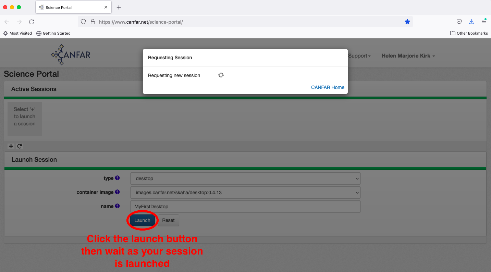
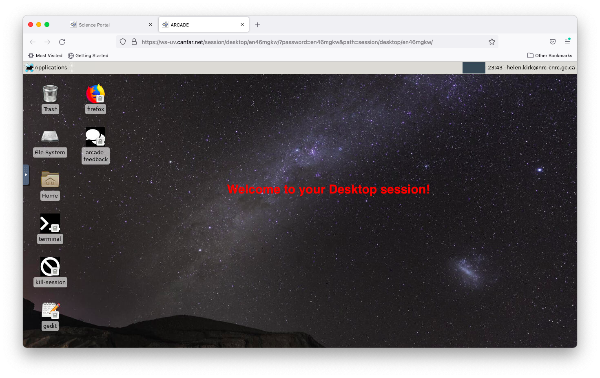
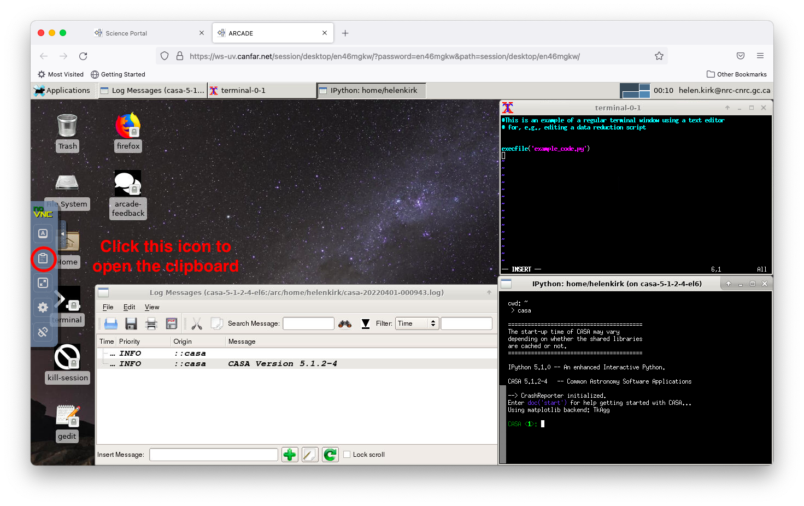

# Launching Desktop Sessions

Desktop sessions provide a full Linux graphical environment in your browser, giving you access to traditional astronomy software with familiar desktop interfaces. This guide walks you through launching and using desktop sessions on the CANFAR Science Platform.

!!! abstract "🎯 What You'll Learn"
    - How to launch, connect, and size desktop sessions
    - What software is available and how to launch it
    - How to manage files and storage within desktop sessions
    - Tips for collaboration, performance, and troubleshooting

## Overview

Desktop sessions offer:

- **Full Linux desktop**: Complete graphical environment in your browser
- **Multi-application workflow**: Run multiple programs simultaneously
- **Traditional interfaces**: Use software with graphical user interfaces
- **File management**: Visual file browser and management tools
- **Session persistence**: Resume work exactly where you left off

Common use cases include:

- Running GUI-based astronomy software (DS9, SAOImage, IRAF)
- Complex multi-step workflows requiring multiple applications
- Teaching and demonstration scenarios
- Legacy software that requires a desktop environment

## Creating a Desktop Session

### Step 1: Select Session Type

From the Science Portal dashboard, click the **plus sign (+)** to create a new session, 
then select **desktop** as your session type.

> 

### Step 2: Choose Container

The desktop container includes a comprehensive set of astronomy software. Currently, 
there's one main desktop environment available with pre-installed tools.

> 

### Step 3: Configure Session

#### Session Name

Give your session a descriptive name that will help you identify it later 
(e.g., "data-reduction", "teaching-session", "multi-instrument-analysis").

> 

#### Resource Configuration

Desktop sessions typically require more resources than other session types:

**Memory (RAM)**:
- **16GB (recommended)**: Standard desktop usage
- **32GB**: Multiple applications or large datasets
- **64GB**: Intensive workflows with large data

**CPU Cores**:
- **2 cores**: Basic desktop operations
- **4 cores (recommended)**: Multiple applications
- **8+ cores**: Compute-intensive desktop workflows

### Step 4: Launch Session

Click the **Launch** button and wait for your session to initialize. Desktop sessions 
may take slightly longer to start than other session types.

> 

Your session will appear on the Science Portal dashboard. Click the desktop icon to access your session.

> 

!!! note "Connection Timing"
    Sometimes it takes a few seconds for the session link to work properly. If you see a "Bad gateway" error, wait a moment and try again.

## Connecting to Your Desktop

### Initial Connection

Click the **Connect** button to access your desktop environment.

> 

### Desktop Environment

You'll see a full Linux desktop environment with:

- **Taskbar**: Application launcher and system controls
- **File manager**: Browse your storage and files
- **Terminal**: Command-line access
- **Pre-installed software**: Astronomy applications ready to use

> 

### Session Persistence

When your session becomes inactive, you'll be returned to the connection page. 
Click **Connect** again to resume exactly where you left off - all your applications 
and work remain open.

## Available Software

### Astronomy Applications

Your desktop session includes:

- **DS9**: Advanced FITS image viewer and analyzer
- **SAOImage**: Astronomical image display
- **CASA**: Complete radio astronomy suite with GUI
- **Python environments**: With Jupyter, AstroPy, and other libraries
- **IRAF/PyRAF**: Legacy optical astronomy reduction (if needed)

### Development Tools

- **Text editors**: gedit, vim, emacs
- **IDEs**: Available through package installation
- **Version control**: Git and other VCS tools
- **Compilers**: GCC, Python, and other development tools

### System Tools

- **File manager**: Graphical file operations
- **Terminal**: Full shell access
- **System monitor**: Resource usage monitoring
- **Network tools**: File transfer and connectivity utilities

## Working with Applications

### Launching Applications

**Method 1: Application Menu**
1. Click the applications menu in the taskbar
2. Browse categories (Graphics, Science, Development)
3. Click to launch your chosen application

**Method 2: Terminal**
```bash
# Launch DS9
ds9 &

# Launch CASA with GUI
casa --gui &

# Launch Python with astronomy libraries
ipython --pylab
```

**Method 3: File Association**
- Double-click FITS files to open in DS9
- Right-click files for "Open with" options

### Example: Multi-Application Workflow

Here's a typical desktop workflow for optical astronomy:

1. **File Management**: Use file manager to organize data
2. **Image Display**: Open FITS files in DS9 for inspection
3. **Analysis**: Launch Python/Jupyter for data analysis
4. **Documentation**: Use text editor for notes and scripts
5. **Results**: Save plots and analysis outputs

### CASA Desktop Usage

To use CASA with its graphical interface:

```bash
# Launch CASA with GUI
casa --gui

# Or use the interactive shell
casa
```

The desktop environment allows you to use CASA's plotting and visualization 
tools that aren't available in command-line mode.

## Desktop Session Tips

### Copy & Paste Between Containers

Since different containers (e.g., CASA and terminal windows) in a desktop session may run on different remote computers, copying and pasting text between containers requires using the **Clipboard** application.

#### Accessing the Clipboard

1. **Open the Clipboard**: Click the arrow at the far left of the desktop to open the application menu
2. **Find Clipboard**: Look for "Clipboard" in the middle of the application list and click it

> 

#### Using the Clipboard

The Clipboard serves as an intermediary for transferring text between containers:

1. **Copy text**: Highlight text in the source container and use `Ctrl+Shift+C`
2. **Transfer via Clipboard**: The text should appear in the Clipboard application
3. **Select in Clipboard**: Highlight the text in the Clipboard and press `Ctrl+Shift+C`
4. **Paste to target**: Click in the destination container and use `Ctrl+Shift+V`

> 

!!! tip "Keyboard Shortcuts"
    - **Copy**: `Ctrl+Shift+C`
    - **Paste**: `Ctrl+Shift+V`
    - These shortcuts work consistently across all desktop containers

### Adjusting Font Size

Desktop containers support adjustable font sizes for better readability:

#### Changing Terminal Font Size

1. **Access font menu**: Hold `Ctrl` and right-click anywhere in a terminal window
2. **Select size**: Choose from the available font size options (Small, Medium, Large)
3. **Apply immediately**: Font changes take effect instantly

> 

This feature works in:
- Terminal windows
- CASA command-line interface
- Text-based applications

!!! note "Font Persistence"
    Font size changes apply only to the current session. You'll need to readjust when starting new sessions.

## File Management

### Storage Access

Your desktop session provides access to:

- **`/arc/projects/[group]/`**: Shared project storage
- **`/arc/home/[username]/`**: Personal persistent storage
- **`/home/[username]/`**: Session-local home directory
- **`/tmp/`**: Temporary scratch space

!!! warning "Persistence Reminder"
    Use `/arc/projects/` or `/arc/home/` for important files. The session-local home and `/tmp/` are not guaranteed to persist after the session ends.

### File Operations

Use the graphical file manager for:

- **Drag-and-drop**: Move files between directories
- **Visual browsing**: Preview images and data files
- **Batch operations**: Select multiple files for operations
- **Permissions**: Set file and directory permissions

### Data Transfer

Transfer files to/from your desktop session:

- **Browser upload**: Use Science Portal file manager
- **Command line**: `scp`, `rsync`, `wget`
- **Cloud storage**: Mount external storage systems
- **USB/local**: Upload through browser interface

## Session Management

### Resource Monitoring

Monitor your session resources:

```bash
# Check memory usage
free -h

# Monitor CPU usage
htop

# Check disk space
df -h /arc /tmp
```

### Performance Optimization

- **Close unused applications**: Free up memory and CPU
- **Use virtual desktops**: Organize workflows across multiple desktops
- **Monitor network**: Large file transfers can affect responsiveness

### Ending Sessions

To properly end your desktop session:

1. **Save all work**: Ensure data is saved to persistent storage
2. **Close applications**: Exit programs cleanly
3. **Disconnect**: Close the browser tab
4. **Delete session**: Use Science Portal to free resources

## Collaboration Features

### Screen Sharing

Share your desktop session with collaborators:

1. Access session sharing from Science Portal
2. Add collaborator usernames
3. Set permissions (view-only or full control)
4. Collaborators see your full desktop in real-time

### Teaching and Demonstration

Desktop sessions are ideal for:

- **Live demonstrations**: Show software usage to groups
- **Hands-on training**: Students can follow along
- **Collaborative debugging**: Work together on problems
- **Code review**: Visual examination of code and results

## Troubleshooting

### Common Issues

**Session won't connect**
- Wait 30 seconds and try again
- Check browser compatibility (Chrome/Firefox recommended)
- Disable browser extensions that might interfere

**Poor performance**
- Check resource usage with `htop`
- Close unnecessary applications
- Consider increasing session memory

**Applications won't start**
- Check for error messages in terminal
- Verify sufficient memory available
- Try launching from command line for error details

**File access problems**
- Verify paths to `/arc/projects/[group]/`
- Check group permissions
- Ensure files aren't locked by other processes

### Browser Optimization

For best performance:

- **Use Chrome or Firefox**: Best compatibility and performance
- **Close other tabs**: Free up browser memory
- **Stable connection**: Ensure reliable internet connection
- **Disable browser extensions**: Remove potential conflicts

### Getting Help

- **Support**: Email [support@canfar.net](mailto:support@canfar.net)
- **Community**: Join our Discord for desktop tips
- **Documentation**: Check software-specific guides for DS9, CASA, etc.

## Best Practices

### Resource Management

- **Plan resource needs**: Estimate memory for your workflow
- **Monitor usage**: Check system resources regularly
- **Clean up**: Remove temporary files when finished

### Workflow Organization

- **Organize windows**: Use multiple desktops for complex workflows
- **Save frequently**: Desktop sessions can be terminated for maintenance
- **Document work**: Keep notes on your analysis steps

### Data Management

- **Use persistent storage**: Save important work to `/arc/`
- **Organize files**: Create clear directory structures
- **Backup results**: Important outputs should be backed up

## Next Steps

- **[CASA Desktop Workflows](../radio-astronomy/casa-workflows.md)**: Advanced CASA usage
- **[Radio Astronomy Guide](../radio-astronomy/index.md)**: Desktop-based radio analysis workflows
- **[Batch Processing](../batch-jobs/index.md)**: Scale up desktop workflows
- **[Notebook Sessions](launch-notebook.md)**: Alternative analysis environment
