# Launching a Firefly Session

**The LSST table and image visualizer for astronomical data exploration**

Firefly is a powerful web-based visualization tool originally developed for the Rubin Observatory LSST. It provides advanced capabilities for viewing images, overlaying catalogs, and analyzing tabular data - making it perfect for survey data analysis and multi-wavelength astronomy.

## 🎯 What is Firefly?

Firefly offers specialized tools for:

- **Image visualization** with advanced stretch and color controls
- **Catalog overlay** and source analysis tools  
- **Table viewer** with filtering, plotting, and statistical tools
- **Multi-wavelength data** comparison and analysis
- **Large survey datasets** like LSST, HSC, and WISE

### Key Features

| Feature | Capability |
|---------|------------|
| **Image Display** | FITS images with WCS support, multiple panels |
| **Catalog Overlay** | Plot sources on images, interactive selection |
| **Table Analysis** | Sort, filter, plot columns, statistical analysis |
| **Multi-band** | RGB color composites, band switching |
| **Cutout Services** | Extract subimages from large surveys |
| **Coordinate Systems** | Support for all standard astronomical coordinates |

## 🚀 Launching Firefly

### Step 1: Create New Session

1. **Login** to the [CANFAR Science Portal](https://www.canfar.net/science-portal)
2. **Click** the plus sign (**+**) to create a new session
3. **Select** `firefly` as your session type


### Step 2: Choose Container

The container selection updates automatically after choosing the session type. Select the Firefly container version you need:

- **firefly:latest** - Most recent stable version (recommended)
- **firefly:X.X** - Specific version for reproducible analysis


### Step 3: Configure Session

#### Session Name
Choose a descriptive name that helps identify your work:
- `lsst-photometry`
- `hsc-catalog-analysis` 
- `multiband-survey`


#### Memory Requirements
Select RAM based on your data size:

- **8GB**: Small catalogs, single images
- **16GB**: Default, suitable for most work
- **32GB**: Large catalogs, multiple images
- **64GB**: Very large survey datasets


#### CPU Cores
Most Firefly work is I/O bound rather than CPU intensive:

- **2 cores**: Default, sufficient for most visualization tasks
- **4 cores**: Large table operations, complex filtering


### Step 4: Launch Session

1. **Click** "Launch" button
2. **Wait** for container initialization (~30-60 seconds)
3. **Session appears** on your portal dashboard
4. **Click** the session icon to access Firefly


## 🔥 Using Firefly

### Interface Overview

Firefly's interface consists of several main areas:

```mermaid
graph TD
    Interface[Firefly Interface]
    
    Interface --> Upload[📁 File Upload Area]
    Interface --> Images[🖼️ Image Display]
    Interface --> Tables[📊 Table Viewer]
    Interface --> Tools[🔧 Analysis Tools]
    
    Upload --> Local[Local Files]
    Upload --> URLs[Remote URLs]
    Upload --> VOSpace[VOSpace Files]
    
    Images --> Display[Image Canvas]
    Images --> Controls[Display Controls]
    Images --> Overlays[Catalog Overlays]
    
    Tables --> Browse[Data Browser]
    Tables --> Filter[Filtering Tools]
    Tables --> Plot[Plotting Tools]
```



### Loading Data

#### Upload Local Files

**FITS Images:**
```
1. Click "Images" tab
2. Select "Upload" 
3. Choose FITS file from your computer
4. Image loads automatically with WCS if available
```

**Catalog Tables:**
```
1. Click "Tables" tab
2. Select "Upload"
3. Choose CSV, FITS table, or VOTable
4. Table opens in browser interface
```

#### Access CANFAR Storage

**From `arc` Projects:**
```bash
# Files in your project directory are accessible via:
# /arc/projects/yourproject/data/image.fits
# /arc/projects/yourproject/catalogs/sources.csv
```

**From VOSpace:**
```
1. In Firefly, use "File" → "Open"
2. Navigate to VOSpace URLs
3. Access: vos://cadc.nrc.ca~vault/yourproject/
```

#### Remote Data Access

**Survey Archives:**
```
# Example URLs for Firefly
https://archive.stsci.edu/hlsp/data.fits
https://irsa.ipac.caltech.edu/data/WISE/cutouts/
```

### Image Analysis

#### Basic Image Display

```
1. Load FITS image
2. Adjust stretch (log, linear, sqrt)
3. Set scale limits (min/max values)
4. Choose color table (heat, cool, rainbow)
```

#### Multi-band RGB

```
1. Load three images (e.g., g, r, i bands)
2. Select "RGB" mode
3. Assign each image to R, G, or B channel
4. Adjust relative scaling
```

#### Coordinate Systems

```
# Firefly supports standard coordinate systems:
- Equatorial (RA/Dec) - J2000, B1950
- Galactic coordinates
- Ecliptic coordinates  
- Pixel coordinates
```

### Catalog Analysis

#### Table Operations

**Basic Navigation:**
```
- Sort columns by clicking headers
- Filter rows using search box
- Select multiple rows with Ctrl+click
- Pan/zoom table with mouse wheel
```

**Advanced Filtering:**
```javascript
// Example filters (use in filter box):
magnitude < 20.5                    // Bright sources
color_g_r > 0.5 && color_g_r < 1.5  // Color selection
distance < 100                      // Distance constraint
```

#### Plotting Tools

**Column Plots:**
```
1. Select table columns for X and Y axes
2. Choose plot type (scatter, histogram, line)
3. Apply color coding by third column
4. Add error bars if available
```

**Image-Catalog Overlay:**
```
1. Load image and catalog table
2. Match coordinate columns (RA, Dec)
3. Select overlay symbol (circle, cross, diamond)
4. Adjust symbol size and color
5. Sources appear overlaid on image
```

### Advanced Features

#### Cutout Services

Extract subimages from large surveys:

```python
# Using Firefly's cutout interface
1. Right-click on image location
2. Select "Create Cutout"
3. Specify size (arcmin)
4. Choose format (FITS, JPEG, PNG)
5. Download or save to VOSpace
```

#### Multi-wavelength Analysis

```
1. Load images in different bands
2. Use "Blink" mode to compare
3. Create RGB composite
4. Overlay catalog with color-magnitude selection
5. Identify sources across wavelengths
```

#### Data Export

**Save Results:**
```
- Modified tables → CSV, FITS, VOTable formats
- Image displays → PNG, PDF for publications  
- Analysis plots → Vector formats for papers
- Session state → Save/restore workspace
```

## 🛠️ Common Workflows

### Survey Photometry

```
1. Load survey image (HSC, LSST, etc.)
2. Upload photometric catalog
3. Overlay sources on image
4. Filter by magnitude and color
5. Create color-magnitude diagram
6. Export selected sources
```

### Multi-object Analysis

```
1. Load target list (CSV with coordinates)
2. Create cutouts around each target
3. Measure properties in each cutout
4. Compile results in table
5. Plot trends and correlations
6. Save analysis products
```

### Time Series Visualization

```
1. Load time-series table (time, magnitude, error)
2. Create light curve plot
3. Apply period folding if needed
4. Identify outliers and trends
5. Export cleaned data
```

## 🔧 Integration with CANFAR

### Storage Access

**ARC Projects:**
```bash
# Your project data appears in Firefly file browser
/arc/projects/yourproject/
├── images/           # FITS images
├── catalogs/         # Source tables  
├── results/          # Analysis products
└── plots/            # Exported figures
```

**VOSpace Integration:**
```bash
# Access archived data
vos://cadc.nrc.ca~vault/yourproject/
├── published_data/   # Public datasets
├── working_data/     # Analysis in progress
└── final_products/   # Paper-ready results
```

### Collaborative Features

**Session Sharing:**
```
1. Copy Firefly session URL
2. Share with team members (same CANFAR group)
3. Collaborate on analysis in real-time
4. Each user sees same data and visualizations
```

**Data Sharing:**
```
1. Save analysis results to shared project space
2. Export publication-quality figures
3. Share VOSpace links for external collaborators
4. Version control important datasets
```

## 📊 Performance Tips

### Large Dataset Handling

**Memory Management:**
```
- Load subsets of large catalogs first
- Use server-side filtering when possible
- Close unused tables and images
- Monitor memory usage in browser
```

**Network Optimization:**
```
- Use compressed file formats (gzip FITS)
- Access local files when possible (/arc/projects)
- Cache frequently used data locally
- Use cutout services for large images
```

### Visualization Performance

**Image Display:**
```
- Use appropriate image size for screen resolution
- Apply reasonable stretch limits
- Close unused image panels
- Use PNG format for screenshots
```

**Table Operations:**
```
- Filter large tables before plotting
- Use sampling for very large datasets
- Index frequently used columns
- Batch operations when possible
```

## 🆘 Troubleshooting

### Common Issues

**Firefly Won't Load:**
```
- Check browser compatibility (Chrome, Firefox recommended)
- Clear browser cache and cookies
- Disable browser extensions that might interfere
- Try incognito/private browsing mode
```

**Images Not Displaying:**
```
- Verify FITS file format and WCS headers
- Check file permissions and accessibility
- Try loading smaller test image first
- Ensure sufficient memory allocation
```

**Tables Not Loading:**
```
- Verify file format (CSV, FITS table, VOTable)
- Check column headers and data types
- Ensure proper delimiter in CSV files
- Try loading subset of data first
```

**Performance Issues:**
```
- Reduce number of overlay sources
- Close unused browser tabs
- Increase session memory allocation
- Use more efficient file formats
```

## 🔗 External Resources

### Documentation
- **[Firefly User Guide](https://firefly-help.ipac.caltech.edu/)** - Comprehensive documentation
- **[LSST Science Pipelines](https://pipelines.lsst.io/)** - Integration with LSST tools
- **[IRSA Tutorials](https://irsa.ipac.caltech.edu/docs/tutorials/)** - Survey data tutorials

### Data Archives
- **[LSST Data Portal](https://data.lsst.cloud/)** - LSST survey data
- **[HSC Archive](https://hsc.mtk.nao.ac.jp/)** - Hyper Suprime-Cam data
- **[IRSA](https://irsa.ipac.caltech.edu/)** - Infrared survey data

## 🔗 What's Next?

Firefly works great with other CANFAR tools:

- **[Table Analysis →](../storage/vospace-api.md)** - Advanced catalog management
- **[Desktop Sessions →](launch-desktop.md)** - Use Firefly with other GUI tools
- **[Batch Processing →](../batch-jobs/index.md)** - Automate large survey analysis
- **[Container Guide →](../containers/index.md)** - Customize Firefly environment

---

!!! tip "Firefly Best Practices"
    1. **Start with small datasets** to learn the interface before tackling large surveys
    2. **Use appropriate memory** - large catalogs need more RAM than single images  
    3. **Save your work frequently** - export important results to `/arc/projects/`
    4. **Collaborate effectively** - share session URLs for real-time teamwork
    5. **Optimize performance** - close unused data and use efficient file formats
