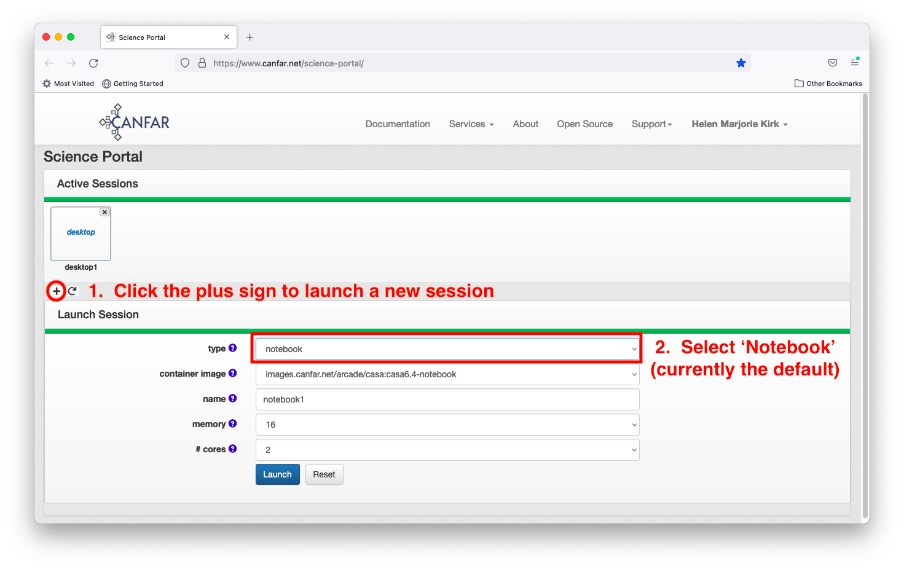
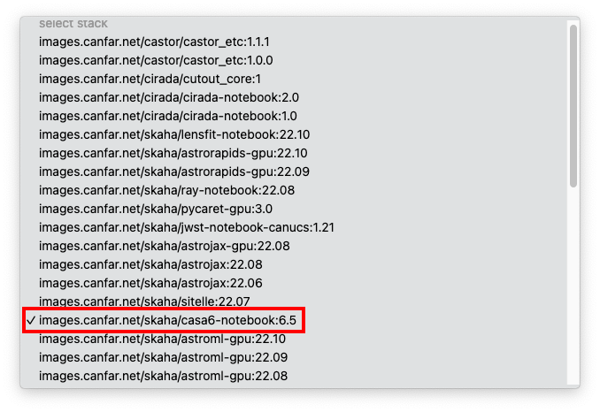
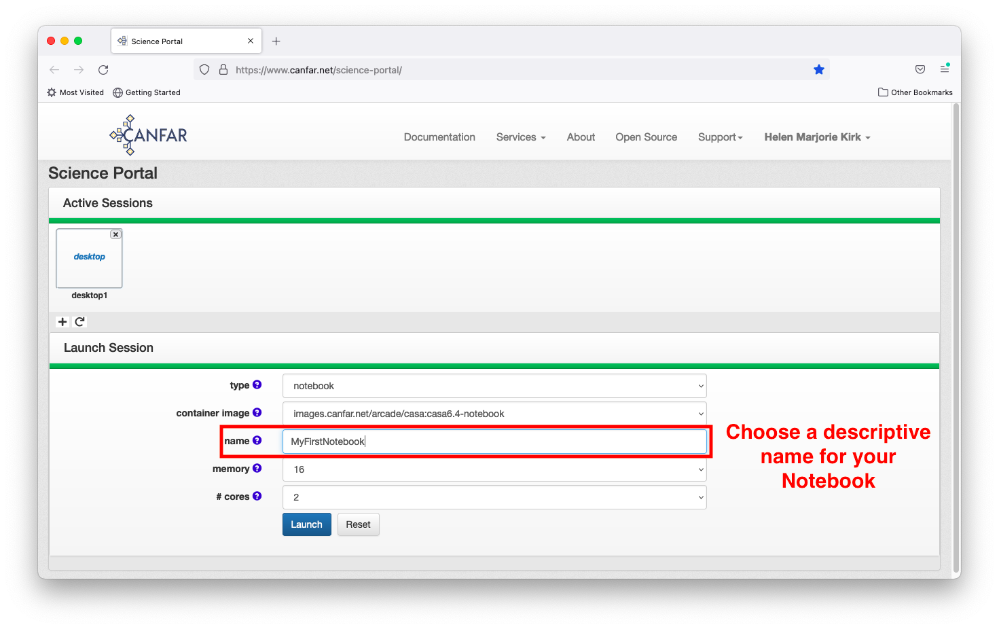
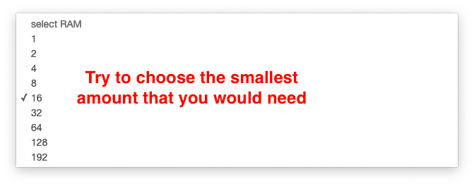

# Launching a Notebook Session 

This guide walks you through starting a Jupyter Lab session for interactive data analysis.

## Step 1: Access Session Creation

After logging into the Science Portal, click the **plus sign (+)** to create a new session, 
then select **notebook** as your session type.

> 
>
> 

## Step 2: Choose Your Container

Select a container image that includes the software you need. Each container comes pre-configured
with specific tools and libraries:

- **CASA 6.5-notebook**: Includes CASA (Common Astronomy Software Applications) for radio astronomy
- **astroconda**: Python astronomy libraries (AstroPy, NumPy, SciPy)
- **General purpose**: Standard Python data science stack

> 

## Step 3: Configure Session Resources

### Session Name
Choose a descriptive name that helps you identify this session later (e.g., "galaxy-photometry", "pulsar-analysis").

> 

### Memory (RAM) Selection
Select the maximum memory your analysis will require. **Start conservatively**—you can always launch
a new session with more memory if needed.

- **16GB (default)**: Suitable for most analyses, equivalent to a MacBook Pro
- **8GB**: Light data analysis, small datasets
- **32GB+**: Large datasets, memory-intensive computations

**Resource sharing**: Computing resources are shared among all users. Large memory requests
may delay session startup if resources are unavailable.

> 

### CPU Cores
Choose the number of processing cores based on your computational needs:

- **2 cores (default)**: Recommended for most tasks
- **1 core**: Simple analysis, single-threaded code
- **4+ cores**: Parallel processing, intensive computations

Most astronomy software uses only one core unless specifically configured for parallel processing.

> 

## Step 4: Launch Your Session

Click the **Launch** button to create your Notebook session. The system will:

1. Allocate computing resources
2. Pull the container image (if not cached)
3. Initialize your environment
4. Start Jupyter Lab

> 

## Step 5: Connect to Your Session

Wait for the Notebook icon to appear on your dashboard, then click it to access your session.
**Initial startup may take 2-3 minutes** if the container hasn't been used recently on this server.

> 

## Step 6: Start Working

Congratulations! You now have access to a fully-configured Jupyter Lab environment with astronomy software.

### Available Interfaces
- **Python 3 (ipykernel)**: Standard Python with astronomy libraries
- **Terminal**: Command-line access for advanced operations
- **File Browser**: Navigate your `/arc` storage directories

### Example: Using CASA in Jupyter
You can run CASA (Common Astronomy Software Applications) commands directly in Python notebooks:

> 
>
> 

## Next Steps

- **[Data Analysis Tutorial](../tutorials/data-analysis.md)**: Learn common astronomy workflows
- **[File Management](../user-guide/web-file-manager.md)**: Upload and organize your data
- **[Storage Guide](../storage-systems-guide.md)**: Understand CANFAR's storage systems
