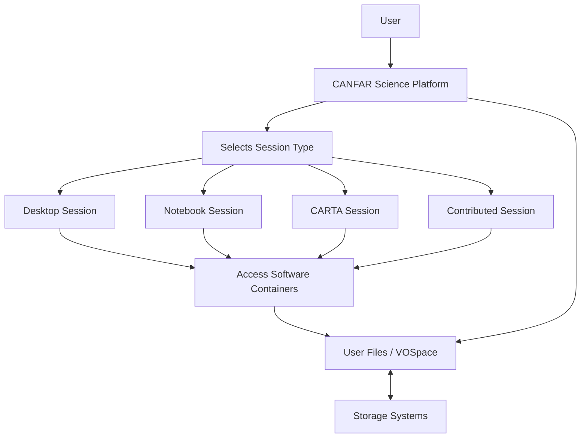

# Science Platform Overview

The CANFAR Science Platform allows users to access the tools and computing
resources they need to conduct their research. This page provides a
brief overview of the system, with a few important notes.

## Containers

Software packages (such as CASA—Common Astronomy Software Applications—for radio interferometry data) run through
*software containers*. These containers come pre-packaged with all necessary
dependencies to ensure consistent operation across different computing environments. 

All containers and sessions can access your shared file storage, though they may run
on different cloud servers behind the scenes. This distributed architecture provides
scalability and reliability for your research computing needs.

**Container Loading**: When you first launch a container on a new server, it may take
2-3 minutes to initialize. Subsequent launches on the same server will be faster.
This initialization time is normal and ensures your software environment is properly configured.

## Sessions

**Sessions** are interactive computing environments where you analyze data using different
types of software interfaces. Each session provides access to your files and computing
resources, but with different user interfaces optimized for specific workflows.

### Session Limits and Management
- **Maximum concurrent sessions**: 3 sessions at any time
- **Session duration**: 4 days maximum, but sessions can be renewed indefinitely
- **Session persistence**: When you close your browser, your session continues running
- **Access from anywhere**: Log back into the Science Portal from any computer to reconnect

### Session Types Available

**Important**: All new sessions must be launched from the main Science Portal
page: <https://www.canfar.net/science-portal/>. You cannot launch sessions from within other sessions.

- **[Desktop Session](launch-desktop.md)**: Provides a Linux desktop environment with astronomy
  software accessible through the *astrosoftware* menu. Best for GUI applications and 
  traditional desktop workflows.

- **[Notebook Session](launch-notebook.md)**: Jupyter Lab environment for interactive data
  analysis, code development, and sharing research notebooks. Ideal for Python/R data science workflows.

- **[CARTA Session](launch-carta.md)**: Specialized radio astronomy image viewer optimized
  for efficiently examining large 3-D data cubes. Essential for radio interferometry work.

- **Contributed Sessions**: Community-created specialized tools, such as the CASTOR 
  (Cosmological Advanced Survey Telescope for Optical and ultraviolet Research) exposure time calculator.

### File Access Across Sessions

All your files remain accessible across all active sessions and through web interfaces:
- **Session file access**: All sessions share the same file storage
- **Web file manager**: <https://www.canfar.net/storage/arc/list/home>
- **Data transfer**: See our [complete data transfer guide](../data-transfer-guide.md) for upload/download methods

## File Storage

Understanding CANFAR's storage systems is crucial for effective data management:

### Storage Types

- **VOSpace**: CANFAR's long-term archive storage service with geographic redundancy
  and multiple backups. Best for permanent data storage and published results.
  Access via: [https://www.canfar.net/storage/vault/list/](https://www.canfar.net/storage/vault/list/)

- **Project Space**: Collaborative storage areas in `/arc/projects/` for active research.
  These directories can be shared among team members and are backed up daily.
  **Recommended for most research work.**

- **Personal Home**: Individual storage in `/arc/home/username/` for personal configurations
  and private files.

### Storage Recommendations

- **Use project space** (`/arc/projects/your-group/`) for collaborative research data
- **Organize clearly** with descriptive directory names and documentation
- **Set appropriate permissions** to enable collaboration while protecting sensitive data
- **Regular backups** are maintained, but organize important files systematically

For detailed storage guidance, see our [complete storage systems guide](../storage-systems-guide.md).
