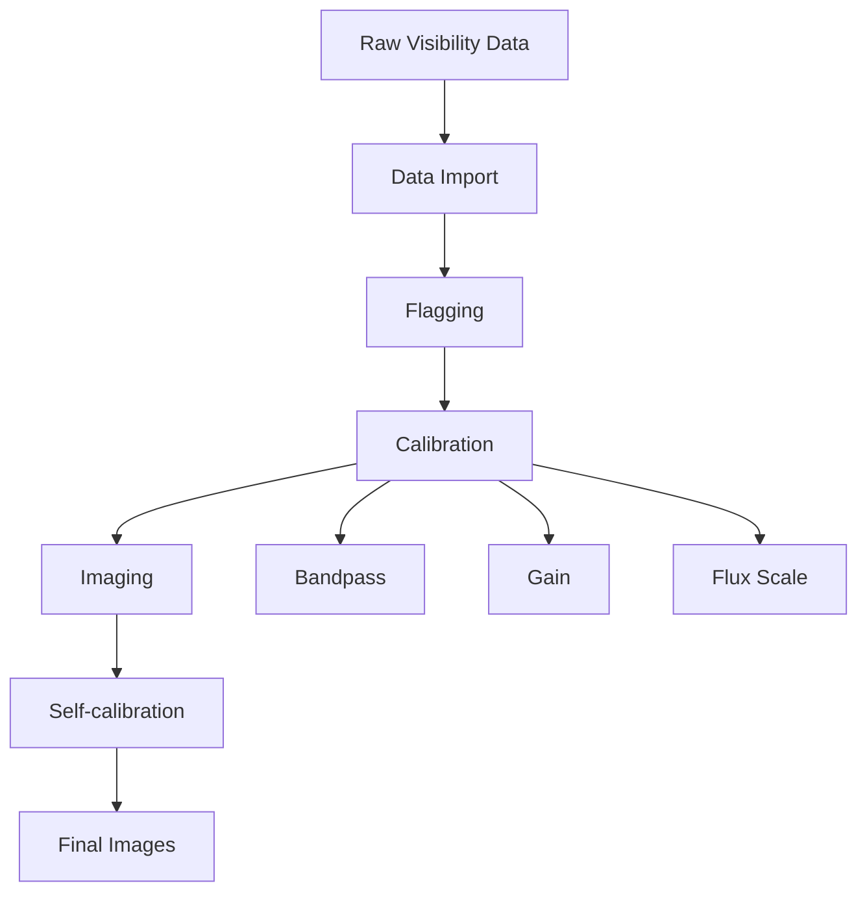

# Radio Astronomy on CANFAR

The CANFAR Science Platform provides comprehensive support for radio astronomy data processing, with specialized containers and workflows optimized for radio interferometry, single-dish observations, and VLBI analysis.

## Overview

Radio astronomy on CANFAR includes:

- **CASA (Common Astronomy Software Applications)**: Complete radio interferometry suite
- **CARTA**: Advanced radio data cube visualization
- **Specialized containers**: Optimized for radio astronomy workflows
- **Large-scale processing**: Handle multi-terabyte datasets efficiently
- **Collaborative analysis**: Share sessions and results with your team

## Radio Astronomy Software Stack

### CASA Environments

CANFAR provides multiple CASA versions and configurations:

- **CASA 6.5** (recommended): Latest stable release with Python 3 support
- **CASA 6.4**: Previous stable version for compatibility
- **CASA Pipeline**: Automated calibration and imaging pipelines
- **Custom builds**: Specialized versions for specific instruments

### Supporting Tools

- **CARTA**: Interactive visualization of radio data cubes
- **Miriad**: Legacy radio astronomy package
- **AIPS**: Classic NRAO package (limited support)
- **Python libraries**: RadioAstro tools, APLpy, spectral-cube

### Data Format Support

- **Measurement Sets (MS)**: CASA native format
- **FITS**: Single-dish and processed data
- **UVFITS**: Legacy interferometry format
- **HDF5**: Large dataset storage
- **MIRIAD**: Legacy format support

## Common Radio Astronomy Workflows

### Interferometry Data Reduction



**Typical steps**:

1. **Data import**: Convert raw data to Measurement Set format
2. **Inspection**: Check data quality and structure
3. **Flagging**: Remove RFI and bad data
4. **Calibration**: Bandpass, gain, and flux scale calibration
5. **Imaging**: Create maps with CLEAN algorithm
6. **Self-calibration**: Iterative improvement
7. **Analysis**: Extract scientific results

### Single-dish Processing

**Workflow elements**:

- **Data import**: Load single-dish observations
- **Baseline subtraction**: Remove instrumental effects
- **Calibration**: Temperature and flux calibration
- **Gridding**: Combine multiple observations
- **Imaging**: Create final maps

### VLBI Processing

**Specialized tools**:

- **CASA VLBI pipeline**: Automated correlation and calibration
- **AIPS integration**: For legacy VLBI workflows
- **Custom scripts**: Institution-specific pipelines

## Getting Started with Radio Astronomy

### Choosing the Right Session Type

**For interactive analysis**:
- **[Notebook sessions](../interactive-sessions/launch-notebook.md)**: Python-based analysis with CASA
- **[Desktop sessions](../interactive-sessions/launch-desktop.md)**: Full CASA GUI access
- **[CARTA sessions](../interactive-sessions/launch-carta.md)**: Data cube visualization

**For large-scale processing**:
- **[Batch jobs](../batch-jobs/index.md)**: Automated pipeline execution
- **API submissions**: Programmatic job control

### Container Selection

Choose containers based on your needs:

```bash
# Latest CASA with Jupyter
images.canfar.net/skaha/casa:6.5-notebook

# CASA desktop environment
images.canfar.net/skaha/casa:6.5-desktop

# CARTA for visualization
images.canfar.net/skaha/carta:3.0

# Custom radio astronomy stack
images.canfar.net/skaha/radio-submm:latest
```

## CASA Usage Examples

### Basic Data Inspection

```python
# In a CASA-enabled Python environment
import casa_tools as tools
import casa_tasks as tasks

# List observation details
tasks.listobs(vis='observation.ms', verbose=True)

# Plot UV coverage
tasks.plotuv(vis='observation.ms')

# Check data quality
tasks.plotms(vis='observation.ms', 
             xaxis='time', yaxis='amp',
             coloraxis='antenna1')
```

### Calibration Pipeline

```python
# Typical CASA calibration sequence
import os
from casa_tasks import *

# Set up paths
msname = 'observation.ms'
caldir = 'calibration/'
os.makedirs(caldir, exist_ok=True)

# 1. Flagging
flagdata(vis=msname, mode='manual', antenna='ant5')  # Bad antenna
flagdata(vis=msname, mode='tfcrop', datacolumn='data')  # RFI

# 2. Set flux scale for calibrator
setjy(vis=msname, field='3C273', standard='Perley-Butler-2017')

# 3. Bandpass calibration
bandpass(vis=msname,
         caltable=caldir+'bandpass.bcal',
         field='3C273',
         refant='ant1',
         solint='inf')

# 4. Gain calibration
gaincal(vis=msname,
        caltable=caldir+'phase.gcal',
        field='3C273',
        calmode='p',
        refant='ant1',
        solint='int')

gaincal(vis=msname,
        caltable=caldir+'amp.gcal',
        field='3C273',
        calmode='ap',
        refant='ant1',
        solint='10min',
        gaintable=[caldir+'bandpass.bcal', caldir+'phase.gcal'])

# 5. Apply calibration
applycal(vis=msname,
         field='target',
         gaintable=[caldir+'bandpass.bcal', 
                   caldir+'phase.gcal', 
                   caldir+'amp.gcal'])
```

### Imaging

```python
# Create images with tclean
tclean(vis='observation.ms',
       imagename='target_image',
       field='target',
       imsize=1024,
       cell='0.1arcsec',
       weighting='briggs',
       robust=0.0,
       niter=1000,
       threshold='0.1mJy',
       interactive=False)

# Create moment maps for spectral line data
immoments(imagename='target_image.image',
          moments=[0, 1, 2],
          outfile='target_moments')
```

### Spectral Line Analysis

```python
# Extract spectral profiles
imval(imagename='datacube.image',
      region='circle[[12h30m45s, -30d15m30s], 5arcsec]')

# Create position-velocity diagrams
impv(imagename='datacube.image',
     outfile='pv_diagram.image',
     mode='coords',
     start='12h30m40s -30d15m30s',
     end='12h30m50s -30d15m30s',
     width='2arcsec')
```

## CARTA for Radio Data

### Loading Data Cubes

CARTA excels at visualizing radio data cubes:

1. **Launch CARTA session**: Use CARTA 3.0 for best performance
2. **Load cube**: Open your CASA image or FITS cube
3. **Navigate channels**: Use channel slider for frequency/velocity
4. **Create animations**: Generate movies through the cube

### Advanced CARTA Features

**Moment map generation**:
- Calculate moment 0, 1, and 2 maps interactively
- Define custom velocity ranges
- Export results for further analysis

**Spectral analysis**:
- Click on pixels to see spectra
- Fit Gaussian profiles to lines
- Measure line properties (velocity, width, flux)

**Region analysis**:
- Define analysis regions
- Extract statistical properties
- Generate publication-quality plots

## Large-Scale Radio Processing

### Batch Processing Strategies

For large surveys or multi-epoch observations:

```python
#!/usr/bin/env python3
"""
Batch process multiple observations
"""

import os
import glob
from casa_tasks import *

def process_observation(msname):
    """Process a single measurement set"""
    
    print(f"Processing {msname}")
    
    # Create output directories
    caldir = f"{msname}.cal/"
    imgdir = f"{msname}.img/"
    os.makedirs(caldir, exist_ok=True)
    os.makedirs(imgdir, exist_ok=True)
    
    try:
        # Calibration
        calibrate_data(msname, caldir)
        
        # Imaging
        image_data(msname, imgdir)
        
        print(f"Completed {msname}")
        
    except Exception as e:
        print(f"Error processing {msname}: {e}")

def calibrate_data(msname, caldir):
    """Standard calibration pipeline"""
    
    # Flagging
    flagdata(vis=msname, mode='tfcrop')
    
    # Calibration steps (simplified)
    bandpass(vis=msname, caltable=f"{caldir}/bandpass.bcal")
    gaincal(vis=msname, caltable=f"{caldir}/phase.gcal")
    applycal(vis=msname, gaintable=[f"{caldir}/bandpass.bcal"])

def image_data(msname, imgdir):
    """Create standard images"""
    
    # Continuum image
    tclean(vis=msname,
           imagename=f"{imgdir}/continuum",
           niter=1000,
           threshold='0.1mJy')
    
    # Spectral cube (if line data)
    tclean(vis=msname,
           imagename=f"{imgdir}/cube",
           specmode='cube',
           niter=500)

# Main processing loop
if __name__ == "__main__":
    
    # Find all measurement sets
    ms_files = glob.glob("/arc/projects/survey/data/*.ms")
    
    for msname in ms_files:
        process_observation(msname)
    
    print("Batch processing complete")
```

### Parallel Processing

For very large datasets, use parallel processing:

```python
#!/usr/bin/env python3
"""
Parallel radio data processing
"""

from multiprocessing import Pool
import functools

def process_with_casa(msname):
    """Process single MS with CASA"""
    
    # Import CASA tools in subprocess
    import casa_tasks as tasks
    
    # Your processing code here
    tasks.flagdata(vis=msname, mode='tfcrop')
    # ... rest of processing
    
    return f"Processed {msname}"

def main():
    # List of measurement sets
    ms_files = [
        "/arc/projects/survey/data/obs1.ms",
        "/arc/projects/survey/data/obs2.ms",
        "/arc/projects/survey/data/obs3.ms",
    ]
    
    # Process in parallel
    with Pool(processes=4) as pool:
        results = pool.map(process_with_casa, ms_files)
    
    for result in results:
        print(result)

if __name__ == "__main__":
    main()
```

## Data Management for Radio Astronomy

### Storage Strategy

Radio astronomy data requires careful storage planning:

**Raw data**: Store in `/arc/projects/[group]/raw/`
- Original measurement sets
- Backup copies of critical observations
- Metadata and observation logs

**Processed data**: Organize in `/arc/projects/[group]/processed/`
- Calibrated measurement sets
- Final images and cubes
- Derived products (catalogs, moment maps)

**Results**: Save to `/arc/projects/[group]/results/`
- Publication-ready images
- Scientific catalogs
- Analysis scripts and notebooks

### File Organization

```
/arc/projects/radio-survey/
├── raw/
│   ├── 2024/
│   │   ├── jan/
│   │   │   ├── obs_20240115.ms
│   │   │   └── obs_20240116.ms
│   │   └── feb/
│   └── 2023/
├── processed/
│   ├── calibrated/
│   ├── images/
│   └── cubes/
├── results/
│   ├── catalogs/
│   ├── plots/
│   └── papers/
└── scripts/
    ├── calibration/
    ├── imaging/
    └── analysis/
```

### Data Transfer

For large radio datasets:

**From observatories**:
- Use `rsync` for efficient transfer
- Transfer during off-peak hours
- Verify data integrity with checksums

**Between CANFAR and external systems**:
- Use VOSpace for large files
- Consider data compression
- Plan transfer schedules

## Performance Optimization

### Memory Management

Radio data processing is memory-intensive:

```python
# Monitor memory usage in CASA
import psutil
import os

def check_memory():
    """Check current memory usage"""
    process = psutil.Process(os.getpid())
    memory_gb = process.memory_info().rss / 1024**3
    print(f"Memory usage: {memory_gb:.1f} GB")

# Use memory-efficient processing
check_memory()
tclean(vis='large_dataset.ms', 
       imagename='output',
       # Use smaller chunk sizes for large data
       parallel=True,
       pbcor=False)  # Skip if not needed
check_memory()
```

### Disk I/O Optimization

```python
# Use scratch space for temporary files
import tempfile
import shutil

# Create temporary directory in scratch space
with tempfile.TemporaryDirectory(dir='/tmp') as tmpdir:
    
    # Copy data to scratch for processing
    scratch_ms = f"{tmpdir}/working.ms"
    shutil.copytree('original.ms', scratch_ms)
    
    # Process on fast scratch storage
    tclean(vis=scratch_ms, imagename=f"{tmpdir}/temp_image")
    
    # Copy results back to persistent storage
    shutil.copy(f"{tmpdir}/temp_image.image", 
                "/arc/projects/myproject/results/")
```

## Troubleshooting Radio Workflows

### Common CASA Issues

**Memory errors**:
- Reduce image size or increase session memory
- Use chunked processing for large datasets
- Clear CASA cache regularly

**Calibration failures**:
- Check data quality with `plotms`
- Verify calibrator flux scales
- Inspect antenna flagging

**Imaging problems**:
- Adjust `tclean` parameters
- Check UV coverage and weighting
- Verify coordinate systems

### Performance Issues

**Slow processing**:
- Use appropriate number of CPU cores
- Enable parallel processing where available
- Monitor system resources

**Disk space problems**:
- Clean up temporary files regularly
- Use scratch space for intermediate products
- Compress completed datasets

### Getting Help

**CASA Documentation**:
- [CASA Guides](https://casaguides.nrao.edu/)
- [CASA Reference Manual](https://casa.nrao.edu/docs/)

**CANFAR Support**:
- Email [support@canfar.net](mailto:support@canfar.net)
- Discord community for peer support
- Check existing tutorials and examples

## Best Practices

### Workflow Documentation

- **Script versioning**: Use Git for analysis scripts
- **Parameter logging**: Record all processing parameters
- **Provenance tracking**: Document data lineage
- **Reproducibility**: Ensure workflows can be repeated

### Collaboration

- **Shared scripts**: Develop reusable pipeline components
- **Session sharing**: Collaborate on interactive analysis
- **Result sharing**: Use consistent output formats
- **Knowledge sharing**: Document lessons learned

### Quality Control

- **Validation steps**: Include quality checks in pipelines
- **Sanity checks**: Verify results at each stage
- **Backup strategies**: Protect critical intermediate products
- **Error handling**: Robust error recovery in automated pipelines

## Next Steps

- **[Interactive Sessions](../interactive-sessions/index.md)**: Get started with CASA and CARTA
- **[Batch Processing](../batch-jobs/index.md)**: Scale up to large datasets
- **[Container Development](../containers/index.md)**: Customize your radio astronomy environment
- **[Storage Guide](../storage/index.md)**: Optimize data management strategies