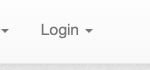
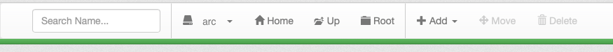
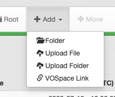
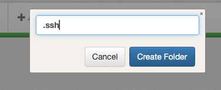

<!-- filepath: /Users/fabbros/src/science-containers/docs/user-guide/sshfs-setup.md -->
# Using SSHFS for File Access

SSHFS (Secure Shell FileSystem) allows you to mount your CANFAR Science Platform storage 
as a local directory on your computer. This creates seamless file access—your CANFAR
files appear as a local folder that you can access with any application.

## Why Use SSHFS?

- **Seamless integration**: CANFAR files appear as local folders
- **Any application**: Use any software to access your remote files
- **Automatic sync**: Changes are instantly reflected on CANFAR
- **Secure transfer**: All data is encrypted during transmission

!!! tip "Alternative: Data Transfer Guide"
    For a comprehensive overview of all data transfer methods, including `sshfs`, `vospace tools`, and web uploads, please see the [Complete Data Transfer Guide](../data-transfer-guide.md).

## Prerequisites

Before you begin, ensure you have:

* **CANFAR account**: Your CADC (Canadian Astronomy Data Centre) username
* **SSH key pair**: Public and private keys for secure authentication
* **Local administrator access**: Required for installing SSHFS and FUSE (Filesystem in Userspace)

## 2. Installation

You\'ll need to install `sshfs` and potentially `FUSE` (Filesystem in Userspace) on your local machine.

=== "Linux (Ubuntu/Debian)"

    sudo apt-get update
    sudo apt-get install sshfs

    If you encounter issues, you might also need `fuse`:

    sudo apt-get install fuse

=== "macOS"

    You\'ll need `macFUSE` and `sshfs`. The easiest way is using [Homebrew](https://brew.sh/):

    brew install --cask macfuse
    brew install sshfs

    After installing `macfuse`, you might need to allow the system extension in "System Settings" > "Privacy & Security". Follow the on-screen prompts from the `macfuse` installer.

## 3. Prepare your CANFAR Account (Add SSH Public Key)

You need to add your SSH **public** key to the `authorized_keys` file on your CANFAR account.

### Step 3.1: Generate or Locate Your SSH Key Pair

=== "Linux (Ubuntu/Debian)"

    1. **Check for existing keys:**

        ls -al ~/.ssh/id_rsa.pub

       If this file exists, you likely already have a key pair. Proceed to copy the public key.

    2. **Generate a new key pair (if needed):**

        ssh-keygen -t rsa -b 4096 -C "your_email@example.com"

       Press Enter to accept the default file location (`~/.ssh/id_rsa`). You can optionally set a passphrase.

    3. **Display your public key to copy it:**

        cat ~/.ssh/id_rsa.pub

       Copy the entire output of this command.

=== "macOS"

    1. **Check for existing keys:**

        ls -al ~/.ssh/id_rsa.pub

       If this file exists, you likely already have a key pair. Proceed to copy the public key.

    2. **Generate a new key pair (if needed):**

        ssh-keygen -t rsa -b 4096 -C "your_email@example.com"

       Press Enter to accept the default file location (`~/.ssh/id_rsa`). You can optionally set a passphrase. If prompted to save to keychain, it\'s usually convenient to do so.

    3. **Display and copy your public key:**

        pbcopy < ~/.ssh/id_rsa.pub

       This copies your public key directly to the clipboard. You can also use `cat ~/.ssh/id_rsa.pub` to display it.

### Step 3.2: Add Public Key to CANFAR `authorized_keys`

1. **Login to the CANFAR File Manager:**

   Go to <https://www.canfar.net/storage/arc/list/home> and log in with your CANFAR credentials.
   > 

2. **Navigate to your Home Directory:**

   You should land in your home directory (e.g., `/home/your_cadc_username/`).
   > 

3. **Create `.ssh` Directory (if it doesn\'t exist):**

   * Click "Add" -> "Folder".
   * Name the folder `.ssh` (note the leading dot).
   > 
   > 

4. **Create or Edit `authorized_keys` File:**

   * Navigate into the `.ssh` directory.
   * If `authorized_keys` doesn\'t exist:
     * Click "Add" -> "Empty File".
     * Name it `authorized_keys`.
   * Click on the `authorized_keys` file to open it in the editor.
   * Paste your **public key** (copied in Step 3.1) into this file. Each key should be on a new line.
   * Save the file.
   >  <!-- TODO: Update this image if possible to show editor -->

   !!! warning "Permissions"
       The CANFAR system should set the correct permissions for `.ssh` (700) and `authorized_keys` (600). If you have issues, these permissions might be a factor, but typically you don\'t need to change them manually via this interface.

## 4. Mount the Remote File System

Now you can mount your CANFAR storage.

1. **Create a local mount point (directory):**

   This is where your CANFAR files will appear on your local computer.

    mkdir ~/canfar_arc # Or any other name you prefer, e.g., ~/arc

2. **Mount using `sshfs`:**

   Replace `your_cadc_username` with your actual CANFAR username and `~/canfar_arc` with the path to your chosen local mount point.

   === "Linux (Ubuntu/Debian)"

        sshfs -o reconnect,ServerAliveInterval=15,ServerAliveCountMax=10 -p 64022 your_cadc_username@ws-uv.canfar.net:/ ~/canfar_arc

   === "macOS"

        sshfs -o reconnect,ServerAliveInterval=15,ServerAliveCountMax=10,defer_permissions -p 64022 your_cadc_username@ws-uv.canfar.net:/ ~/canfar_arc

       The `defer_permissions` option is often needed on macOS to avoid permission issues.

   You might be prompted for your SSH key passphrase if you set one.

3. **Verify the mount:**

    ls ~/canfar_arc

   You should see the contents of your CANFAR home directory. You can navigate to your projects, e.g., `~/canfar_arc/arc/projects/your_project_code`.

## 5. Using the Mounted Filesystem (Examples)

Once mounted, you can interact with your CANFAR files like any other local directory.

* **Navigate:**

    cd ~/canfar_arc/arc/projects/your_project_code/data
    ls

* **Copy files to CANFAR:**

    cp ~/local_data/my_dataset.fits ~/canfar_arc/arc/projects/your_project_code/data/

* **Copy files from CANFAR:**

    cp ~/canfar_arc/arc/projects/your_project_code/results/plot.png ~/my_local_results/

* **Edit files directly** using your local text editor or IDE.

### Synchronize with `rsync`

`rsync` is a powerful tool for efficiently synchronizing directories.

* **Sync local directory TO CANFAR:**

  This command syncs the contents of `~/my_local_project_data/` to `~/canfar_arc/arc/projects/your_project_code/data/`.

    rsync -avz --progress ~/my_local_project_data/ ~/canfar_arc/arc/projects/your_project_code/data/

  * `-a`: archive mode (preserves permissions, ownership, timestamps, etc.)
  * `-v`: verbose
  * `-z`: compress file data during the transfer
  * `--progress`: show progress during transfer

* **Sync CANFAR directory TO local:**

    rsync -avz --progress ~/canfar_arc/arc/projects/your_project_code/results/ ~/my_local_analysis_results/

* **Dry run (see what `rsync` would do without actually changing anything):**

  Add the `-n` or `--dry-run` option:

    rsync -avzn --progress ~/my_local_project_data/ ~/canfar_arc/arc/projects/your_project_code/data/

!!! tip "Trailing Slashes Matter with `rsync`"
    * `rsync source_dir destination_dir/`: Copies `source_dir` into `destination_dir` (e.g., `destination_dir/source_dir/...`).
    * `rsync source_dir/ destination_dir/`: Copies the contents of `source_dir` into `destination_dir` (e.g., `destination_dir/...`).

## 6. Unmounting the File System

When you're finished, it's important to unmount the filesystem.

=== "Linux (Ubuntu/Debian)"

    sudo umount ~/canfar_arc

    If it's busy, you might need to force it (use with caution):

    sudo umount -l ~/canfar_arc # Lazy unmount

    Or, if `fusermount` is available (often the case if `fuse` was installed):

    fusermount -u ~/canfar_arc

=== "macOS"

    umount ~/canfar_arc

    If it\'s busy, you might need to force it (use with caution):

    diskutil unmount force ~/canfar_arc

    Or, sometimes simply:

    sudo umount -f ~/canfar_arc

## Troubleshooting

* **"Connection timed out" or "Connection refused"**:
  * Verify `ws-uv.canfar.net` is reachable and you are on a network that allows outbound SSH on port `64022`.
  * Check your local firewall.
* **"Permission denied (publickey)"**:
  * Ensure your public key is correctly added to `~/.ssh/authorized_keys` on CANFAR.
  * Ensure the SSH agent on your local machine is using the correct private key (e.g., `ssh-add ~/.ssh/id_rsa` if it\'s not the default).
  * Verify permissions on your local `~/.ssh` directory (should be `700`) and its contents (private keys `600`, public keys `644`).
* **Mount succeeds, but you see permission errors when accessing files**:
  * On macOS, ensure you used the `defer_permissions` option.
* **`umount` says "target is busy"**:
  * Make sure no applications or terminal windows are currently using any files or directories within the mount point (`~/canfar_arc`). Close them and try again.
  * Use the force or lazy unmount options for your OS if necessary.

If you continue to have issues, please contact CANFAR support.
