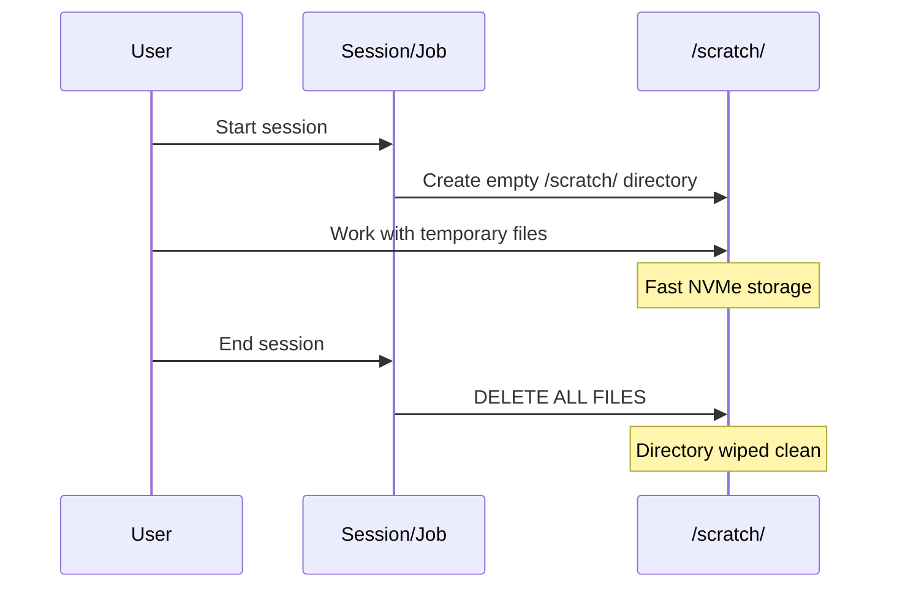

# CANFAR Storage Systems

**Master CANFAR's storage systems for efficient data management**

!!! abstract "🎯 What You'll Learn"

    By the end of this guide, you'll understand:
    - The different storage systems available on CANFAR
    - When and how to use each storage type for your research
    - Best practices for data management, transfer, and backup
    - How to optimize your workflow for performance and data safety

CANFAR provides multiple storage systems optimized for different stages of your research workflow. Understanding when and how to use each storage type is crucial for efficient data analysis and collaboration.

## 📊 Types Comparison

| Storage | Mount Path | Speed | Persistence | Backup | Quota | Best For |
|---------|------------|-------|-------------|--------|-------|----------|
| **ARC Projects** | `/arc/projects/group/` | Fast SSD | ✅ Permanent | ✅ Daily snapshots | Project-based | Active research, shared data |
| **ARC Home** | `/arc/home/username/` | Fast SSD | ✅ Permanent | ✅ Daily snapshots | 10GB default | Personal configs, keys |
| **Scratch** | `/scratch/` | Fastest NVMe | ❌ **Wiped at session end** | ❌ No backup | Unlimited | Temporary processing |
| **VOSpace** | `vos:username/` | Medium | ✅ Permanent | ✅ Geo-redundant | User/project based | Archives, public data |

## 🗺️ Storage Lifecycle Overview

CANFAR's storage architecture is designed around the astronomy research lifecycle:

```mermaid
graph LR
    Archive["📦 External Archives<br/>ALMA, HST, etc."] 
    Download["⬇️ Download"]
    Scratch["⚡ Scratch Storage<br/>Fast processing"]
    Process["🔄 Data Processing"]
    ARC["📁 ARC Projects<br/>Shared results"]
    VOSpace["☁️ VOSpace<br/>Long-term archive"]
    
    Archive --> Download
    Download --> Scratch
    Scratch --> Process
    Process --> ARC
    ARC --> VOSpace
    ARC -.-> |Backup| Process
```



---

## 📁 ARC Storage

ARC (Advanced Research Computing) storage provides high-performance, persistent storage for active research.

### `/arc/projects/groupname/` - Shared Research Storage

!!! success "When to Use ARC Projects"

    - Raw and processed datasets
    - Analysis scripts and notebooks  
    - Results and publications
    - Shared team resources
    - Collaborative workflows

**🔧 Features:**

  - **Shared access** - All group members can read/write
  - **Fast SSD storage** - Optimized for data analysis
  - **Daily backups** - 30-day retention policy
  - **ACL support** - Fine-grained permission control

**📂 Recommended Structure:**

```text
/arc/projects/myproject/
├── data/
│   ├── raw/              # Original observational data
│   ├── processed/        # Calibrated/reduced data  
│   ├── catalogs/         # Reference catalogs
│   └── simulations/      # Synthetic datasets
├── code/
│   ├── pipelines/        # Data processing workflows
│   ├── analysis/         # Analysis scripts
│   ├── notebooks/        # Jupyter notebooks
│   └── tools/            # Custom utilities
├── results/
│   ├── plots/            # Figures and visualizations
│   ├── tables/           # Output measurements
│   ├── papers/           # Manuscripts and drafts
│   └── presentations/    # Conference materials
└── docs/
    ├── README.md         # Project documentation
    ├── data_notes.md     # Dataset descriptions
    └── procedures.md     # Analysis procedures
```

### `/arc/home/username/` - Personal Space  

!!! info "When to Use ARC Home"
    - Personal configuration files (`.bashrc`, `.jupyter/`)
    - SSH keys and authentication credentials
    - Personal scripts and utilities
    - Small reference files

**⚠️ Limitations:**

  - **10GB default quota** (contact support for increases)
  - Personal access only (not shared)
  - Not suitable for large datasets

### Managing ARC Storage {#storage-management}

#### Check Usage and Quotas

```bash
# Check project storage usage
df -h /arc/projects/myproject

# Detailed usage breakdown
du -sh /arc/projects/myproject/*

# Check home directory usage
du -sh /arc/home/$USER/*

# Check available space
df -h /arc
```

#### Organizing Data

```bash
# Create organized directory structure
mkdir -p /arc/projects/myproject/{data/{raw,processed,catalogs},code,results,docs}

# Set group permissions for collaboration
chmod -R g+rw /arc/projects/myproject/
chmod g+s /arc/projects/myproject/  # Inherit group ownership
```

#### Backup and Recovery

!!! tip "ARC Backup"
    ARC storage is automatically backed up daily with a 30-day retention policy. You can also restore files from snapshots if needed.

```bash
# List available snapshots (if enabled)
ls /arc/projects/myproject/.snapshots/

# Restore from snapshot
cp /arc/projects/myproject/.snapshots/daily.2024-03-15/important_file.fits \
   /arc/projects/myproject/restored_file.fits
```

---

## ⚡ Scratch Storage

Scratch provides the fastest storage available on CANFAR, but files are **temporary**.

!!! warning "Important: Scratch Storage Lifecycle"
    **Scratch storage is wiped at the end of each session**, not nightly as some older documentation stated. When your interactive session ends or your batch job completes, all files in `/scratch/` are permanently deleted.

### When to Use Scratch

**✅ Excellent for:**
- Large intermediate files during processing
- Temporary downloads before organizing in ARC
- High I/O operations requiring maximum speed
- Uncompressing large archives
- Sorting and filtering large datasets

**❌ Never use for:**
- Important results (will be lost!)
- Files you need to keep between sessions
- Shared data (only accessible within your session)

### Scratch Lifecycle



### Scratch Best Practices

```bash
# 1. Download large files to scratch first
cd /scratch
wget https://archive.alma.cl/large_dataset.tar.gz

# 2. Process immediately
tar -xzf large_dataset.tar.gz
casa --nologger -c "process_data.py"

# 3. Save results to permanent storage
cp processed_results.fits /arc/projects/myproject/data/processed/

# 4. Clean up isn't necessary (done automatically)
# but good practice during long sessions
rm large_dataset.tar.gz intermediate_*.fits
```

#### Multi-step Processing Workflow

```bash
#!/bin/bash
# Example: ALMA data reduction workflow using scratch

# Step 1: Download to scratch
cd /scratch
almaget 2019.1.00123.S

# Step 2: Process with CASA
casa --nologger --agg -c """
# CASA script here
execfile('/arc/projects/myproject/code/reduction_script.py')
"""

# Step 3: Save important results
mkdir -p /arc/projects/myproject/data/2019.1.00123.S/
cp *.image.fits /arc/projects/myproject/data/2019.1.00123.S/
cp *.uvfits /arc/projects/myproject/data/2019.1.00123.S/

# Step 4: Create processing log
echo "Processed $(date): 2019.1.00123.S" >> /arc/projects/myproject/processing_log.txt
```

---

## ☁️ VOSpace

VOSpace provides web-accessible, long-term archive storage based on IVOA standards.

!!! info "When to Use VOSpace"
    - Archives and public data
    - Long-term preservation
    - Sharing data with external collaborators
    - Metadata-rich datasets

**🔧 Features:**

- **Web-based access** - Upload/download via browser or command line
- **Metadata support** - Store astronomical metadata with files
- **Version control** - Track changes to datasets
- **Sharing controls** - Fine-grained access permissions
- **Geographic redundancy** - Multiple backup locations

**⚠️ Considerations:**

- **Slower access** than ARC storage (network-based)
- **Better for archives** than active analysis
- **Command-line tools required** for advanced features

### VOSpace vs ARC Comparison

| Use Case | VOSpace | ARC Projects |
|----------|---------|--------------|
| **Active analysis** | ❌ Too slow | ✅ Optimized |
| **Data sharing** | ✅ Web interface | ⚠️ Requires group membership |
| **Public releases** | ✅ Public URLs | ❌ Access controlled |
| **Long-term preservation** | ✅ Geo-redundant | ✅ Daily backups |
| **Large file processing** | ❌ Network overhead | ✅ Direct access |

### Using VOSpace

#### Web Interface

Access VOSpace through the CANFAR portal:
[**🔗 VOSpace File Manager**](https://www.canfar.net/storage/vault){ .md-button }

#### Command Line Tools

```bash
# Install VOSpace tools
pip install vostools

# List VOSpace contents
vls vos:myproject

# Upload file
vcp local_file.fits vos:myproject/

# Download file  
vcp vos:myproject/data.fits ./

# Create directory
vmkdir vos:myproject/results

# Set permissions
vchmod o+r vos:myproject/public_data.fits  # Make publicly readable
```

#### VOSpace Python API

```python
import vos

# Create client
client = vos.Client()

# Upload file with metadata
client.copy("local_file.fits", "vos:myproject/survey_data.fits")

# Set metadata
node = client.get_node("vos:myproject/survey_data.fits")
node.props["TELESCOPE"] = "ALMA"
node.props["OBJECT"] = "NGC1365"
client.update(node)

# Download with progress
client.copy("vos:myproject/large_file.fits", "local_copy.fits", send_md5=True)
```

---

## 🔄 Data Transfers {#data-transfer-strategies}

!!! tip "Data Transfer Best Practice"
    Always move important results from `/scratch/` to `/arc/projects/` or VOSpace before ending your session. Use the right tool for your file size and workflow.

### Transfer Strategies by Data Size

#### Small Files (<1GB)
```bash
# Direct copy (fastest for small files)
cp /scratch/result.fits /arc/projects/myproject/results/

# VOSpace upload
vcp /arc/projects/myproject/final_catalog.fits vos:myproject/
```

#### Medium Files (1-100GB)
```bash
# Use rsync for reliability
rsync -av --progress /scratch/large_dataset/ /arc/projects/myproject/data/

# VOSpace with compression
vcp --enable-compression /arc/projects/myproject/datacube.fits vos:myproject/
```

#### Large Files (>100GB)
```bash
# Process in chunks
for file in /scratch/survey_*.fits; do
    # Process individual file
    process_file.py "$file" 
    # Save results immediately
    cp "${file%.fits}_processed.fits" /arc/projects/myproject/processed/
    # Remove processed input to save space
    rm "$file"
done
```

### SSHFS Setup for External Access

Mount CANFAR storage on your local computer:

```bash
# Install SSHFS (macOS with Homebrew)
brew install --cask macfuse
brew install sshfs

# Create mount point
mkdir ~/canfar

# Mount ARC storage
sshfs username@ws-uv.canfar.net:/arc/projects/myproject ~/canfar

# Work with files locally
ls ~/canfar
cp ~/local_analysis.py ~/canfar/code/

# Unmount when done
umount ~/canfar
```

#### SSHFS on Different Platforms

=== "macOS"
    ```bash
    # Install dependencies
    brew install --cask macfuse
    brew install sshfs
    
    # Mount
    sshfs username@ws-uv.canfar.net:/arc/projects/myproject ~/canfar
    ```

=== "Linux"
    ```bash
    # Install SSHFS
    sudo apt install sshfs  # Ubuntu/Debian
    # or
    sudo yum install sshfs  # CentOS/RHEL
    
    # Mount
    sshfs username@ws-uv.canfar.net:/arc/projects/myproject ~/canfar
    ```

=== "Windows"
    ```powershell
    # Install WinFsp and SSHFS-Win
    # Download from: https://github.com/billziss-gh/sshfs-win
    
    # Mount using SSHFS-Win GUI or command line
    ```

---

## 🛠️ Advanced Storage Operations

### Full VOSpace API Usage

#### Metadata Management

```bash
# Set custom metadata
vattr vos:myproject/observation.fits TELESCOPE ALMA
vattr vos:myproject/observation.fits OBJECT "NGC 1365"
vattr vos:myproject/observation.fits DATE-OBS "2024-03-15"

# View metadata
vattr vos:myproject/observation.fits
```

#### Advanced Permissions

```bash
# Make file publicly readable
vchmod o+r vos:myproject/public_catalog.fits

# Grant read access to specific group
vchmod g+r:external-collaborators vos:myproject/shared_data.fits

# Set up public directory
vmkdir vos:myproject/public
vchmod o+r vos:myproject/public
```

### Cutout Services

Access subsections of large files without downloading the entire dataset:

```python
import requests

# Get cutout from FITS file in VOSpace
cutout_url = "https://ws-cadc.canfar.net/vospace/data/myproject/large_image.fits"
params = {"cutout": "[1:100,1:100]", "format": "fits"}  # Section to extract

response = requests.get(cutout_url, params=params)
with open("cutout.fits", "wb") as f:
    f.write(response.content)
```

### Automated Data Workflows

```python
#!/usr/bin/env python
"""
Automated data processing workflow using multiple storage systems
"""
import os
import shutil
import vos
from pathlib import Path


def process_dataset(dataset_id):
    """Process a dataset using optimal storage strategy"""

    # 1. Download to scratch for fast processing
    scratch_dir = Path(f"/scratch/{dataset_id}")
    scratch_dir.mkdir(exist_ok=True)

    # Download from VOSpace to scratch
    client = vos.Client()
    client.copy(f"vos:archive/{dataset_id}.fits", str(scratch_dir / "raw_data.fits"))

    # 2. Process data (using scratch for speed)
    os.chdir(scratch_dir)
    # ... processing code here ...

    # 3. Save results to ARC projects
    results_dir = Path(f"/arc/projects/myproject/results/{dataset_id}")
    results_dir.mkdir(parents=True, exist_ok=True)

    # Copy important results
    shutil.copy("processed_image.fits", results_dir)
    shutil.copy("measurements.csv", results_dir)
    shutil.copy("processing.log", results_dir)

    # 4. Archive final products to VOSpace
    client.copy(
        str(results_dir / "processed_image.fits"),
        f"vos:myproject/processed/{dataset_id}_final.fits",
    )

    # Scratch cleanup happens automatically at session end
    print(f"Processed {dataset_id} successfully")


# Process multiple datasets
for dataset in ["obs001", "obs002", "obs003"]:
    process_dataset(dataset)
```

---

## 🔗 What's Next?

Now that you understand CANFAR's storage systems:

- **[VOSpace API Guide →](vospace-api.md)** - Advanced programmatic access and detailed transfer methods
- **[Interactive Sessions →](../interactive-sessions/index.md)** - Access storage from sessions
- **[Batch Jobs →](../batch-jobs/index.md)** - Automated storage workflows
- **[Container Guide →](../containers/index.md)** - Storage access in containers

---

!!! tip "Storage Strategy Summary"
    **Golden Rule:** Use `/scratch/` for fast temporary work, save everything important to `/arc/projects/`, and archive final results in VOSpace. Plan your data workflow around these three storage tiers for optimal performance and data safety.
