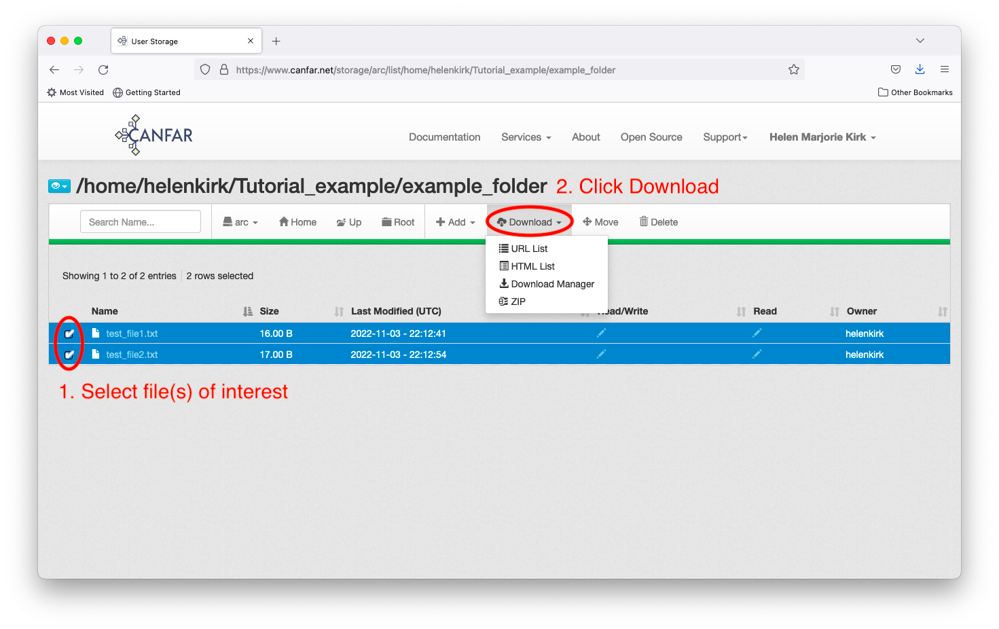
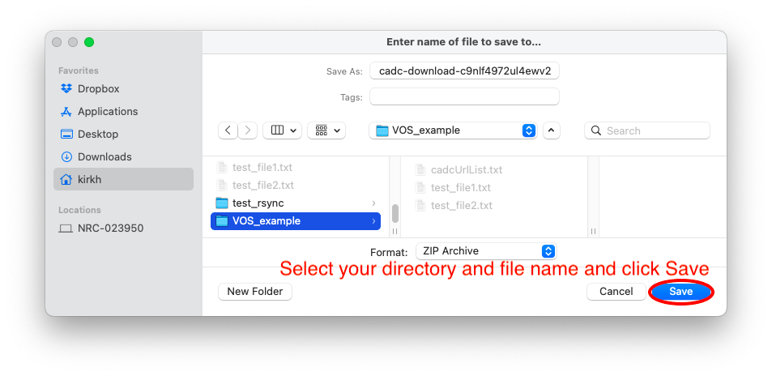

# Web File Manager

Use CANFAR's web interface to upload and download files through your browser - no additional software required.

## 📋 Overview

CANFAR provides web-based file management for both storage systems:

- **[ARC Storage](https://www.canfar.net/storage/arc/list/)** - Active research data and project files
- **[VOSpace](https://www.canfar.net/storage/vault/list/)** - Long-term archive and public data sharing

**When to Use**: Perfect for small to medium files (<1GB), casual file management, and when you need a simple point-and-click interface.

**Alternative Methods**: For large files or automated transfers, see our [complete data transfer guide](../data-transfer-guide.md).

---

## 📤 Uploading Files

### Step 1: Navigate to Upload Location

1. Go to [ARC Storage](https://www.canfar.net/storage/arc/list/) or [VOSpace](https://www.canfar.net/storage/vault/list/)
2. Navigate to your desired directory (e.g., `/arc/projects/your-group/data/`)
3. Click the **Add** button in the toolbar

### Step 2: Choose Upload Type


Select from the upload menu:
- **File** - Single file upload
- **Multiple Files** - Select several files at once  
- **Folder** - Upload entire directory structure

### Step 3: Select and Upload


1. **Choose your files** - Use the file browser to select files
2. **Click Upload** - Begin the transfer process
3. **Click OK** - Confirm completion


### Upload Complete

Your files will appear in the directory listing:


---

## 📥 Downloading Files

Choose from three download methods based on your needs:

### Method Comparison

| Method | Best For | What You Get |
|--------|----------|--------------|
| **Zip Download** | Most files, folders | Single zip file with all content |
| **HTML List** | Few files, preview | Clickable links to individual files |  
| **URL List** | Command-line, scripting | Text file with download URLs |

### Starting a Download

1. **Select files** - Check boxes next to desired files/folders
2. **Click Download** - Choose your preferred method



---

### Method 1: URL List (Command-Line)

**Best for**: Scripting and automated downloads

#### Step 1: Generate URL List

Choose **URL List** option and save the file:


#### Step 2: Set Up Authentication

**For ARC Storage** (Science Portal files):

```bash
# Install vostools if needed (see vospace-tools.md)
cadc-get-cert -u your_username
# Enter password when prompted
```

**What this does**: Creates a security certificate `~/.ssl/cadcproxy.pem` valid for 10 days.

#### Step 3: Download Files

**For ARC Storage**:
```bash
wget --content-disposition -i cadcUrlList.txt \
  --certificate ~/.ssl/cadcproxy.pem \
  --ca-certificate ~/.ssl/cadcproxy.pem
```

**For VOSpace** (alternative method):
```bash
wget --content-disposition -i cadcUrlList.txt \
  --http-user=your_username --ask-password
```


---

### Method 2: HTML List (Point-and-Click)

**Best for**: Downloading just a few files with browser convenience

#### How it Works

1. Choose **HTML List** option
2. A popup window displays clickable download links for each file
3. Each file appears as a clickable URL (usually spanning 2 lines)


#### Using the Links

**To download files**:
- **Left-click** the link → Browser download dialog appears
- **Right-click** → Choose "Save link as..." or "Download linked file"

**To preview files** (PDFs, images, text):
- **Right-click** → Choose "Open link" to view in browser

**When to use**: Best for 1-5 files when you want simple point-and-click downloading.

### Method 3: Zip Download (Bulk)

**Best for**: Downloading multiple files or entire folders as a single package

#### How it Works

1. Choose **Zip** option from the download menu
2. A save dialog appears with options to customize the zip filename and location
3. Download a single zip file containing all your selected content



#### Using Your Downloaded Zip

**Extract the files**:
```bash
# On Mac/Linux
unzip your-download.zip

# On Windows
Right-click → "Extract All..."
```

**Example extraction** (terminal on Mac):
```bash
open downloaded-files.zip  # Opens with default unzip utility
```


**When to use**: Perfect for downloading many files, preserving folder structure, or when you want everything in one convenient package.

---

## 💡 Tips and Best Practices

### File Size Considerations

- **Small files (<100MB)**: All methods work well
- **Medium files (100MB-1GB)**: Zip and URL methods recommended  
- **Large files (>1GB)**: Use [command-line tools](../data-transfer-guide.md) for better reliability

### Authentication Notes

- **ARC Storage**: Requires CADC certificate authentication
- **VOSpace**: Can use either certificate or username/password authentication
- **Certificates expire**: Re-run `cadc-get-cert` every 10 days for command-line access

### Common Issues

**Downloads fail or timeout**:
- Try smaller batches of files
- Switch to URL list method for better resume capability
- Check your internet connection stability

**Authentication errors with wget**:
- Verify your certificate is current: `cadc-get-cert -u your_username`
- Ensure certificate paths are correct in commands

---

## 🆘 Need Help?

**For web interface issues**:
- Contact [CANFAR Support](mailto:support@canfar.net)

**For command-line authentication**:
- See our [VOSpace tools guide](vospace-tools.md)
- Review the [complete data transfer guide](../data-transfer-guide.md)

**For large file transfers**:
- Consider [SSHFS mounting](sshfs-setup.md) for seamless file access
- Use [advanced transfer methods](../data-transfer-guide.md) for better performance
